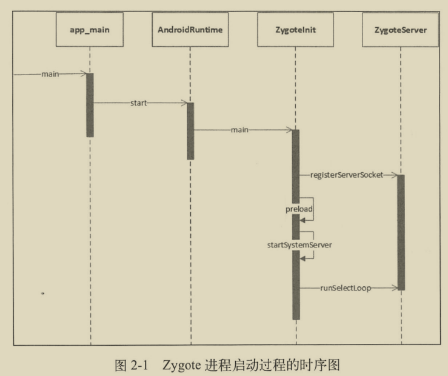
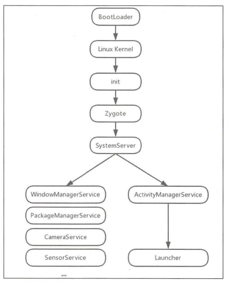

# Android系统启动

## 1、init进程启动过程

> init进程是Android 系统中用户空间的第一个进程，进程号为1，是Android 系统启流程中一个关键的步骤，作为第一个进程，它被赋予了很多极其重要的工作职责，比如创建 Zygote(孵化器)和属性服务等。init 进程是由多个源文件共同组成的，这些文件位于源码目录system/core/init 中。

### 1.1、引入init进程

App系统启动流程的前几步:

1. **启动电源以及系统启动**
   当电源按下时引导芯片代码从预定义的地方(固化在 ROM)开始执行。加载引导程序BootLoader到 RAM中，然后执行。
2. **引导程序 BootLoader**
   引导程序 BootLoader 是在Android 操作系统开始运行前的一个小程序，它的主要作用是把系统 OS 拉起来并运行。
3. **Linux内核启动**
   当内核启动时，设置缓存、被保护存储器、计划列表、加载驱动。在内核完成系统设置后，它首先在系统文件中寻找 init.rc 文件，并启动init 进。

4. **init进程启动**

   imit 进程做的工作比较多，主要用来初始化和启动属性服务，也用来启动 Zygote 进程。

> 僵尸进程与危害
>
> 在UNIX/Linux中，父进程使用fork创建子进程，在子进程终止之后，如果**父进程并不知道子进程已经终止**了，这时子进程虽然已经退出了，但是在**系统进程表中还为它保留了一定的信息**(比如进程号、退出状态、运行时间等),这个子进程就被称作**僵尸进程**。系统进程表是一项**有限资源**，如果系统进程表被僵尸进程耗尽的话，系统就可能**无法创建新的进程**了。

### 1.2、init进程总结

init 进程启动做了很多的工作，总的来说主要做了以下三件事

(1) 创建和挂载启动所需的文件目录
(2) 初始化和启动属性服务
(3)解析 init.rc 配置文件并启动 Zygote 进程

## 2、Zygote 进程启动过程

### 2.1、Zygote概述

>  Zygote 进程是在 init 进程启动时创建的,起初 Zygote 进程的名称并不是叫“zygote”，而是叫“app_process”，这个名称是在 Android.mk 中定义的，Zygote 进程启动后，Linux 系统下的 pctrl 系统会调用 app process，将其名称换成了“zygote”

在 Android 系统中，DVM (Dalvik 虚拟机)和ART、应用程序进程以及运行系统的关键服务的 SystemServer 进程都是由 Zygote 进程来创建的，我们也将它称为孵化器。它通过fock (复制进程)的形式来创建应用程序进程和 SystemServer 进程，由于 Zygote 进程在启动时会创建 DVM 或者 ART，因此通过 fock 而创建的应用程序进程和 SystemServer 进程可以在内部获取一个 DVM 或者 ART 的实例副本。

### 2.2、Zygote进程启动总结

Zygote 进程启动共做了如下几件事:
(1)创建 AppRuntime 并调用其 start 方法，启动 Zygote 进程
(2)创建 Java 虚拟机并为 Java 虚拟机注册JNI方法
(3)通过JNI调用 ZygoteInit 的 main 函数进 Zygote的 Java 框架层
(4)通过 registerZygoteSocket 方法创建服务器端 Socket，并通过 runSelectLoop 方法等待 AMS 的请求来创建新的应用程序进程
(5)启动 SystemServer 进程

## 3、SystemServer 处理过程

SystemServer 进程被创建后，主要做了如下工作:
(1)启动 Binder 线程池，这样就可以与其他进程进行通信。

(2)创建 SystemServiceManager，其用于对系统的服务进行创建、启动和生命周期管理

(3)启动各种系统服务(引导、核心、其他)

## 4、Launcher 进程启动过程

## 5、Android系统启动流程

1. 启动电源以及系统启动
   当电源按下时引导芯片代码从预定义的地方 (固化在 ROM)开始执行。加载引导程序BootLoader到 RAM，然后执行
2. 引导程序 BootLoader
   引导程序 BootLoader 是在 Android 操作系统开始运行前的一个小程序，它的主要作用是把系统 OS 拉起来并运行。
3. Linux内核启动
   当内核启动时，设置缓存、被保护存储器、计划列表、加载驱动。当内核完成系统设置时，它首先在系统文件中寻找 init.rc 文件，并启动nit 进程。
4. init 进程启动
   初始化和启动属性服务，并且启动 Zygote 进程
5. Zygote 进程启动
   创建 Java 虚拟机并为 Java 虚拟机注册 JNI 方法，创建服务器端 Socket，启动SystemServer 进程。
6. SystemServer 进程启动
   启动 Binder 线程池和 SystemServiceManager，并且启动各种系统服务
7. 被 SystemServer 进程启动的AMS 会启动 Launcher，Launcher 启动后会将已安装应用的快捷图标显示到界面上。

