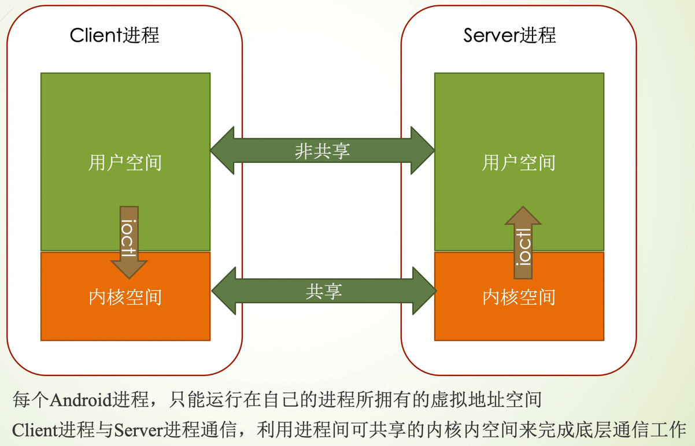
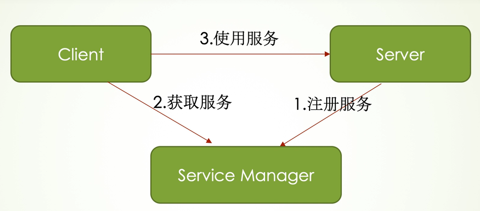
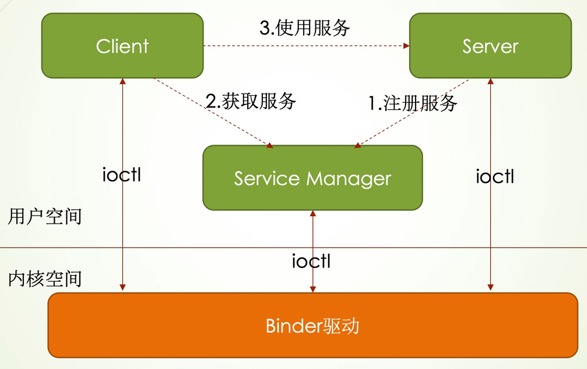
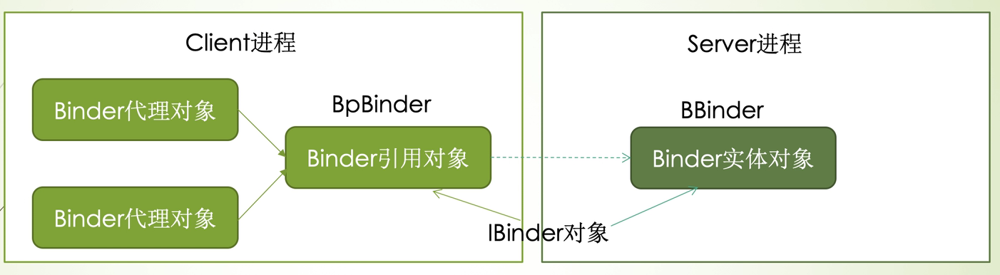
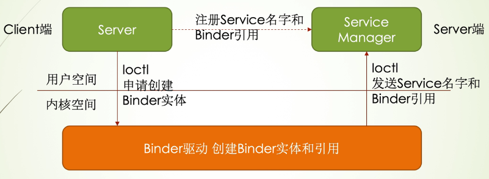
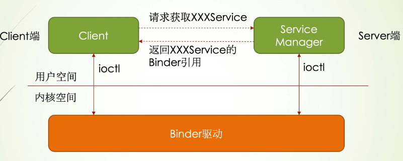
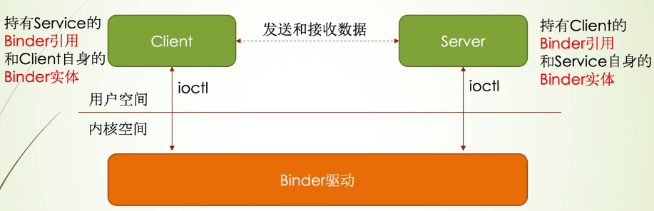
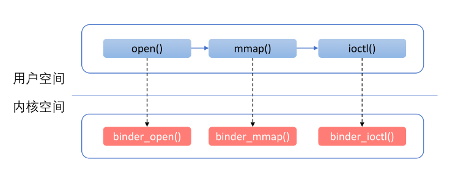
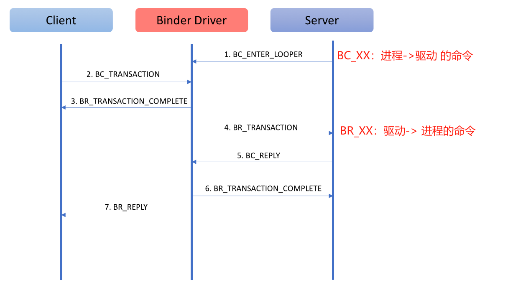
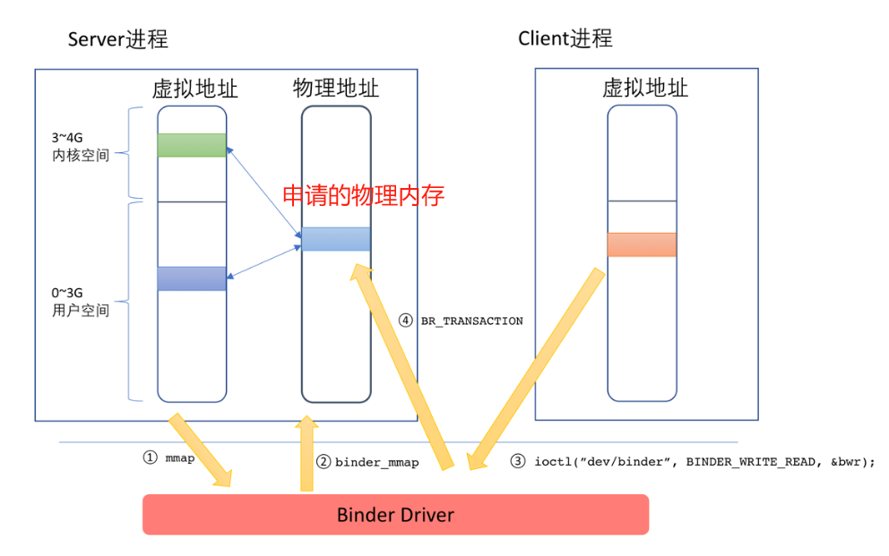

# Binder机制

## 进程间通信(IPC)

进程间通信（IPC，InterProcess Communication）是指在不同进程之间传播或交换信息

## Android C/S通信机制

- Server是Service的提供者，提供的Service需要在Service Manager进行注册:Server可以注册一个或多个Service
- Client是Service的使用者，使用前需要向Service Manager申请服务
- Client获取到Service后，可以调用Server使用服务了

## Binder通信模型

1. Client 和 Server都需要通过ioctl方式将数据从用户空间交换到内核空间
2. 通过Binder驱动，完成进程间数据交换与共享

## Binder机制关键概念

- IBinder对象:实体对象和引用对象的统称，因为BBinder和BpBinder都继承自lBinder
- Binder实体对象: Binder服务的提供者，类型是BBinder，也称为BBinder对象
- Binder引用对象:Binder实体对象在客户端进程的代表，类型是BpBinder，也称BpBinder对象
- Binder代理对象:代理对象也称接口对象，主要是为客户端的上层应用提供接口服务，类型是llnterface;Android将Binder引用对象和代理对象分开的好处是一个Binder引l用对象可以有多个代理对象，方便应用层使用

## Binder通信流程

### 1.注册服务

1. 首先Server在自己的进程向Binder驱动申请创建Service的Binder实体
2. Binder驱动为这个Service创建位于内核的Binder实体节点和Binder引用
3. Server通过Binder驱动将Service名字和Service的Binder引用打包发送给ServiceManager
4. ServiceManager收到数据包后，取出Service的名字和引用，填入一张查找表

### 2.获取服务

- Client利用handle值为0的引用找到ServiceManager(Android系统在启动时会自动为ServiceManager分配一个handle值为0的Binder引用)
- 通过Binder驱动向ServiceManager发送XXXService的访问申请
- ServiceManager从请求包中获取XXXService的名字，在查找表中找到对应的条目，取出对应的Binder引用
- ServiceManager将XXXService的Binder引用通过Binder驱动回复给Client

### 3.使用服务

- Client和Server既是发送方，又是接收方
- 发送方通过自身的Binder实体进行发送操作，把数据通过接收方的Binder引用发送给接收方
- Binder驱动会处理这个发送请求，利用内核空间进程共享的机制:
  - 把发送方的数据放入**写缓存**(binder_write _read.write_buffer)(对于接受方来说为读缓存区)
  - 接收方之前一直在阻塞状态中，当写缓存有数据，则会读取数据，执行命令操作
  - 接收方执行完后，会把返回结果同样采用子人缓冲区(对于发送方，为读缓冲区)

------

- binder_open：打开Binder设备
- binder_mmap：进行内存映射
- binder_ioctl：进行实际的操作，Client对于Server端的请求，以及Server对于Client请求结果的返回，都是通过ioctl完成的。

## Binder驱动

### Binder驱动主要结构

| **结构体名称**        | **说明**               |
| --------------------- | ---------------------- |
| **binder_write_read** | 存储一次读写操作的数据 |
| **binder_write_read** | 存储一次事务的数据     |

### Binder协议

#### 控制协议

控制协议是进程通过ioctl(“/dev/binder”) 与Binder设备进行通讯的协议

| 命令                  | 说明                                                        | 参数类型          |
| :-------------------- | :---------------------------------------------------------- | :---------------- |
| **BINDER_WRITE_READ** | 读写操作，最常用的命令。IPC过程就是通过这个命令进行数据传递 | binder_write_read |

#### 驱动协议

Binder的驱动协议描述了对于Binder驱动的具体使用过程，驱动协议又可以分为两类：

- `binder_driver_command_protocol`，描述了**进程发送给Binder驱动的命令**

- `binder_driver_return_protocol`，描述了**Binder驱动发送给进程的命令**

  `binder_driver_return_protocol`中重点命令

  | 返回类型            | 说明                                   | 参数类型                |
  | :------------------ | :------------------------------------- | :---------------------- |
  | **BR_TRANSACTION**  | 通知进程收到一次Binder请求（Server端） | binder_transaction_data |
  | **BR_REPLY**        | 通知进程收到Binder请求的回复（Client） | binder_transaction_data |
  | **BR_SPAWN_LOOPER** | 通知Binder进程创建一个新的线程         | void                    |

#### Binder协议是如何通信的？

### mmap 内存映射

mmap的作用有如下两个：

1. 申请一块内存空间，用来接收Binder通信过程中的数据
2. 对这块内存进行地址映射，以便将来访问

mmap函数会申请一块物理内存，然后在用户空间和内核空间同时映射到这块申请的内存。

当Client要发送数据到Server时，将Client发送的数据拷贝到Server端申请的物理内存中。

由于该物理内存同时映射了Server端的内核空间与用户空间，因此Server可以直接访问，不需要第二次拷贝。

