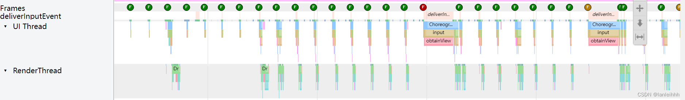
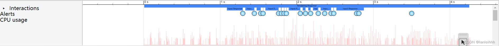
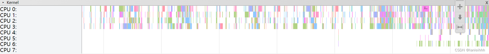
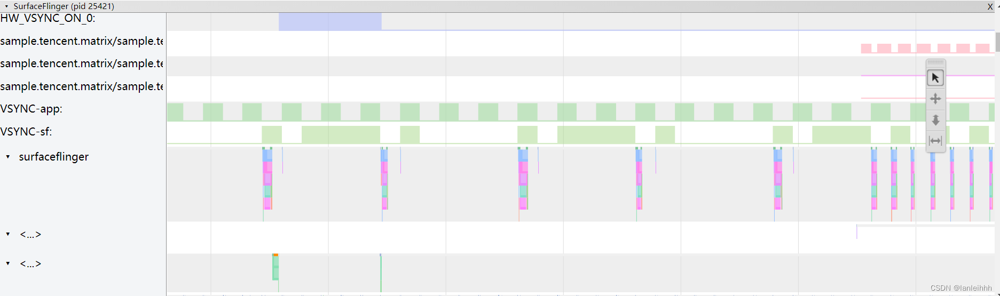

# Systrace学习笔记

>使用Systrace前提：
>1. Python 2.7.x 环境；
>2. 安卓SDK ： systrace 命令在 Android SDK 工具软件包中提供，并且可以在 android-sdk/platform-tools/systrace/ 中找到(旧版带systrace.py)
>3. chrome://tracing/  ：浏览器打开systrace.html

>Systrace 适用于 Android 4.3（API 级别 18）及更高版本的所有平台版本，但建议将 Perfetto 用于运行 Android 10 及更高版本的设备


## 1.Systrace快捷键
W：放大
S：缩小
A：左移
D：右移
M：高亮
1	：将当前正在使用中的选择模型更改为“选择”模式。
2	：将当前正在使用中的选择模型更改为“平移”模式。
3	：将当前正在使用中的选择模型更改为“缩放”模式。 
4	：将当前正在使用中的选择模型更改为“计时”模式。
G	：在当前所选任务的开头显示网格。
左键：在当前选定的时间轴上选择上一个事件。
右键：在当前选定的时间轴上选择下一个事件。

## 2.线程状态
- **绿色 Running**：线程正在完成与某个进程相关的工作或正在响应中断
- **蓝色 Runnable**：可以运行，等待CPU调度，同一时刻可能有多个线程处于Runnable，这些线程的 task_struct 结构被放入对应 cpu 的Runnable队列中（一个线程最多只能出现在一个 cpu 的可执行队列中）。调度器的任务就是从各个 cpu 的Runnable队列中分别选择一个线程在该cpu 上运行
- **白色 Sleep**：线程没有可执行的任务，可能是因为线程在遇到互斥锁定时被阻塞
- **橙色 Uninterruptible Sleep - IO Block**：线程在遇到 I/O 操作时被阻止或正在等待磁盘操作完成，IO操作慢
- **紫色 Uninterruptible Sleep**：线程在另一内核操作时被阻塞，一般是陷入内核态(内存管理)

## 3.CPU info
CPU按照核心数和**架构**分类：
1.非大小核架构：八核/四核/两核同构，频率相同，功耗相同
2.大小核架构：小核主频低功耗低，大核主频高功耗高
	八核心：CPU0-3是小核心，CPU4-7是大核心
	ohter：4小核心+2大核心；6小核心+2大核心
3. 大中小核架构：大核心1~2个，主频功耗高，用来处理繁重高负载任务

**绑核**
将任务绑定到一个或一组核心上运行来满足实际需求
负载高-------------------大核心组
任务避免频繁切换----绑定某一个核心
任务要求低-------------绑定小核心组


## 4.图形化
横坐标是以时间为单位，纵坐标是以进程-线程的方式来划分，同一进程的线程为一组放在一起，可收缩/展开，如下图：

### 4.1 Frames帧
在每个app进程，都有一个Frames行，正常情况以绿色的圆点表示。当圆点颜色为黄色或者红色时，意味着这一帧超过16.6ms（即发现丢帧），这时需要通过放大这一帧进一步分析问题。

对于Android 5.0(API level 21)或者更高的设备，该问题主要聚焦在UI Thread和Render Thread这两个线程当中。对于更早的版本，则所有工作在UI Thread。



### 4.2 用户活动


### 4.3 CPU活动



### 4.4 系统事件
描绘 SurfaceFlinger 进程（包括 VSync 事件和界面线程交换工作）的其他直方图


## 5. SystemServer
### 5.1 SystemServer简介
Android系统在启动的时候有两个重要的进程：Zygote进程 和 由zygote进程fork出来的system_server进程


system_server 进程主要是用于创建系统服务，AMS、WMS、PMS 都是由它创建的。 具体来说，SystemServer 进程被创建后，主要做了以下工作：

- 启动 Binder 线程池，这样就可以与其他进程进行通信；
- 创建 SystemServiceManager，用于对系统服务进行创建、启动和生命周期管理；
- 启动各种系统服务；

SystemServer进程的核心是SystemServer类，它是Android系统启动后的第一个Java进程。SystemServer类负责启动系统的各种服务，它通过Binder机制提供各种服务接口

SystemServer 由于提供大量的基础服务，所以进程间的通信非常繁忙，且大部分通信都是通过 **Binder** 。


```java
public final class SystemServer {
    private static final String TAG = "SystemServer";
    private static final boolean DEBUG_LISTENER = false;
    private static final boolean DEBUG_PRIORITY = false;
    private static final String ANSI_RED_BACKGROUND = "\u001B[31;40m";
    private static final String ANSI_RESET = "\u001B[0m";
    ...
    public static void main(String[] args) {
        ...
        Trace.traceBegin(Trace.TRACE_TAG_SYSTEM_SERVER, "InitBeforeStartServices");
        SystemServer systemServer = null;
        try {
            //创建systemServer实例
            systemServer = new SystemServer();
            //启动系统服务
            systemServer.run();
        } catch (Throwable ex) {
            Log.e("System", "******************************************");
            Log.e("System", "************ Failure starting system services", ex);
            System.exit(10);
        } finally {
            Trace.traceEnd(Trace.TRACE_TAG_SYSTEM_SERVER);
        }
    }

    //启动各种系统服务的方法
    private void run() {
        ...
        startCoreServices();
        startOtherServices();
        startBootstrapServices();
        ...
    }

    //启动核心服务的方法
    private void startCoreServices() {
        ...
	    //启动属性服务
	    Trace.traceBegin(Trace.TRACE_TAG_SYSTEM_SERVER, "InitializeSystemProperties");
	    SystemProperties.init();
	    Trace.traceEnd(Trace.TRACE_TAG_SYSTEM_SERVER);
	
	    //启动电源服务
	    Trace.traceBegin(Trace.TRACE_TAG_SYSTEM_SERVER, "StartPowerManagerService");
	    power = powerManagerService;
	    powerManagerService.setPolicy((WindowManagerPolicy) policy);
	    Trace.traceEnd(Trace.TRACE_TAG_SYSTEM_SERVER);
	
	    //启动USB服务
	    Trace.traceBegin(Trace.TRACE_TAG_SYSTEM_SERVER, "StartUsbService");
	    UsbService usb = new UsbService(context);
	    ServiceManager.addService(Context.USB_SERVICE, usb);
	    Trace.traceEnd(Trace.TRACE_TAG_SYSTEM_SERVER);
	
	    //启动Vibrator服务
	    Trace.traceBegin(Trace.TRACE_TAG_SYSTEM_SERVER, "StartVibratorService");
	    vibrator = new VibratorService(context);
	    ServiceManager.addService(Context.VIBRATOR_SERVICE, vibrator);
	    Trace.traceEnd(Trace.TRACE_TAG_SYSTEM_SERVER);
	
	    //启动下载服务
	    Trace.traceBegin(Trace.TRACE_TAG_SYSTEM_SERVER, "StartDownloadService");
	    ServiceManager.addService(Context.DOWNLOAD_SERVICE, new DownloadManagerService(context));
	    Trace.traceEnd(Trace.TRACE_TAG_SYSTEM_SERVER);
	    ...
    }

    //启动其他服务的方法
    private void startOtherServices() {
        ...
        //启动媒体服务
	    Trace.traceBegin(Trace.TRACE_TAG_SYSTEM_SERVER, "StartMediaServer");
	    media = new MediaServer(context);
	    ServiceManager.addService(Context.MEDIA_ROUTER_SERVICE, media.getMediaRouter());
	    Trace.traceEnd(Trace.TRACE_TAG_SYSTEM_SERVER);
	
	    //启动网络服务
	    Trace.traceBegin(Trace.TRACE_TAG_SYSTEM_SERVER, "StartNetworkManagementService");
	    try {
	        final NetworkManagementService nmService = NetworkManagementService.create(context);
	        ServiceManager.addService(Context.NETWORKMANAGEMENT_SERVICE, nmService);
	    } catch (Throwable e) {
	        reportWtf("starting NetworkManagementService", e);
	    }
	    Trace.traceEnd(Trace.TRACE_TAG_SYSTEM_SERVER);
	
	    //启动位置服务
	    Trace.traceBegin(Trace.TRACE_TAG_SYSTEM_SERVER, "StartLocationManagerService");
	    locationManagerService = new LocationManagerService(context);
	    ServiceManager.addService(Context.LOCATION_SERVICE, locationManagerService);
	    Trace.traceEnd(Trace.TRACE_TAG_SYSTEM_SERVER);
	    ...
    }

    //启动引导服务的方法
    private void startBootstrapServices() {
        //重命名文件系统
	    if (!mRuntimeRestart) {
	        Trace.traceBegin(Trace.TRACE_TAG_SYSTEM_SERVER, "RenameFilesystem");
	        ZygoteInit.renameAndRemoveOldUserSystemDirs();
	        Trace.traceEnd(Trace.TRACE_TAG_SYSTEM_SERVER);
	    }
	
	    //格式化data分区
	    Trace.traceBegin(Trace.TRACE_TAG_SYSTEM_SERVER, "StartBootstrapServices");
	    Intent intent = new Intent(Intent.ACTION_PRE_BOOT_COMPLETED);
	    intent.addFlags(Intent.FLAG_RECEIVER_NO_ABORT);
	    intent.setPackage("android");
	    context.sendBroadcastAsUser(intent, UserHandle.ALL);
	    Trace.traceEnd(Trace.TRACE_TAG_SYSTEM_SERVER);
    }
    ...
}
```

### 5.2 窗口动画
应用启动流程：点击App时，首先Launcher会启动一个StartingWindow，等App中启动页面的第一帧绘制好了，就会马上从Launcher切换回App的窗口动画。

>Android 9.0之前App启动动画在SystemServer里
>Android 9.0之后App启动动画由Laucher和App自身第一帧组成


### 5.3 AMS(ActivityManagerService)
AMS主要负责Android系统中四大组件的启动、切换、调度以及应用进程管理和调度工作

AMS 相关的 Trace 一般会用 TRACE_TAG_ACTIVITY_MANAGER 这个 TAG，在 Systrace 中的名字是 ActivityManager。


### 5.4 WMS(WindowMagerService)
WMS管理所有的窗口，包括创建、删除、修改，以及将某个窗口设置为焦点窗口。

一般会用 TRACE_TAG_WINDOW_MANAGER 这个 TAG，在 Systrace 中 WindowManagerService 在 SystemServer 中多在 对应的 Binder 中出现。

### 5.5 ServiceThread

ServiceThread 继承自 HandlerThread。

UIThread、IoThread、DisplayThread、AnimationThread、FgThread、SurfaceAnimationThread都是继承自 ServiceThread，分别实现不同的功能，根据线程功能不同，其线程优先级也不同。

每个 Thread 都有自己的 Looper 、Thread 和 MessageQueue，互相不会影响。Android 系统根据功能，会使用不同的 Thread 来完成。

### 5.6 HandlerThread

BackgroundThread，许多对性能没有要求的任务，一般都会放到 BackgroundThread 中去执行。
## 6. SurfaceFlinger
SurfaceFlinger始终显示内容，始终保留一个缓冲区。

作用：接收所有缓冲区，进行合成，发送到显示设备（屏幕）

触发：收到VSync信号后，开始以帧的形式绘图；

流程：收到VSync信号后，SurfaceFlinger遍历层列表，寻找新缓冲区，找到新的缓冲区就获取，未找到新的就使用以前的缓冲区，某个层上没有提交缓冲区就会忽略该层，收集完后询问HWC如何合成
	
### 6.1 App --> BufferQueue

App与BufferQueue交互流程：收到vsync信号后，应用主线程(UI Thread)被唤醒，主线程处理完数据后，会唤醒应用渲染线程RenderThread同步数据，RenderThread会从BufferQueue取出一个Buffer，然后往Buffer写入具体的 drawcall，完成后再将有数据的Buffer还给BufferQueue。

### 6.2 BufferQueue --> Surface Flinger

思考后认为，App是不断往BufferQueue里面丢数据的，而vsync信号的发送与前面无关，就是系统提醒Surface Flinger可以画图了，那Surface Flinger就马上去BufferQueue取数据，然后画图。


### 6.3Surface Flinger --> HWC 
HWC HAL是用于合成从Surfaceflinger接收到的图层，而分担GLES和GPU执行合成的压力，提升整体性能和效率

使用HWC来合成该窗口而不是用surfaceflinger通过GPU来合成原因？
1）大部分GPU没有为合成优化
2）当使用Surfaceflinger通过GPU来合成layers 时，应用是无法用GPU来做渲染的工作的


## 7.Input
Input分类
- 触摸事件(Down、Up、Move) 
- Key 事件(Home Key 、 Back Key)

#### 7.1 Input流程
1. system_server的native线程InputReader首先负责从EventHub中监听并从屏幕驱动读取上报的触控事件，然后放入InboundQueue(iq)中，然后唤醒另外一条native线程InputDispatcher负责进行进一步事件分发（对事件进行包装后）
2. InputDispatcher 在拿到 InboundQueue(iq)中的事件之后， 对注册了Input事件的所有App：
	a. 派发到各个App连接的OutboundQueue(oq)
	b.记录到各个App的WaitQueue(wq)
3. App 接收到 Input 事件，InputDispatcher通过直接唤醒、Binder方式将主线程UI Thread唤醒，同时记录到 PendingInputEventQueue ，然后对事件进行分发处理
4.  App  处理完成后，回调 InputManagerService 将负责监听的 WaitQueue 中对应的 Input 移除


### 7.2 iq、oq、wq

-  InboundQueue(iq) 
InputDispatcher 执行 notifyKey 的时候，会将 Input 事件封装后放到 InboundQueue 中，后续 InputDispatcher 循环处理 Input 事件的时候，就是从 InboundQueue 取出事件然后做处理
 - Outbound(oq) 
    OutboundQueue 指的是要被 App 拿去处理的事件队列，每一个 App(Connection) 都对应有一个 OutboundQueue ，事件会先进入 InboundQueue ，然后被 InputDIspatcher 派发到各个 App 的 OutboundQueue
 - WaitQueue (wq) 
    - WaitQueue(wq) 里面记录的是已经派发给 App 但是 AppConnection 还在处理没有返回处理成功的事件
    - 当 InputDispatcher 将 Input 事件分发出去之后，将 DispatchEntry 从 outboundQueue 中取出来放到 WaitQueue 中，当 publish 出去的事件被处理完成（finished），InputManagerService 就会从应用中得到一个回复，此时就会取出 WaitQueue 中的事件，从 Systrace 中看就是对应 App 的 WaitQueue 减少

## 8. VSync信号
### 8.1 起源

####  逐行扫描
显示器并不是一次性将画面显示到屏幕上，而是从上到下逐行扫描显示，不过这一过程快到人眼无法察觉到变化。以 60 Hz 刷新率的屏幕为例，即 1000 / 60 ≈ 16ms。

#### 屏幕撕裂
CPU / GPU 生成图像的 Buffer 数据，屏幕从 Buffer 中读取数据刷新后显示。

理想情况下帧率和刷新频率保持一致，即每绘制完成一帧，显示器显示一帧。引入 Vsync 之前的 Android 版本，渲染一帧相关的 Message ，中间是没有间隔的，上一帧绘制完，下一帧的 Message 紧接着就开始被处理。这样的问题就是，帧率不稳定，可能高也可能低。

当 GPU 利用一块内存区域写入一帧数据时，从顶部开始新一帧覆盖前一帧，并立刻输出一行内容。当屏幕刷新时，此时它并不知道图像缓冲区的状态，因此从缓冲区抓取的帧并不是完整的一帧画面（绘制和屏幕读取使用同一个缓冲区）

此时屏幕显示的图像会出现上半部分和下半部分明显偏差的现象，这种情况被称之为 “tearing”（屏幕撕裂）。

发生 “tearing” 现象的根源是由于帧速率与刷新频率不一致导致。


### 8.2 VSync是什么？
从 Android 4.1 开始， VSYNC 则更进一步，现在 VSYNC 脉冲信号开始用于下一帧的所有处理。

Vsync是信号，用来控制App渲染图像、SurfaceFlinger合成图像的节奏。它可以同步 GPU 的帧速率和显示器的刷新频率，Vsync可以由硬件或软件产生，主要是由硬件HWC生成。

HWC 可生成 VSYNC 事件并通过回调将事件发送到 SurfaceFlinge , DispSync 将 Vsync 生成 Choreographer 使用的 VSYNC_APP 和 SurfaceFlinger 使用的 VSYNC_SF 信号.

### 8.3 App绘制到屏幕显示流程
1. App 在收到 Vsync-App 的时候，在主线程进行 measure、layout、draw(构建 DisplayList , 里面包含 OpenGL 渲染需要的命令及数据) 。这里对应的 Systrace 中的主线程 doFrame 操作
2. CPU 将数据上传（共享或者拷贝）给 GPU,　这里 ARM 设备 内存一般是 GPU 和 CPU 共享内存。这里对应的 Systrace 中的渲染线程的 flush drawing commands 操作
3. 通知 GPU 渲染，真机一般不会阻塞等待 GPU 渲染结束，CPU 通知结束后就返回继续执行其他任务，使用 Fence 机制辅助 GPU CPU 进行同步操作；
4. swapBuffers，并通知 SurfaceFlinger 图层合成。这里对应的 Systrace 中的渲染线程的 eglSwapBuffersWithDamageKHR 操作
5. SurfaceFlinger 开始合成图层，如果之前提交的 GPU 渲染任务没结束，则等待 GPU 渲染完成，再合成（Fence 机制），合成依然是依赖 GPU，不过这就是下一个任务了.这里对应的 Systrace 中的 SurfaceFlinger 主线程的 onMessageReceived 操作（包括 handleTransaction、handleMessageInvalidate、handleMessageRefresh）SurfaceFlinger 在合成的时候，会将一些合成工作委托给 Hardware Composer,从而降低来自 OpenGL 和 GPU 的负载，只有 Hardware Composer 无法处理的图层，或者指定用 OpenGL 处理的图层，其他的 图层偶会使用 Hardware Composer 进行合成
6. 最终合成好的数据放到屏幕对应的 Frame Buffer 中，固定刷新的时候就可以看到了
### 8.4 SurfaceFlinger 、App、  HWC
1. HWC产生第一个VSync信号，SF和App同时收到信号
2. SF收到VSync-sf信号，开始进行App上一帧的Buffer的合成
3. App收到VSync-app信号后，开始进行这一帧的Buffer的渲染(第1,2,3,4步)
4. HWC产生第二个VSync信号，SF和App同时收到信号，SF获取App在第2步中渲染的Buffer，开始合成(第5步)；App收到VSync-app信号，开始新一帧的Buffer渲染(第1,2,3,4步)

## 9. Choreographer 编舞者

### Choreographer 简介
>Android 主线程运行的本质，其实就是 Message 的处理过程，我们的各种操作，包括每一帧的渲染操作 ，都是通过 Message 的形式发给主线程的 MessageQueue ，MessageQueue 处理完消息继续等下一个消息。

Choreographer 本质是一个Java类，以接收系统的 VSYNC 信号，统一管理应用的输入、动画和绘制等任务的执行时机。

Choreographer 的主要功能是，当收到 VSYNC 信号时，去调用通过 postCallback 设置的回调方法。目前一共定义了五种类型的回调，它们分别是：

1. CALLBACK_INPUT：优先级最高，和输入事件处理有关；
2. CALLBACK_ANIMATION：优先级其次，和 动画的处理有关；
3. CALLBACK_INSETS_ANIMATION ： 处理 Insets Animation 的相关回调
4. CALLBACK_TRAVERSAL：优先级最低，和 measure、layout、draw 有关
5. CALLBACK_COMMIT：最后执行，和提交任务有关（在 API Level 23 添加）

### FrameDisplayEventReceiver 
DisplayEventReceiver 是一个 abstract class，在其构造方法内会通过 JNI 创建一个 IDisplayEventConnection 的 VSYNC 的监听者，**FrameDisplayEventReceiver** 是 DisplayEventReceiver 的唯一实现类，**并重写 onVsync 方法用于通知 Choreographer**。

DisplayEventReceiver 中包含3个非常重要的方法：
1. 申请 VSYNC 信号的 scheduleVsync 方法
2. 接收 VSYNC 信号的 onVsync 方法
3. 执行 doFrame的 run 方法


#### doFrame 编舞者处理一帧的逻辑

doFrame 主要做：
1. **计算掉帧逻辑**：Vsync 信号到来的时候会标记一个 start_time ，执行 doFrame 的时候标记一个 end_time ，这两个时间差就是 Vsync 处理时延，也就是掉帧
2. **记录绘制信息**
3. **执行 input、animation、insets animation 、traversal、commit 回调** 

### 下一帧的VSync请求
每一帧的 doFrame 的时候，都会根据情况触发下一个 Vsync 的申请，这样我们就可以获得连续的 Vsync 信号。
## 10. Triple Buffer

### Triple Buffer

#### Triple Buffer简介

再加入一个Back Buffer ，BufferQueue中两个Back Buffer，一个FrontBuffer进行轮转

当FrontBuffer在使用时，App有两个空闲的Buffer可以用作生产；

如果GPU渲染时间过长，CPU也可以拿到另一个Back Buffer进行生产，SurfaceFlinger消费Front Buffer


#### Triple Buffer的作用

##### 缓解掉帧

三个 Buffer 的轮转有助于缓解掉帧出现的次数；App 主线程超时不一定会导致掉帧，由于 Triple Buffer 的存在，部分 App 端的掉帧(主要是由于 GPU 导致)，到 SurfaceFlinger 这里未必是掉帧


##### 减少主线程和渲染线程等待时间

Double Buffer轮转时，App主线程有时必须等待SurfaceFlinger释放Buffer后，才能获取Buffer进行生产，大部分手机并没有设置offset，也就是App与SurfaceFlinger同时收到VSync信号，App等待SurfaceFlinger释放Buffer必然会导致App主线程的执行时间延后


Triple Buffer轮转时，渲染线程一般在dequeueBuffer时，都可以拿到Buffer


##### 降低GPU和surfaceFlinger瓶颈

GPU：Double Buffer时，GPU渲染超时容易导致SurfaceFlinger无法及时合成Buffer导致掉帧

surfaceFlinger：如果SurfaceFlinger本身耗时，dequeueBuffer没有及时响应，导致掉帧


## 11. Binder 与 锁

### Systrace中Binder信息


### Systrace中锁信息


**monitor** contention with **owner** Binder:1605_B (4667) **at** void com.android.server.wm.ActivityTaskManagerService.activityPaused(android.os.IBinder)

(ActivityTaskManagerService.java:1733) **waiters**=2 **blocking** from android.app.ActivityManager$StackInfo com.android.server.wm.ActivityTaskManagerService.getFocusedStackInfo()(ActivityTaskManagerService.java:2064)

- monitor：锁池，未持有锁被阻塞的线程会进入到锁池中，去竞争对象锁
- 等待池：持有锁的线程释放锁后进入等待池， 等待池中的线程不会去竞争对象锁

- owner：当前持有该对象锁的对象——Binder:1605_B；4667 是其线程 ID
- at：at后是持有锁的对象正在执行的方法，(ActivityTaskManagerService.java:1733) 是其方法在代码中位置
- waiters：锁池中竞争锁的线程个数，**waiters**=2表示当前锁池中有两个线程在等待竞争锁

- blocking：竞争不到当前对象锁被阻塞的任务


## 12.MianThread & RenderThread

在Android 5.0之前，Android应用程序的Main Thread不仅负责用户输入，同时也是一个OpenGL线程，也负责渲染UI。通过引进Render Thread，我们就可以将UI渲染工作从Main Thread释放出来，交由Render Thread来处理，从而也使得Main Thread可以更专注高效地处理用户输入，这样使得在提高UI绘制效率的同时，也使得UI具有更高的响应性。


### 主线程创建

Android App 线程基于消息机制，Zygote进程fork出的进程视为主线程，主线程需要和App 的 Message绑定。

ActivityThread连接了 fork出的进程 和 Message ，一起组成主线程。

ActivityThread连接fork进程

ActivityThread连接Message：初始化MQ、Looper、Handler(负责处理大部分Message消息)


### 渲染线程

最初的 Android 版本里面是没有渲染线程的，渲染工作都是在主线程完成，使用的也都是 CPU ，调用的是 libSkia 这个库，RenderThread 是在 Android Lollipop 中新加入的组件，负责承担一部分之前主线程的渲染工作，减轻主线程的负担。


RenderThread是一个无限循环的线程，它有一个queue来接受任务，有任务来时唤醒线程进行执行。RenderThread是一个单例对象，通过RenderThread::getInstance()来获取创建好的对象。

#### 硬件加速

就是 GPU 加速，这里可以理解为用 RenderThread 调用 GPU 来进行渲染加速 。 硬件加速在目前的 Android 中是默认开启的

在AndroidManifest  里面，在 Application 标签里面加一个`android:hardwareAccelerated="false"`来关闭硬件加速，系统检测到你这个 App 关闭了硬件加速，**就不会初始化 RenderThread** ，直接 cpu 调用 libSkia 来进行渲染


**Flutter 的渲染是基于 libSkia库的，所以Flutter App在systrace上没有RenderThread ，而是重点关注UI Thread 与GPU**

#### 硬件加速绘制

正常情况下，硬件加速是开启的，主线程的 draw 函数并没有真正的执行 drawCall ，而是把要 draw 的内容记录到 DIsplayList 里面，同步到 RenderThread 中，一旦同步完成，主线程就可以被释放出来做其他的事情，RenderThread 则继续进行渲染工作

#### 渲染线程初始化

渲染线程初始化在真正需要 draw 内容的时候，一般我们启动一个 Activity ，在第一个 draw 执行的时候，会去检测渲染线程是否初始化，如果没有则去进行初始化，更新DIsplayList ，更新结束后通知渲染线程开始工作。


### 主线程与渲染线程分工

主线程负责处理进程 Message、处理 Input 事件、处理 Animation 逻辑、处理 Measure、Layout、Draw ，更新 DIsplayList ，但是不与 SurfaceFlinger 打交道；渲染线程负责渲染渲染相关的工作，一部分工作也是 CPU 来完成的，一部分操作是调用 OpenGL 函数来完成的。


当启动硬件加速后，在 Measure、Layout、Draw 的 Draw 这个环节，Android 使用 DisplayList 进行绘制而非直接使用 CPU 绘制每一帧。DisplayList 是一系列绘制操作的记录，抽象为 RenderNode 类

DisplayList 的好处：

1. DisplayList 可以按需多次绘制而无须同业务逻辑交互
2. 特定的绘制操作（如 translation， scale 等）可以作用于整个 DisplayList 而无须重新分发绘制操作
3. 当知晓了所有绘制操作后，可以针对其进行优化：例如，所有的文本可以一起进行绘制一次
4. 可以将对 DisplayList 的处理转移至另一个线程（也就是 RenderThread）
5. 主线程在 sync 结束后可以处理其他的 Message，而不用等待 RenderThread 结束

