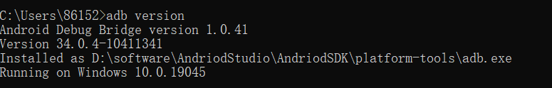
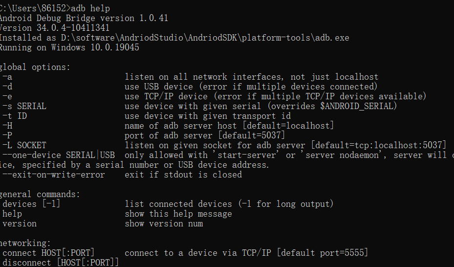
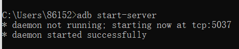
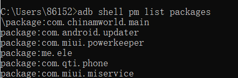
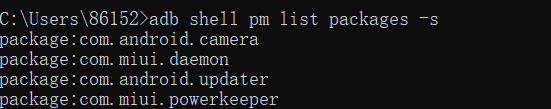
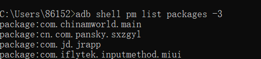
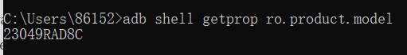
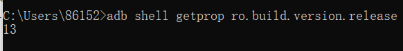
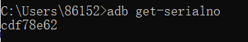
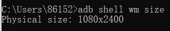

# adb命令

## adb是什么？

ADB 全称为 Android Debug Bridge，起到调试桥的作用，是一个客户端-服务器端程序。其中客户端是用来操作的电脑，服务端是 Android 设备。ADB 也是 Android SDK 中的一个工具，可以直接操作管理 Android 模拟器或者真实的 Android 设备。

## adb基本命令

### adb version 查看 adb版本

### adb help 查看adb支持的所有命令

### adb start-server 启动adb服务

### adb kill-server 终止adb服务

### adb shell 进入adb运行环境

### adb root 以root权限重启adb

### adb devices

### adb connect 设备号

### adb reboot [bootloader|recovery] 

重启设备,可选参数进入bootloader(刷机模式)或recovery(恢复模式)

## apk操作指令

### adb shell pm list packages 显示所有包名

### adb shell pm list packages -s 显示系统应用包名

### adb shell pm list packages -3 显示第三方应用包名

### adb install <apk 文件在电脑中绝对路径>   

将本地 apk 软件安装到设备上

### adb uninstall -k <package_name>

卸载设备上的APK -k的做用为卸载软件可是保留配置和缓存文件

### 启动Activity

adb shell am start -n <package_name>/.<activity_class_name>

## 文件操作指令

### adb push<本地路径><手机端路径>  本地文件/文件夹复制到手机

### adb pull<手机端文件><本地路径>   手机文件/文件夹复制到本机

## 日志操作指令

### adb logcat -v time >D: logs\logcat.log

输出实时日志并保存在本地文件，通过 Ctrl+C 来停止。抓取日志的步骤:先输入命令启动日志，然后操作 App，复现 bug，再ctrl+c 停止日志，分析本地保存的文件

### adb bugreport >D: logs\ bugreport.log

输入指令后开始抓取 Log，不需要按 Ctrl+C 来停止，会自动化停止 Log 打印，并将日志文件保存在本地。抓取日志的步骤:主要抓取执行命令时往前10分钟左右的日志信息，所以在出现 bug后立即采用此方法才有效，问题出现时间太长不建议使用此方法

## 系统操作指令

### adb shell getprop ro.product.model

获取设备型号

### adb shell getprop ro.build.version.release

获取安卓系统版本

### adb get-serialno

获取序列号

### adb shell wm size

获取屏幕分辨率

### adb shell screencap -p /sdcard/mms.png

屏幕截图

### adb pull /sdcard/mmspng D:app

将截图导出到本机

