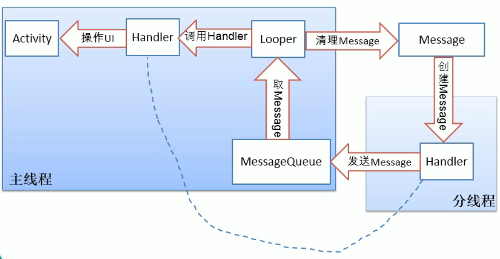

# Android 消息机制

> :email::email::email:Android通过Looper、MessageQueue、Handler来实现消息循环机制。Android的消息机制主要是指Handler的运行机制。Handler的运行需要底层MessageQueue和Looper的支撑。
>
> Android消息循环是针对线程的，Handler用于同一个进程的线程间通信。创建的工作线程默认是没有消息队列和消息循环的。
>
> 消息处理机制本质：**一个线程开启循环模式持续监听并依次处理其他线程给它发的消息**。

## Message

Message 是线程之间传递消息的对象，其内部包含了要传递的内容，最常用的包括 what、arg、callback 等

## MessageQueue

存储消息，在没有 Message 的时候，MessageQueue 借助 Linux 的 nativePoll 机制，阻塞等待，直到有 Message 进入队列

## Looper

轮询消息队列，通过loop()调用MQ.next()方法取出Message，对 Message 进行 Delivery 和 Dispatch，最终发给对应的 Handler 去处理。

`由于 Looper 中应用可以在 Message 处理前后插入自己的 printer，所以很多 APM 工具都会使用这个作为性能监控的一个切入点，具体可以参考 Tencent-Matrix 和 BlockCanary`

## Handler

发送和处理Message

### Handler多线程通信机制

