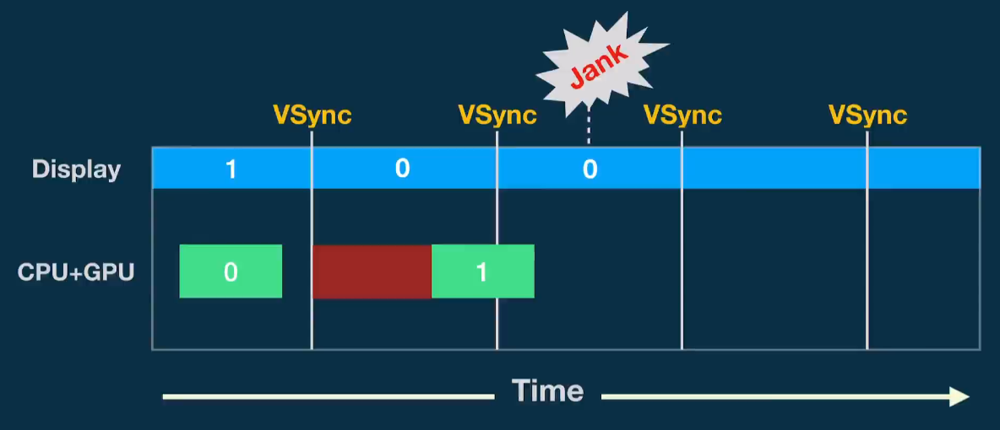
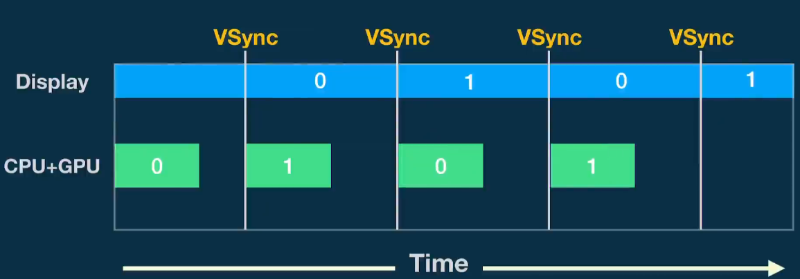
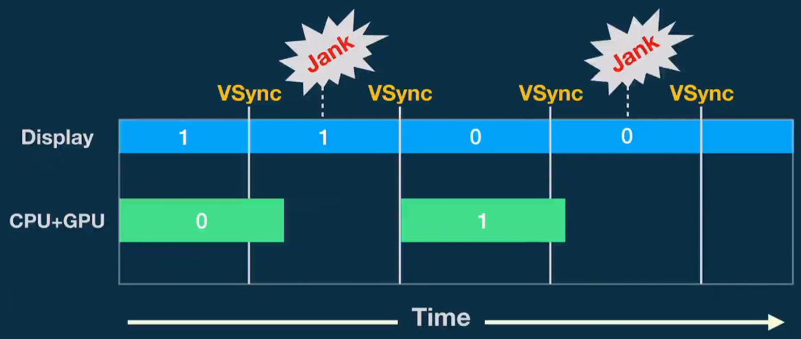
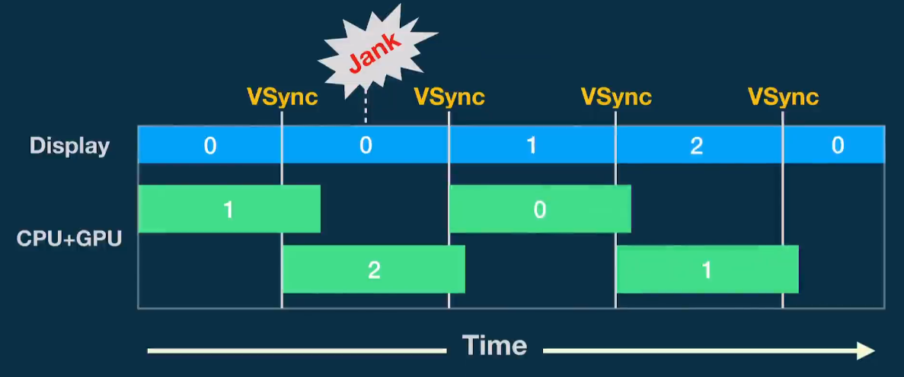

# 安卓渲染机制

## 显示系统基础知识

在一个典型的显示系统中，一般包括CPU、GPU、Display三个部分，

CPU负责计算帧数据，把计算好的数据交给GPU，

GPU会对图形数据进行渲染，渲染好后放到buffer(图像缓冲区)里存起来，

Display（屏幕或显示器）负责把buffer里的数据呈现到屏幕上。

## Tearing

显示器并不是一次性将画面显示到屏幕上，而是从上到下逐行扫描显示。

屏幕显示一部分帧信息后，帧缓冲区被更新，屏幕继续向下显示缓冲区新的帧，当屏幕刷新时，此时它并不知道buffer的状态，因此从buffer抓取的帧并不是完整的一帧画面，一个屏幕内的数据来自2个不同的帧，画面会出现撕裂感。简单说就是Display在显示的过程中，buffer内数据被CPU/GPU修改，导致画面撕裂。

出现tearing的原因：帧缓冲区会被写入，也会被屏幕读取，类似并发中的临界资源；

加锁会导致UI流畅度大大降低，可以将写入的buffer和读取的buffer分开，即Double Buffer

## SurfaceFlinger 合成显示

`SurfaceFlinger`作为系统中独立运行的一个`Native`进程，**其职责就是负责接受来自多个来源的数据缓冲区，对它们进行合成，然后发送到显示设备**。

### BufferQueue机制

`BufferQueue`是一个**典型的生产者-消费者模型中的数据结构**。在`Android`应用的渲染流程中，应用是“生产者”，而`SurfaceFlinger`是“消费者”，**其配合工作的流程如下**：

1. dequeue(生产者发起) ：应用进程中在开始界面的绘制渲染之前，需要通过`Binder`调用`dequeueBuffer`接口从`SurfaceFlinger`进程中管理的`BufferQueue` 中申请一张处于`free`状态的可用`Buffer`，如果此时没有可用`Buffer`则阻塞等待；
2. queue(生产者发起)：应用进程中拿到这张可用的`Buffer`之后，选择使用`CPU`软件绘制渲染或`GPU`硬件加速绘制渲染，渲染完成后再通过`Binder`调用`queueBuffer`接口将缓存数据返回给应用进程对应的`BufferQueue`（如果是 `GPU` 渲染的话，这里还有个 `GPU`处理的过程，所以这个 `Buffer` 不会马上可用，需要等 `GPU` 渲染完成的`Fence`信号），并申请`sf`类型的`Vsync`以便唤醒“消费者”`SurfaceFlinger`进行消费；
3. acquire(消费者发起)：`SurfaceFlinger` 在收到 `Vsync` 信号之后，开始准备合成，使用 `acquireBuffer`获取应用对应的 `BufferQueue` 中的 `Buffer` 并进行合成操作；
4. release(消费者发起)：合成结束后，`SurfaceFlinger` 将通过调用 `releaseBuffer`将 `Buffer` 置为可用的`free`状态，返回到应用对应的 `BufferQueue`中。

## Android UI渲染发展

### 1. Prior to Android 4.1

Android 4.1之前 使用 Double Buffer，之后使用Triple Buffer

由于图像绘制和读取使用的是同一个缓冲区，所以屏幕刷新时可能读取到的是不完整的一帧画面，使用Double Buffer解决，让绘制和显示器拥有各自Buffer ：Back Buffer 和 Front Buffer。

GPU 将完成的一帧图像数据写入到 Back Buffer，而显示器使用 Front Buffer，当屏幕刷新时，Front Buffer 并不会发生变化，Back Buffer 根据屏幕的刷新将图形数据 copy 到 Front Buffer，copy实际是交换各自的内存地址。**屏幕最后一行扫描显示完成，回到顶部自上而下扫描的间隙  叫做 VerticalBlanking Interval (VBI)；这是交换buffer 内存地址 的最好时机**

>  如何控制这个交换内存地址的时机？
>
> Android4.1后引入了 VSync，**在屏幕最后一行扫描显示完毕后，立刻发送一个同步信号 VSync 通知 帧buffer进行指针交换**。

一般来说，在同一个 View Hierarchy 内的不同 View 共用一个 Window，也就是共用同一个 Surface。

每个 Surface 都会有一个 BufferQueue 缓存队列，但是这个队列会由 SurfaceFlinger 管理，通过匿名共享内存机制与 App 应用层交互。

1. 每个 Surface 对应的 BufferQueue 内部都有两个Buffer，一个用于绘制一个用于显示。系统会把内容先绘制到离屏缓冲区（OffScreen Buffer），在需要显示时，才把离屏缓冲区的内容通过 Swap Buffer 复制到 Front Graphic Buffer 中。
2. 这样 SurfaceFlinge 就拿到了某个 Surface 最终要显示的内容，但是同一时间可能会有多个 Surface。这里面可能是不同应用的 Surface，也可能是同一个应用里面类似 SurfaceView 和 TextureView，它们都会有自己独立的 Surface。
3. 这个时候 SurfaceFlinger 把所有 Surface 要显示的内容统一交给 Hardware Composer，它会根据位置、Z-Order 顺序等信息合成为最终屏幕需要显示的内容，而这个内容会交给系统的帧缓冲区 Front Buffer 来显示（Front Buffer 是非常底层的，可以理解为屏幕显示的抽象）

### 2. After Android 4.1 

黄油计划从android4.1引入，主要有三个部分：VSync、Choreographer和Triple Buffer

#### VSync机制

`Vysnc`垂直同步是`Android`在“黄油计划”中引入的一个重要机制，本质上是为了协调`BufferQueue`的应用生产者生成UI数据动作和`SurfaceFlinger`消费者的合成消费动作，避免出现画面撕裂的`Tearing`现象。`Vysnc`信号分为两种类型：

1. VSync-app：**`app`类型的`Vysnc`信号由上层应用中的`Choreographer`根据绘制需求进行注册和接收，用于控制应用UI绘制上帧的生产节奏**；应用在UI线程中调用invalidate刷新界面绘制时，需要先透过`Choreographer`向系统申请注册app类型的`Vsync`信号，待`Vsync`信号到来后，才能往主线程的消息队列放入待绘制任务进行真正UI的绘制动作
2. VSync-sf：**`sf`类型的`Vsync`是用于控制`SurfaceFlinger`的合成消费节奏**。应用完成界面的绘制渲染后，通过`Binder`调用`queueBuffer`接口将缓存数据返还给应用对应的`BufferQueue`时，会申请`sf`类型的`Vsync`，待`SurfaceFlinger` 在其UI线程中收到 `Vsync` 信号之后，便开始进行界面的合成操作。

#### Choreographer

用于控制帧的生成节奏，使得尽量在VSync信号到来时，CPU/GPU就开始制作帧数据

双缓冲区： Buffer 0 和 Buffer 1

1. 显示Buffer 1的帧信息，渲染Buffer 0 
2. 第一个VSync信号到来，交换Buffer 0 ,Buffer 1缓冲区，显示Buffer 0 ，渲染Buffer 1
3. 第二个VSync信号到来，由于Buffer 01未准备好，无法交换指针，继续显示 Buffer 0的信息，出现**卡顿**(连续两帧或多帧相同)

Android 4.1之前的VSync机制没有与帧的生成时机进行联动，渲染Buffer可能会超过两个VSync时间间隔，出现卡顿

黄油计划引入了**Choreographer**对此进行优化，**Choreographer**会请求VSync信号，在VSync信号到来之时去进行帧的生成工作，使得帧的生成时机与显示时机更加紧凑，减少卡顿的发生；如下图

#### Triple Buffer

##### 为什么有Triple Buffer

**相比于Double Buffer ，Triple Buffer减少了掉帧的发生，降低了掉帧的概率**

对于Double Buffer双缓存下,如果CPU 和  GPU 资源紧张， 生产一帧的时间不可能总是小于两个VSync之间的间隔：如下图

1. 生成Buffer 0 中的帧数据
2. 第一个VSync到来，Buffer 0中的数据没有生成好，继续显示Buffer 1的；掉帧+1
3. 第二个VSync到来，显示Buffer 0 中的帧数据，生成Buffer 1中的帧数据
4. 第三个VSync到来，由于Buffer 1还没有生成完毕，继续显示上一帧的Buffer 0中的数据，掉帧+1

Double Buffer + VSync + Choreographer 机制下的限制：即使帧数据生成了，也必须等到下一个VSync到来时消费掉这次的帧数据，才可以生产下一帧数据，这导致了从  绘制一帧完毕 ->下一个VSync到来前的一段时间被浪费掉，容易产生掉帧现象。

优化方案：再添加一个帧缓冲区  Buffer;如下图

1. 屏幕显示Buffer 0 中帧数据，生成Buffer 1中帧数据
2. 第一个VSync到来：Buffer 1中帧数据没有生成完，继续显示Buffer 0中帧数据，CPU/GPU还有资源，继续生成Buffer 2中帧数据
3. 第二个VSync到来：显示Buffer 1中帧数据，生成Buffer 0中帧数据
4. 第三个VSync到来：显示Buffer 2中帧数据，生成Buffer 1中帧数据

相比于Double Buffer ，Triple Buffer减少了掉帧的发生，降低了掉帧的概率，但是没有降低因为帧生成过长导致的画面延迟问题

`在目前的大部分系统上，每个应用都有三个 Buffer 轮转使用，来减少由于 Buffer 在某个流程耗时过长导致应用无 Buffer 可用而出现卡顿情况`

##### Triple Buffer的好处

1. **缓解掉帧**：对比Double Buffer 中SurfaceFlinger 无法及时合成Buffer，导致掉帧，Triple Buffer缓解了掉帧的发生
2. **减少主线程和渲染线程等待时间**：Double Buffer有时必须等SF释放Buffer后，才能获取Buffer进行生产，UI Thread 与 RenderThread 等待SF释放Buffer，延后了主线程执行时间
3. **降低 GPU 和 SurfaceFlinger 瓶颈**：充分利用GPU和SF的”闲暇“时机
