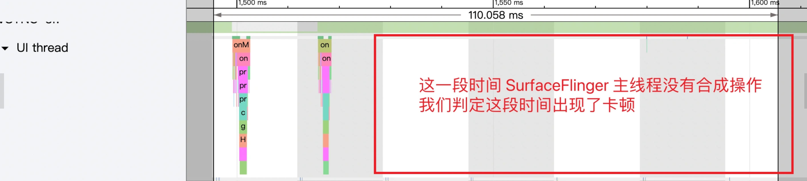
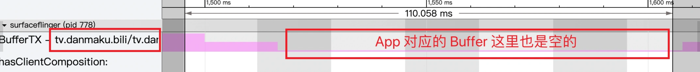

# 流畅性分析——Systrace

## 1、卡顿的原理

什么是卡顿？

FPS是衡量系统流畅度的一个指标，60fps表示1s内画面更新60次，在用户看来是流畅的，如果1s内的画面更新次数小于60次，也就是掉帧Jank，在用户的角度就是卡顿。

## 2、一帧在Systrace中的表现

> 绿帧：1个Vsync周期内完成
>
> 黄帧：超过1个Vsync周期完成；可能导致卡顿
>
> 红帧：超过2个Vsync周期完成；很可能导致卡顿

一帧的合成在Systrace中表现：

1. Vsync-app信号到达，Choreographer通知主线程进行一帧的绘制
2. App主线程开始一帧的绘制，处理input、animation、draw(一个displayList集合)
3. 主线程工作完成后，渲染线程开始工作，dequeueBuffer取出空闲Buffer，进行渲染，queueBuffer放回BufferQueue，Swap Buffer
4. Swap Buffer后，app的launcher中可以看到自身可用的Buffer个数增加
5. Vsync-sf信号到达，SurfaceFlinger主线程开始一帧的合成
6. SurfaceFlinger与HWC共同完成一帧的合成，交给屏幕显示

## 3、卡顿的定义

1. 现象：App连续动画 or 滑动列表，连续 2 帧 or 2帧 以上 app画面都没有更新，认为发生卡顿
2. SF：在Vsync到来时，surfaceflinger没有可以用作合成的Buffer，这个Vsync周期内SF就不会去合成这个app的帧，可能会合成其他后台app的Buffer(其他app有可用的Buffer)，这样下一个Vsnc到来，还是显示上一帧画面，认为发生卡顿
3. app：RenderThread在一个Vsync周期内没有queueBuffer到SF中app对应的BufferQueue中，认为发生了卡顿

> 逻辑卡顿：正常渲染，app也有可用Buffer给SF去合成，但是Buffer中内容与上一帧Buffer内容相同，在用户看来是发生了卡顿。一般是APP自身代码逻辑问题。

## 4、Systrance卡顿问题分析套路

1. **抓取trace**：可以用 shell 或者手机自带的工具()来抓取

2. **在 Chrome 中打开 Systrace 文件：trace.html**

   [Systrace]: chrome://tracing/
   [Perfetoo]: https://ui.perfetto.dev/

3. 了解卡顿问题发生背景，提高分析效率：

   1. 用户 or 测试 的操作流程
   2. 卡顿复现概率
   3. 竞品机器是否有同样的卡顿问题

4. 检查systrace，了解基本信息

   1. CPU 频率、架构、Boost 信息等
   2. 是否触发温控：表现为cpu 频率被压低
   3. 是否是高负载场景：表现为 cpu 区域任务非常满
   4. 是否是低内存场景：表现为 lmkd 进程繁忙，App 进程的 HeapTaskDeamon 耗时，有很多的 Block io

5. 定位App进程在Systrace中位置

   1. 首先看App进程：App进程主要看UI Thread 和 RenderThread。找到每一帧耗时

   2. 所有超过一个Vsync周期的doFrame耗时，都需要检查是否真的发生掉帧，没有掉帧要分析原因

      (黄帧超过1Vsync,红帧超过2Vsync)

   3. Vsync与刷新率对照

      - 60fps 对应的 Vsync 周期是 16.6ms

      - 90fps 对应的 Vsync 周期是 11.1ms

      - 120fps 对应的 Vsync 周期是 8.3ms

        

6. 分析SurfaceFlinger进程的主线程 与 Binder线程

   1. 由于多Buffer机制，UI Thread 与 Render Thread 超过一个Vsync，也不一定会卡顿；因此我们需要查看SurfaceFlinger进程的主线程，是否有合成Buffer的动作

      

   2. 如果SF主线程没有合成Buffer，查看Systrace中的SurfaceFlinger进程区域，查看对应的App的可用Buffer个数

      

7. 从整机角度 和 Binder调用角度
   1. 如果是App 自身执行耗时，那么只需要把耗时的部分涉及到的 View 找到，进行代码或者设计方面的优化就可以了
   2. 如果App进程 的 主线程出现大量的Runnable or Binder调用时，也会导致App出现卡顿，这是需要分析整机问题，看是什么原因导致Runnable/Binder调用耗时

## 5、滑动桌面卡顿问题实例分析

1. 分析Input时间

   一次滑动的 input 事件由一个 Input Down 事件 + 若干个 Input Move 事件 + 一个 Input Up 事件组成

   

2. 分析主线程

   黄帧 or 红帧 不一定会发生卡顿，只看主线程无法确定

   

3. 分析渲染线程

   1. 查看RenderThread耗时 和 RenderThread线程状态
   2. 如果是running，这一帧耗时的原因可能是：
      1. RenderThread本身耗时，任务繁忙
      2. CPU频率低，或 RenderThread任务跑到小核

4. SurfaceFlinger

   分析SurfaceFlinger时，主要注意App的可用Buffer和 SF的合成情况

   - 查看App对应的BufferQueue中的Buffer个数，可以知道在SurfaceFlinger主线程中，App是否有可用Buffer供SurfaceFlinger消费合成

   - 查看SurfaceFlinger主线程的合成情况。查看SF在Vsync-sf到来时 有没有进行合成工作，就可以判断这一帧是否有卡顿

     判断是否出现卡顿：

     1. 如果SF主线程没有合成，App在Vsync周期内正常工作，但是App对应的BufferQueue中没有可用Buffer——卡顿出现

     2. 如果SF主线程进行合成，App在Vsync周期内正常工作，但是App对应的BufferQuue中没有可用Buffer——卡顿出现

        SF能够正常合成，是因为后台其他App对应的BufferQueue中有可用Buffer，SF为其他app提供了帧

     3. SF主线程进行合成，App在Vsync周期内正常工作，App对于BufferQueue有可用Buffer——正常情况

        |             1、SF没有合成 + App BQ 中 没有Buffer             | 2、SF合成+App BQ 中 没有 Buffer                              | 3、SF合成 + App BQ中 有 Buffer                               |
        | :----------------------------------------------------------: | ------------------------------------------------------------ | ------------------------------------------------------------ |
        |  |  |  |

        

5. 回到渲染线程

   1. 桌面滑动负载不高，排除RenderThread本身耗时的可能
   2. 查看RenderThread跑在CPU中的情况

6. 分析CPU信息

   

   1. 查看RenderThread在CPU哪个核上跑：图中是CPU 0 与 CPU 2 对应的是处理器小核
   2. 查看核上对应的频率，案例为小核当前为1.8hz
   3. 查看是否有 boost介入，如果没有：可能是就算CPU0 和 CPU2小核跑满，也无法在一个Vsync内完成任务

   验证猜想：

   1. 对比其他正常帧，是否有跑在小核的，如果RenderThread有跑在小核的,并且没有掉帧，那么推断错误
   2. 对比其他异常帧，看掉帧原因是否是因为RenderThread任务跑到了小核里，如果不是，那么推断错误

   如果是RenderThread任务跑到小核：跟调度器有关，大小核调度与负载有关，调度器有参数和算法控制

   1. 调整大小核迁移的阈值 or 切换调度器算法
   2. 参考竞品

## 6、主线程为什么要等待渲染线程？

## 7、为什么一直滑动不松手就不会卡？

## 8、如果不卡，如何衡量app性能？

在两台机器中测试一个app

1. 确定要测试的包名，到App界面准备好操作
2. 执行2-3次 `adb shell dumpsys gfxinfo com.miui.home framestats reset`
3. 开始操作（比如使用命令行左右滑动，或者自己用手指滑动）
4. 操作结束后，执行`adb shell dumpsys gfxinfo com.miui.home framestats`
5. 重点关注：
   1. **Janky frames** ：超过 Vsync 周期的 Frame，不一定出现卡顿
   2. **95th percentile** ：95% 的值
   3. **HISTOGRAM** ： 原始数值
   4. **PROFILEDATA** ：每一帧的详细原始数据

