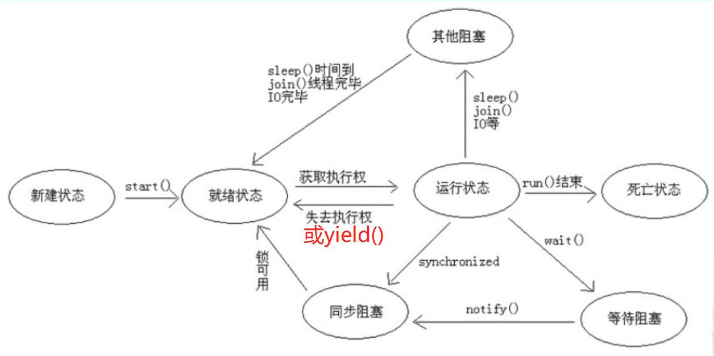
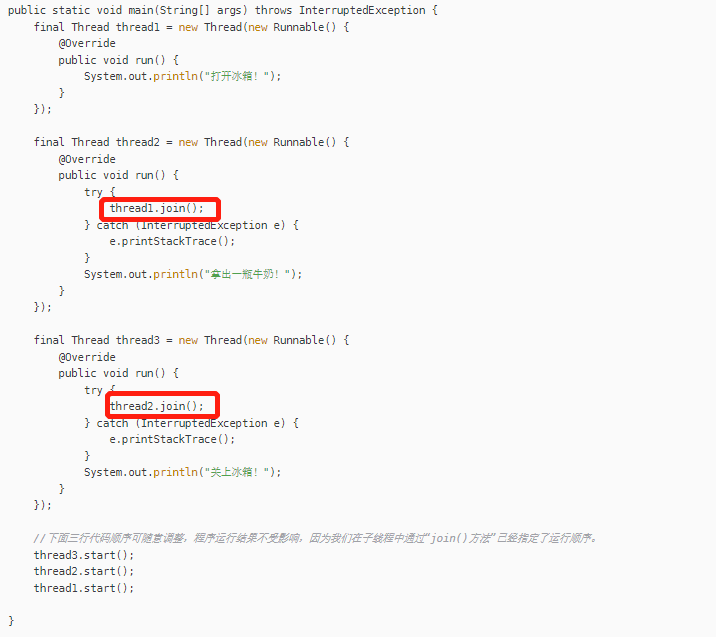
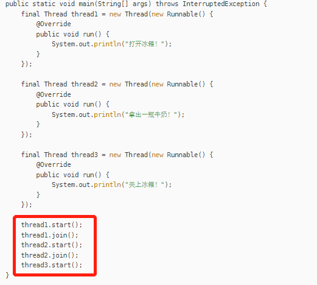
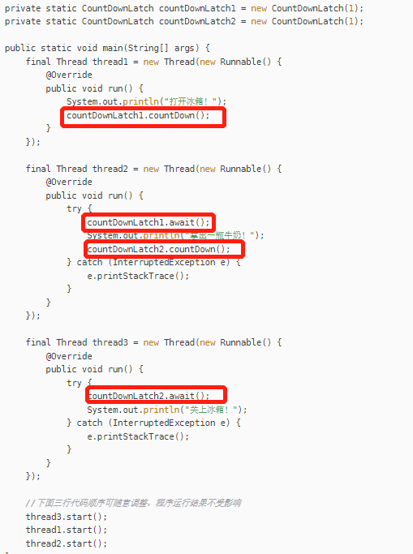
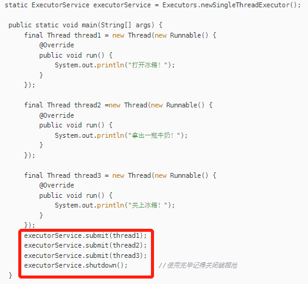

# 多线程面试题

### 进程、线程、协程

- 进程是在运行中的程序，进程是操作系统分配资源的最小单位，一个系统可以运行多个进程，每个进程都需要占用必要的操作系统的资源才能正常工作
- 线程可以看做是进程的细化分支，线程是操作系统CPU调度的最小单位；线程依赖于进程存在，进程结束，线程也结束。一个进程可以有多个线程，最少有一个主线程，但一个线程只能依赖于一个进程存在
- 协程，也叫微线程，类似的，一个线程也可以有多个协程，协程的调度完全由开发者来控制；协程不是被操作系统管理的，而是由程序控制


一个进程挂掉了，不会对其他进程造成太大的影响，进程有自己独立的地址空间和资源；一个线程挂掉会让整个进程崩溃。所以多进程是比多线程要更健壮的。

一个进程的线程之间是共享地址空间和资源的。而进程之间的地址空间和资源是相互独立的

### 创建线程的方式

- 实现Runnable，重写run方法，Thread(new Runnable)
- 实现Callable，重写call方法，call方法可以有返回值，可以在方法声明处抛出异常,new Thread(new FutureTask(new Callable());
- 继承Thread，重写run方法，Thread()
- 使用线程池ThreadPollExcutor来创建

使用实现接口的方式的话，多个线程可以共享一个target对象。比较适合多个相同的线程来处理同一份资源的情况，将CPU、代码和数据都分开。   劣势：编译复杂了，要访问当前线程的话，就必须Thread.currentThread方法

使用继承的方式，编写简单，直接this就可以了，   劣势：java是单继承的

### start()与 与 run() 区别

start（）方法来启动线程，无需等待 run 方法体代码执行完毕，可以直接继续执行下面的代码。

在new一个Thread的时候，线程进入了新建状态；调用start会执行线程的相应准备工作，然后再自动执行run方法，（就是在调用start方法的时候，会启动一个线程并使线程进入就绪状态，当分配到时间片之后就开始运行）

执行执行run方法的话，是不会创建线程的，会把run方法当做一个main线程下的普通方法去执行，并不会再某个线程中执行它


### Runnable和Callable的区别

Callable规定重写的方法是call().Runnable规定重写的方法是run()

Callable 可以有返回值，借助FutureTask类来获取返回的结果

Call方法可以抛出异常，run不行

运行Callable任务可以拿到一个Future对象，表示异步计算的结果。它提供了检查计算是否完成的方法，以等待计算的完成，并检索计算的完成。通过Future 对象可以了解任务执行的情况，可取消任务的执行，还可以获取执行结果

Callable仅在jdk1.7中引入，目的就是为了来处理Runnable不支持的情况。Callable接口是可以返回结果或抛出检查异常的。

Runnable接口是不会返回结果或抛出异常的

如果任务不需要返回结果或抛出异常就推荐使用Runnable。代码简洁

```java
//创建线程要执行的任务
MyThread myThread = new MyThread();
//Callable接口实现的要靠FutureTask来转换一下
FutureTask<Integer> futureTask = new FutureTask<>(myThread);
//转换后的任务创建为线程
Thread thread = new Thread(futureTask);
//启动线程
thread.start();
//通过FutureTask可以获得线程里面的返回值。
Integer integer = futureTask.get();
```


### 为什么使用多线程

虽然多进程比多线程更加安全，但是多进程需要的资源更多，切换和调度比不上多线程

从计算机底层来说，线程是可以比作是轻量级的进程，是程序运行的最小单位，线程之间的切换和调度时远远比小于进程的。多核CPU意味着多个线程是可以同步执行的，这就更大大的减少了线程之间的上下文切换

多线程并发编程是现在开发高并发系统的基础。

在单核时代多线程主要是为了提高CPU和IO之间的设备利用率；多核时代为了提高CPU的利用率

### 线程的生命周期

新建、就绪、运行、阻塞、死亡

阻塞：等待阻塞，遇到wait()方法，使线程进入到等待阻塞的状态。同步阻塞，线程在获取synchronized同步的时候失败了（锁被其他的占用）。其他阻塞：通过调用线程的sleep()或join()方法或发出IO请求时

### 死锁

互斥条件：该资源任意一个时刻只能有一个线程占有

请求和保持条件：一个进程因请求资源而阻塞的，对已获得的资源保持不放

不可剥夺条件：线程在已获得的资源在未使用完之前不能被其他线程强行剥夺。只有自己使用完毕后才释放资源

循环等待条件：若干个进程之间形成一种头尾相接的循环等待资源确认就可以了

**避免**：

互斥条件避免不了

破坏请求和保持条件：一次就申请所有的资源。 

破坏不可剥夺条件：进一步申请资源的时候，申请不到，释放手里所有资源。 

破坏循环等待条件：靠按序申请资源来预防。按某一顺序申请资源，释放资源则反序释放，破坏循环等待条件。  

锁排方法：指定获取锁的顺序，比如某个线程在只有同时获得A锁和B锁的情况下，才可以对某些元素进行操作。在多线程条件下，通过指定锁的获取顺序，比如规定，只有获得A锁的线程才有资格获得B锁，按顺序获取锁就可以避免锁。  使用显式锁中的ReentrantLock,try(long,TimeUnit)来申请锁。

### shutdown和shutdownNow

shutdown是关闭线程池，线程池不会再接受新的任务，但是在队列当中中的任务要执行完，线程池的状态就变为shutdown

shutdownNow 线程池的状态就变为stop状态，线程池会终止当前正在运行的任务，并停止处理线程池中的任务，并返回正在等待的list，  原理就是变量线程池中的工作线程，然后逐个调用线程的 interrupt 方法来中断线程，所以无法响应中断的任务可能永远无法终止

### isTerminated和isShutdown的区别

isShutDown 调用 shutdown 方法后返回true

isTerminated 调用shutdown 方法后，并且所有提交的任务完成后返回true。

### sleep()和wait()

sleep方法，是Thread类的静态方法，让当前线程暂停一段时间，进入阻塞状态，让别的线程运行，时间结束进入就绪状态，睡眠过程是不释放锁的。

wait方法，是Object类的方法，必须是与synchronized一起使用的，线程进入阻塞状态，当notify或notifyall被调用后，会结束阻塞，但是只有重新占用互斥锁之后才可以进入就绪状态，等待的时候，会释放互斥锁。

sleep不释放锁，wait释放锁

sleep通常用于暂停 wait通常用于线程之间交互/通信

sleep方法执行完成之后，线程会自动苏醒，或者可以使用wait(long timeout)超时的时候线程会自动苏醒的，wait方法被调用之后，线程不会自动苏醒，需要别的线程调用同一对象去唤醒。

两个都可以暂停线程的执行。

### yield()、join()

- yield()：线程让步，让当前线程回到就绪状态，只需要等待重新获取CPU执行时间，不会释放锁；这个方法会暂停当前线程，放弃自己占有的CPU，让其他相同优先级的线程有机会执行，是一个静态方法，不能保证使其它线程一定能占用上CPU，执行yield()线程也可能在进入到暂停状态后马上就执行
- join()：有线程加入时，主线程进入等待状态，一直到调用join()方法的线程结束，主线程恢复；底层调用了wait()，所以可以一直等待


### 线程生命周期


### 线程状态转换




### volatile 如何保证可见性和有序性

前期：总线锁  后面：MESI缓存一致性协议

volatile方法：保证变量对所有线程的可见性，当volatile变量被修改的时候，新值就会对所有的线程通知立即更新。或者在多线程情况之下使用了volatile修饰的变量的值一定是最新的

在jdk5之后volatile完全避免了指令重排优化，实现了有序性

**原理**：获取JIT（java编译器）的汇编代码，发现volatile多加了lock addl指令，这个操作相当于一个内存的屏障使得lock指令后的指令不能重排序到内存屏障前的位置。也是在jdk5之后可以使用双锁检测实现单例模式。lock前缀的另一层含义就是使得本线程内存中的volatile变量值立即写入到主内存当中，并且使得其他线程共享该volatile变量无效化。使得其他线程必须重新从主内存中读取该变量值。

### 线程阻塞的三种情况

等待阻塞 RUNNING 状态的线程执行Object.wait方法，JVM会将线程放入等待序列

同步阻塞 在获取对象的同步锁的时候，若该同步锁被其他线程占用着，则JVM就将线程放入锁池当中	。

其他阻塞 执行sleep、wait、发出IO请求，JVM会将其设置为阻塞状态

### 线程死亡的三种情况

正常结束 run或call方法执行完

异常结束 线程抛出一个未捕获的Exception 或Error，导致线程异常结束

调用stop方法。这个方法容易造成死锁

### Fork/Join框架

设置JDK7之后提供的一个用于并行执行任务的框架，是一个把大任务分割为若干个小任务，最终汇总每个小任务结果后得到的大任务结果的框架

**分而治之**和**工作窃取算法**

工作：在把大任务拆分为小任务的时候，放到不同的队列执行的时候，交由不同的线程分别执行的时候，有的线程优先把自己负责的任务执行完了，其他线程还在慢悠悠处理自己的任务，这时为了提高自己的效率就用到这个算法

某个线程从其他队列中窃取任务进行执行，一般是做的快的线程抢慢的线程任务做，为了减少锁竞争，采用的是双端队列

### CAS

即比较并交换，是一条CPU同步原语，是一种硬件对并发的操作，针对多处理器操作而设计的一种特殊的指令

CAS就是一种无锁的非阻塞算法的实现

3个操作数：需要读写的内存值V，旧的预期值A，要修改的更新值B

当且仅当V的值等于A的时候，CAS通过原子方式用新值B来更新V的值，否则就不会执行任何操作（它的功能就是判断内存某个位置的值是否为预期值，如果是则更改，这就是原子性）

JVM是帮助我们执行CAS汇编指令，一种依赖于硬件的功能，是由若干条指令发布的。用于完成某个功能的一部分，并且原语的执行必须是连续的，在执行过程中不允许被中断，CAS是一条CPU的原子指令。

**缺陷**

ABA问题： 通过AtomicStampedReference去解决这个问题的，就是带有标记的原子应用类，通过控制变量的值来保证CAS的正确性

循环时间长开销 自旋的CAS，如果一直循环，会给CPU带来非常大的执行开销。在这个里面加上自旋次数

只能保证一个变量的原子操作。  如果对多个变量操作的时候，CAS是无法直接保证操作的原子性操作的。

通过互斥锁来保证原子性。将多个变量疯转为一个对象，通过AtomicReference来保证原子性。

### synchronized和volatile的区别

volatile是保证可见性的，synchronized是解决是执行控制的问题，它会阻止其他线程获取当前对象的监控，这样一来就让当前对象中被synchronized关键字保护的代码块无法被其他线程访问，也就是无法并行执行

synchronized会创建一个内存屏障，内存屏障执行保证了所有CPU操作结果都会执行刷到主存当中，从而保证操作的内存可见性。

1. volatile关键字是线程同步的轻量级实现，所以volatile性能肯定比synchronized要好；volatile只能修饰变量，而synchronized可以修饰方法，代码块。随着JDK新版本的发布，synchronized的执行效率也有较大的提升，在开发中使用synchronized的比率还是很大的。
2. 多线程访问volatile变量不会发生阻塞，而synchronized可能会阻塞。
3. volatile能保证数据的可见性，但是不能保证原子性；而synchronized可以保证原子性，也可以保证可见性。
4. 关键字volatile解决的是变量在多个线程之间的可见性；synchronized关键字解决多个线程之间访问公共资源的同步性。
5. volatile本质是告诉JVM当前变量在寄存器中的值是不确定的，需要从主存中读取，synchronized 则是锁当前变量，只有当前线程可以访问该变量，其他线程被阻塞
6. volatile标记的变量不会被编译器优化，synchronized可以被编译器优化

### synchronized和lock

synchronized可以给类、方法、代码块加锁。lock只能给代码块加锁

synchronized不需要手动获取锁和释放锁，使用简单，发生异常会自动释放锁，不会造成死锁。Lock需要自己去加锁和释放锁，如果使用不当的没有unLock去释放锁的话，会造成死锁

通过Lock可以知道有没有成功获取锁，而synchronized却无法办到

### synchronized和ReentrantLock

都是可重入锁，在一个线程中可以多次获取同一把锁，一个线程在执行的时候，调用了另一个带有相同锁的方法，无须重新获得锁，直接运行，没进入一个线程，锁的计数器就加1。

synchronized依赖于JVM，ReentrantLock依赖于API（需要lock和unlock配合try/finally 去做

ReentrantLock比synchronized高级一点：

等待可中断。通过lock.lockInterruptibly来实现这个机制，也就是说正在等待的线程可以选择放弃等待

可实现公平锁，先等待的线程先获得锁，通过ReentrantLock(boolean fair)构造方法来实现是否公平（默认非公平)

可实现选择性通知，ReentrantLock类线程对象可以注册在指定的Condition中，从而可以有选择性的进行线程通知，在调度线程上更加灵活。    在使用notify/notifyAll方法进行通知。被通知的线程是由JVM选择的。用ReentrantLock结合Condition实例可以实现“选择性通知”


### ReentrantLock实现原理

ReentrantLock是可重入的排他锁，为了解决多线程对于共享资源竞争的问题

可重入：获得锁的线程在释放锁之前再次竞争同一把锁的时候，不用加锁可以直接访问；AQS中有一个变量来保存当前获取锁的线程，当该线程再次来竞争这把锁的时候，不会走锁的竞争逻辑，直接增加重复次数

支持公平锁和非公平锁

提供了阻塞竞争锁lock()和非阻塞竞争锁tryLock()的方法

- 通过互斥变量，使用CAS机制来实现的
- 没有竞争到锁的线程进入AQS的等待队列，底层是一个双向链表，锁释放后，唤醒等待队列中头部的等待线程
- 公平锁需要判断等待队列中是否有等待线程，非公平锁不需要判断

### ReentrantLock锁如何实现公平锁和非公平锁

- 公平锁：竞争锁资源的线程，严格按照请求的顺序来分配锁
- 非公平锁：允许线程可以插队竞争，不用按照请求顺序来


ReentrantLock默认使用非公平锁

内部使用了AQS来实现锁资源的竞争，竞争锁资源失败的线程会加入到AQS的同步队列中(一个FIFO的双向链表)

公平锁的实现是如果AQS等待队列中有线程，就加入到队列尾部进行等待

非公平锁的实现是不管队列中有没有线程，都会先去尝试竞争锁资源，竞争失败的话就会加入到队列尾部进行等待


**为什么这样设计？**


```java
public class ReentrantLock implements Lock, java.io.Serializable
```

核心结构--3个内部类

```java
//继承AQS的同步类
abstract static class Sync extends AbstractQueuedSynchronizer{}
//公平锁
static final class FairSync extends Sync {}
//非公平锁
static final class NonfairSync extends Sync {}
```

lock()方法

```java
public void lock() {
	//调用内部类Sync的lock()方法，
   sync.lock();
}
```


### synchronized

修饰普通方法、静态方法、代码块

原子性：确保线程互斥  

可见性：对一个变量unlock操作之前，必须要同步到主内存中，如果一个变量进行lock操作，就清空工作内存中此变量的值，在执行引擎使用此变量前，需要重新从主存中load操作或assign操作初始化变量值

有序性：一个unlock操作先行发生（happen-before）于后面对同一个锁的lock操作。


### JVM对synchronized的优化/锁升级过程

JDK1.6之前，synchronized通过重量级锁来实现线程之间的锁竞争，这个重量级锁是因为依赖于操作系统底层的Mutex Lock来实现互斥锁的功能，Mutex是系统方法，业务程序调用系统方法时需要从用户态到内核态这样的一个切换，带来性能上的损耗，所以1.6之后，synchronized增加了锁升级的一个机制。


线程访问synchronized同步代码块时，根据线程的竞争情况先去尝试不用重量级锁去保证线程的安全性，所以引入了偏向锁和轻量级锁


1. **无锁**
2. **偏向锁**：(把当前锁偏向与某个线程)只有一个线程访问，该线程自动获取锁(通过CAS机制来修改偏向锁的一个标记，偏向锁适合在同一个线程中多次申请同一个锁资源，没有其他线程来竞争的情况)
3. **轻量级锁**：自旋锁；锁状态为偏向锁时，又有线程访问，锁升级为轻量级锁，通过自旋的方式去尝试获取锁，而不会去进入操作系统内核调用底层方法，自旋锁避免了用户态到内核态带来的开销，不会阻塞线程，提升了效率(不存在竞争，交替获取锁)
4. **重量级锁**：(存在竞争)
   锁状态为轻量级锁时，其他线程自旋到一定次数，线程阻塞，锁升级为重量级锁(默认自旋10次，*–XX:PreBlockSpin修改自旋次数*)
   获取不到锁的线程将阻塞，等待操作系统调度

我认为synchronized锁升级过程是对性能和线程安全做出的平衡；

### 线程池中多个任务如何自定义顺序执行？

- **在子线程中通过`join()`方法指定顺序**
- **在主线程中通过`join()`方法指定顺序**
- **通过倒数计时器`CountDownLatch`实现**

- **通过创建单一化线程池`newSingleThreadExecutor()`实现**


**子线程join()实现**



**主线程join()实现**



**CountDownLatch实现**



**创建单一化线程池`newSingleThreadExecutor()`实现**


