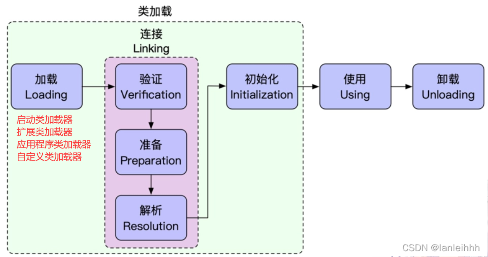

# 1.类加载
## 1. 1类加载子系统
类加载器子系统负责从文件系统或网络中加载 class 文件。
类加载器**ClassLoader只负责 class 文件的加载**，至于是否可以**运行则由执行引擎Execution Engine决定**。
加载的==类信息==存放于一块称为==方法区==（元空间）的内存空间。


## 1.2 类加载的角色

1. class file 存在于硬盘上，可以理解为设计师画在纸上的模板，而最终这个模板在执行的时候是要加载JVM当中来，根据这个模板实例化出n个相同的实例。
2. class file 加载到JVM中，被称为DNA元数据模板，放在方法区中。
3. 在 .class --> JVM --> 最终称为元数据模板，此过程就要有一个运输工具（类加载器--Class Loader）。

## 1.3 类加载的过程




### 1. 加载
1. 通过类名 (地址) 获取此类的二进制字节流。
2. 将这个字节流所代表的**静态存储结构**转换为方法区（元空间）的**运行时结构**
3. 在内存中生成一个代表这个类的java.lang.Class对象，作为这个类的各种数据的访问入口。

### 2. 连接
1. **验证**
检验被加载的类是否有正确的内部结构，并和其他类协调一致。

- **验证文件格式是否一致**：
	class文件在开头有特定的文件标识（``字节码文件都以CA FE BA BE 标识开头``）
	主/次版本号是否在当前Java虚拟机接收范围内
	
- **元数据验证**：
	对字节码描述的信息进行语义分析，以保证其描述的信息符合Java语言规范的要求。
	`例如:该类是否有父类,是否final修饰的类`
2. **准备**
	准备阶段负责为类的静态属性分配内存,并设置默认初始值。
	==不包含用final修饰的static常量，常量在编译时进行初始化==
	
	```java
	public static int value = 100；
	```
	value 在准备阶段后的初始值是 0,而不是 100

3. **解析**
将类的二进制数据中的**符号引用**替换成**直接引用** 
`符号引用是Class文件的逻辑符号，直接引用指向的方法区中的某一个地址`
### 3. 初始化
#### 类在何时初始化？
- ==new==关键字创建类的实例 
`new User()`
- ==反射==创建类的实例
`Class.forName("com.mysql.jdbc.Driver")`
-  ==反序列化==(Serialize)创建类的实例
- 初始化该类的一个子类（会首先初始化父类）
- 访问该类的静态属性或静态方法
- 含有main()方法的类启动时

**注意: 不会发生类初始化的情况**
1、访问该类的==常量==(常量在链接阶段已经存入常量池了)
2、==子类调用父类的静态变量==
3、==定义该类的数组引用==不会初始化该类

#### 类的初始化顺序
- 先初始化静态的,多个静态的按照从上向下的顺序执行
- 若该类由父类，那么先初始化父类中的静态成员/块，再初始化子类中的静态
- 创建对象时，先初始化父类，再初始化子类

初始化顺序:


**我们用代码来验证**
父类
```java
package com.ffyc.forword.jvm.classloader;

public class ClassInitOrder {

    static String s1 = "父类静态变量";
    String s2 = "父类变量";

    static {
        System.out.println(s1);
        System.out.println("父类静态代码块");
    }

    {
        System.out.println(s2);
        System.out.println("父类代码块");
    }

    public ClassInitOrder(){
        System.out.println("父类构造方法");
    }
}
```
子类
```java
package com.ffyc.forword.jvm.classloader;

public class ClassInitOrderChild extends ClassInitOrder{

    static String s1 = "子类静态变量";
    String s2 = "子类变量";

    static {
        System.out.println(s1);
        System.out.println("子类静态代码块");
    }

    {
        System.out.println(s2);
        System.out.println("子类代码块");
    }

    public ClassInitOrderChild(){
        System.out.println("子类构造方法");
    }
}
```
创建子类的实例

```java
	public static void main(String[] args) {
        new ClassInitOrderChild();
    }
```


**对于静态代码块和静态变量,按照顺序自上而下执行**。（如下代码）
```java
	static int num = 10;

    static {
        num = 20;
    }

    public static void main(String[] args) {
        /*num: 
        准备阶段:默认初始化为0
        初始化:对静态变量num赋值为10
        	             赋值为20
        */
        System.out.println(num);//20
    }
```
```java
 	static {
        num = 20;
    }

	static int num = 10;
	
    public static void main(String[] args) {
        /*num: 
        准备阶段:默认初始化为0
        初始化:对静态变量num赋值为20
        	             赋值为10
        */
        System.out.println(num);//10
    }
```
## 1.4 类加载器分类
**按JVM的角度可分为：**
1. ==引导类加载器==（启动类加载器 Bootstrap ClassLoader）`不是Java语言实现的`
2. ==其他所有类加载器== ，这些加载其由Java语言实现，独立存在于虚拟机外部，并全部继承自抽象类：	`java.lang.ClassLoader`.

**按开发人员的角度可分为三层：**
 1. ==启动类加载器==（BootStrap ClassLoader）
 2. ==扩展类加载器== （Extension ClassLoader）
 3. ==应用程序类加载器==（Application ClassLoader）

### 启动类加载器（引导类加载器 BootStrap ClassLoader）
不是继承于 `java.lang.ClassLoader` 没有父加载器（不是Java语言写的，自然也不继承于Java类）

- 这个类加载器使用 C / C++ 语言实现，嵌套在JVM内部，它用来==加载Java核心类库==。
- 负责加载**扩展类加载器**和**应用类加载器**， 并为他们指定父类加载器。
- 只加载存放在`<JAVA_HOME>\lib` 目录 或者被`-Xbootclasspath` 参数所指定的路径中存储的类（出于安全考虑）。


### 扩展类加载器 (Extension ClassLoader)
Java语言编写，由sun.misc.Launcher$ExtClassLoader实现。继承自ClassLoader类。

从 java.ext.dirs 系统属性所指定的目录中加载类库，或从JDK系统安装目录的jre/lib/ext 子目录（扩展目录）下加载类库。如果用户创建的jar放在此目录下，也会自动由扩展类加载器加载。

### 应用程序类加载器(Application ClassLoader)
Java语言编写，由 sun.misc.Launcher$AppClassLoader 实现，继承自ClassLoader类。

加载我们自定义的类，用于加载用户类路径（classpath）上所有的类。

应用程序类加载器是程序中==默认的类加载器==。

```java
	public static void main(String[] args) {
        ClassLoader loader = ClassLoaderDemo.class.getClassLoader();
        System.out.println(loader);
        //sun.misc.Launcher$AppClassLoader 自定义类 由 应用程序类加载器 加载
        System.out.println(loader.getParent());
        //sun.misc.Launcher$ExtClassLoader  扩展类加载器
        System.out.println(loader.getParent().getParent());
        //null   扩展类加载器由引导类加载器 加载 为null是由启动类加载器加载的-->引导类加载器不是Java编写的
        System.out.println(String.class.getClassLoader());//null
        //java系统类库的类的加载器是启动类加载器
    }
```
除启动类加载器外,其余类加载器都是继承自ClassLoader抽象类.
## 1.5 双亲委派机制
Java虚拟机对Class文件采用的是按需加载的方式,即当需要该类时才会将它的class文件加载到内存中生成class对象,而且加载某个类的class文件时,Java虚拟机采用的是==双亲委派==模式,即把请求交由父类处理,它是一种**任务委派模式**。

 
### 双亲委派的工作原理：
1. 如果一个类加载器收到了类加载请求，它并不会自己先去加载，而是把这个请求委托给父类的加载器区执行。
2. 如果父类加载器还存在其他父类加载器，那么再一次向上委托，依次递归，请求最终到大顶层的启动类加载器。
3. 如果父类加载器可以完成类的加载任务，就成功返回，如果父类加载器失败了，将请求交给它的子类加载器去加载。

### 双亲委派的优点：
- 安全，可以避免用户的自定义类动态替换Java核心类。`例如java.lang.String`
- 避免全限定类名的类重复加载（使用了`findLoadClass()` ）判断当前类是否已经加载。

我们来测试自定义一个java.lang.String

测试

在自定义的java.lang包下测试

`错误：发生JNI错误，请检查安装并重试
线程“main”java中出现异常。lang.SecurityException:禁止的包名：java.lang`


在其他包下测试

没有执行自定义String类的构造方法，依然创建的是Java核心类库中的String。
`双亲委派机制保护了Java核心类不被用户自定义类所替换`

### 对双亲委派机制的理解？

JVM有

- 用户自定义类加载器(可以加载指定路径下的类)，继承应用程序类加载器，自己实现；
- 应用程序类加载器(加载当前classpath下的类)；
- 扩展类加载器(加载lib\ext目录下的jar包和class文件)；
- 启动类加载器(加载Java核心类库，rt.jar/resource.jar) c++编写；


双亲委派的原理：

进行类加载时，就算要加载的类不是父类加载器负责的范围，也要委托给父类加载器去加载，一直向上委托给启动类加载器，如果加载不到该类，再依次向下委托给子类加载器去加载，如果一直到用户自定义类加载器也没有加载到，那么会抛出ClassNotFoundException


双亲委派的作用：

- 双亲委派机制可以避免类的重复加载，父类加载到该类的话，会直接返回，子类不会重复加载

- 双亲委派机制保护了Java的核心类库不被自定义的类替换掉


双亲委派的实现：

1. 判断该类是否被加载过
2. 如果没有被加载，如果父类不为空，也就是还没有到达最顶端的类加载器，就将加载请求委托给父类加载器
3. 如果父类为空，也就是已经到达了启动类加载器，由启动类加载器来加载这个类
4. 如果没有加载到，向下委派给子类加载器去加载，一直到最底层，如果加载不到就会抛出ClassNotFoundException

### 如何打破双亲委派机制？

打破双亲委派也就是说：让类加载器可以加载不属于自己加载范围的jar包或class文件

1. **继承ClassLoader，重写loadClass()**方法,实现自定义类加载

   可以自定义要加载的类使用哪个类加载器；改变源码中委托给父类加载器的逻辑，

2. **线程上下文类加载器**，将启动类加载器负责加载的类交给应用类加载器来加载

   通过**Thread**类**setContextClassLoader**()方法设置当前类使用的类加载器的类型

   如：java.jdbc.Driver接口，接口的加载是由启动类加载器负责，但是它由其他数据库厂商去实现，因此就有启动类加载的类由应用类加载器来调用的情况

   

Tomcat中打破双亲委派，实现不同应用之间的资源隔离

- 可能部署多个war包，不同程序之间可能依赖同一个类库的不同版本，需要保证每一个程序的类库都是独立相互隔离的
- 防止web容器自身的类库和应用程序的类库混淆

## 1.6 类的主动使用和被动使用
JVM中规定，每个类or接口被**首次主动使用时才对其进行初始化**，有主动使用，也就有被动使用。

主动使用与被动使用的区别在于==类是否会被初始化==
### 主动使用
- 通过new关键字创建对象
- 访问类的静态变量，或对静态变量进行操作
- 访问类的静态方法
- 对某个类进行反射操作（Class.forName("")）
- 初始化该类的子类
- 执行该类的main()方法


### 被动使用
1. 引用该类的静态常量
	- `public final static int num = 100; //不会导致类初始化，被动使用`
	- `public final static int random = new Random().nextInt(); //会导致类的初始化，主动使用`
2. 构造某个类的数组时，不会导致该类初始化。（`Demo[] demos = new Demo[10];`）

# 2.运行时数据区
##  概述
JVM的运行时数据区,不同的虚拟机实现可能有所不同,但是都会遵从Java虚拟机的规范,Java8 虚拟机规范规定,Java虚拟机所管理的内存将会包含以下几个运行时数据区域:
1.  **程序计数器(Program Counter Register)**
	是一块较小的内存空间,可以看做是==当前线程所执行的字节码的行号指示器==。
2. **Java 虚拟机栈（Java Virtual Machine Stacks)**
	是Java方法执行的内存模型，每个**方法在执行**的同时都会创建一个**栈帧**（Stack Frame）用于				`存储局部变量表，操作数栈，动态链接，方法出口`等信息，每个方法从调用直至执行完成的过程，都对应着一个栈帧在虚拟机栈中入栈到出栈的过程。
	1.  **本地方法栈（Native Method Stack）**
	  与虚拟机栈的作用一样,区别在于**虚拟机栈是服务Java方法的**,而==本地方法栈是为虚拟机调用Native方法服务的==
	
3.  **Java 堆（Java Heap）**
  是Java虚拟机中内存最大的一块,是==被所有线程共享==的,在虚拟机启动时创建,==Java堆唯一的目的就是存放对象实例==,几乎所有的对象实例都在这里分配内存。
4.  **方法区（Methed Area）**
  **用于存储已经被虚拟机加载**的`类信息、常量、静态变量、即时编译后的代码`等数据。 
  方法区是很重要的系统资源，是硬盘和CPU的中间桥梁，承载着操作系统和应用程序的实时运行。
  JVM内存布局规定了Java在运行过程中内存申请，分配、管理的策略，保证了JVM的搞笑稳定运行。不同的JVM对于内存的划分方式和管理机制存在着部分差异，此处使用HotSpot虚拟机为例。
  
  Java虚拟机定义了运行期间会使用到的运行时数据区。
  **其中有一些会随着虚拟机启动而创建，随着虚拟机退出而销毁**。
  另外一些则是与线程一一对应的。**与线程对应的区域会随着线程开始而创建，结束而销毁**


上图中
- **方法区**和**Java 堆**是多个==线程共享==的
- **Java栈**、**本地方法栈**、**程序计数器**是单个==线程私有==的


## 2.1 程序计数器（Program Counter Register）


**概述** 

JVM中的程序计数寄存器（Program Counter Register）中的Register命名源于CPU的寄存器，寄存器存储指令相关的现场信息。CPU只有把数据装载到寄存器才能运行。
**JVM中的程序计数器不是CPU中的寄存器**，只是对物理PC寄存器的一种抽象模拟。

**作用**

程序计数器用来**存储下一条指令的地址**，也就是将要执行的指令代码。由执行引擎读取下一条指令。


- 程序计数器是一块很小的内存空间，也是**运行速度最快**的存储区域。
- 在JVM规范中，每个线程都有自己的程序计数器，是==线程私有==的
- 任何时间一个线程都只有一个方法在执行，也就是所谓的当前方法。**程序计数器会存储当前线程正在执行的Java方法的JVM指令地址**。
- 它是程序控制流的指示器，`分支、循环、跳转、异常处理、线程恢复` 等基础功能都需要依赖这个计数器来完成。
- **字节码解释器**工作时就是通过改变这个计数器的值来选取下一条需要执行的字节码指令。
- 是唯一在Java虚拟机规范中没有规定任何`OutOfMemoryError`情况的区域。


## 2.2 本地方法栈(Native Method Stack)
- Java虚拟机栈管理Java方法的调用，而本地方法栈用于管理本地方法的调用（`Java API源码中的native方法`）
- 本地方法栈是==线程私有==的，是==C语言实现==
- 允许被实现成固定或者是可动态扩展的内存大小，如果线程请求分配的栈容量超过本地方法栈允许的最大容量抛出 `StackOverflowError`。
- 它的具体做法是在**Native Method Stack 中登记native方法**，**在Execution Engine执行时加载本地方法库**
## 2.3 Java虚拟机栈（Java Virtual Machine Stacks）
### 概述
由于跨平台性的设计，Java的指令都是根据栈来设计的。不同平台CPU架构不同，所以不能设计为基于寄存器的。

基于栈的指令设计优点是跨平台，指令集小，编译器容易实现，缺点是性能下降，实现同样功能需要更多的指令集。

Java虚拟机栈(Java Virtual Machine Stack)，**每个线程在创建时都会创建一个虚拟机栈**，内部保存一个个==栈帧==，对应着一次==方法的调用==。
**Java虚拟机栈是线程私有的**，**生命周期随线程启动而产生，线程结束而消亡**。

### 栈与堆的区别
栈是运行时的单位，而堆是存储的单位。
- **栈**是解决程序的==运行问题==，加载方法运行
- **堆**解决的是==数据存储==的问题，用来**存储对象**

### 作用
主管Java程序的运行（方法），保存了方法的**局部变量**（基本数据类型，对象的引用地址），部分**结果**，并参于方法的**调用和返回**。


### 栈的特点
栈是一种==快速==有效的分配存储方式，访问速度**仅次于程序计数器**
JVM直接对Java栈的操作有两个：

- 调用方法--**进栈**
- 方法结束--**出栈**


因此对于栈来说不存在垃圾回收的问题。

### 栈中会出现的异常
**StackOverflowError**：
- 根本原因：线程**请求的栈深度超出**了虚拟机栈所允许的最大深度。
- 直接原因：递归调用方法次数过多  or  栈中存储方法运行时的数据


### 栈中存储的信息
每个线程都有自己的栈，栈中的数据都以**栈帧为单位**存储。
在该线程上正在执行的每个**方法**各自**对应**着一个**栈帧**。
栈帧存储着方法执行过程中需要的各种数据信息。

### 栈的运行原理
- JVM对Java栈的操作：进栈和出栈（先进后出FIFO）
- 在一条活动的线程中，一个时间点上，只会有一个**活动栈**。也就是只有当前在执行的方法的栈帧（栈顶）是有效的，这个栈帧叫做**当前栈**（Current Frame），与当前栈对应的方法叫**当前方法**（Current Method），定义这个方法的类称为**当前类**（Current Class）。
- 执行引擎运行的所有字节码指令**只针对当前栈帧**进行操作。
- 如果在该方法中调用其他方法，其他方法对应的新栈帧就会被创建出来放在栈顶，成为新的当前栈帧。
- 如果当前方法调用了其他方法，方法返回之际，当前栈帧会传回此方法的执行结果给前一个栈帧，接着虚拟机会丢弃当前栈帧，使前一个栈帧重新称为当前栈帧


- **不同线程所包含的栈帧**（方法）是不允许存在相互引用的，即**不可能**在一个栈中**引用另一个线程的栈帧**（方法）

`Java方法有两种返回的方式，一种是return，另一种是抛出异常，两种方式都会导致栈帧被弹出。`

### 栈帧的结构
每个栈帧存储着：
- **局部变量表**(Local Variables)
- **操作数栈**(Operand Stack) `也叫     表达式栈`
- **动态链接**(Dynamic Linking)`指向运行时常量池的方法引用`
- **方法返回地址**(Retuen Address)(或方法正常退出或者异常退出的定义)

**局部变量表**
- 是一组变量值存储空间，存放**方法参数**和方法内部定义的**局部变量**。
- 对于基本类型的变量，直接存储它的值
- 对于引用类型的变量，存储它指向对象的引用

**操作数栈**

- 栈的典型应用--对表达式求值
- 在一个线程执行方法的过程中，实际上就是不断执行语句的过程，本质也就是进行计算的过程。`可以说程序中的所有计算过程都是借助于操作数栈来完成的`

**动态链接**
- 在方法执行的过程中有可能使用类中的常量，所以要有一个引用指向运行时常量。

**方法返回地址**
当一个方法执行完毕之后，要返回之前调用它的地方，因此在栈帧中必须要保存一个方法返回地址。


## 2.4 Java堆内存

- 堆是用来存储创建的对象，是**线程共享**的
- 一个JVM实例只存在一个堆内存，堆也是Java内存管理的核心区域。
- Java堆**在JVM启动的时被创建**，是JVM管理的最大的一块内存空间。
- 堆内存的**大小可以调节**： 
 - -Xms:10m（堆起始大小）
 - -Xmx:30m（堆最大内存大小）
 - 一般情况可以将起始值和最大值设为一致，如此可以减少垃圾回收之后堆内存重新分配大小的次数，提高效率。

《Java虚拟机规范》中

 - 堆可以处于**物理上不连续**的内存空间中，但**逻辑上应该被视为连续**的。
 - 对Java堆的描述是：所有的**对象实例**都应当**在运行时分配到堆**上
- 在方法结束后，堆中的对象不会马上移除，仅仅在垃圾收集的时候才会被移除。
- 堆是GC（(Garbage Collection 垃圾收集器）执行垃圾回收的重点区域。

### 堆内存区域划分
Java8以及之后的堆内存分为：
- **新生代**（新生区）
- **老年代**（老年区）

新生代又分为：
- Eden  **伊甸园区**（新生的对象存储）
- Survivor  **幸存者区**
	- Survivor0（from）
	- Survivor1（to）
	

JVM 每次会使用Eden和一块survior区存储对象，总是有一块survior是空闲的，所以新生代的空间利用率是90%

### 为什么分区？

不同对象的生命周期不同，将对象根据存活概率分类，堆存活时间长的对象放到固定区，减少扫描垃圾时间和GC的频率。针对不同的分区使用不同的垃圾回收算法，提高垃圾回收效率。


### 堆中为对象分配内存的过程
为新对象分配内存，要考虑内存如何分配，在哪分配，由于内存分配算法于内存回收算法密切相关，还需考虑GC执行完内存回收后，是否会在内存空间中产生内存碎片。

1. new 的新对象先放到伊甸园区（该区大小有限制）
2. 当**伊甸园区满**时，又有新的对象要创建，JVM的垃圾回收器将对伊甸园区进行**垃圾回收**（Minor GC），将伊甸园区中**不再被引用的对象进行销毁**，再加载**新的对象放到伊甸园区**。
3. 将**伊甸园区**中的剩余对象移动到**幸存者0区**。
4. 如果再次发生垃圾回收，如果幸存者0区的对象没有被回收,就会被放到幸存者1区。清空幸存者0区，依次交替执行。
`每次会保证有一个幸存者区是空的，内存是完整的。`

5. **何时移动到老年区？**：经历15次垃圾回收依然存活的对象
	`默认15，最大值15，参数可以设置`
	`-XX:MaxTenuringThreshold=<N>`
	`在对象头中,由4位数据保存GC的年龄,最大值为1111(转为10进制也就是15),因此在对象的GC年龄到达15时,就会从新生区转到老年区`
6. 老年区中,内存不足时触发Major GC,若垃圾回收之后依然无法保存新的对象,就会发生`Java.lang.OutOfMemoryError:Java heap space`异常


### 使用jdk自带工具查看堆中的空间内存变化
进入安装目录:`Java\jdk1.8.0_261\bin`中,打开`jvisualvm.exe`执行文件


可以观察到幸存者区s0和s1之间交替存储.

### 新生区与老年区的配置比例
配置新生区与老年区在堆结构的占比
- 默认`-XX:NewRatio=2` 表示新生区占1,老年区占2  `新生区占堆的1/3`
- 修改`-XX:NewRatio=4` 表示新生区占1,老年区占4  `新生区占堆的1/5`
- 如果在整个项目中,**生命周期长的对象偏多**,可以通过**调整老年区的大小来进行调优**
- 在HotSpot中, 默认`-XX:SurvivorRatio=8`,Eden:S0:S1===8:1:1==
	可以通过参数`-XX:SurvivorRatio`调整Eden区空间占比
	`-XX:SurvivorRatio=4`,Eden:S0:S1=4:1:1


### 分代收集思想 Minor GC、Major GC、Full GC
HotSpot VM的GC按照回收区域分为两大类型：
- . 部分收集
	- 新生区收集（Minor GC/Yong GC）：`只是新生区(Eden,S0,S1)的垃圾收集`
		
	- 老年区收集(Major GC / Old GC)：`只是老年区的垃圾收集`

-  整堆收集(Full GC)  `整个Java堆和方法区的垃圾收集`
	- `System.gc()时`
	- 老年区空间不足时
	- 方法区空间不足时
	- `开发期间尽量避免整堆收集，因为再垃圾回收时，会STW（stop the world ）回收时会停止其他线程运行。`
	- JVM调优的目的就是减少Full GC，减少STW的时间

### TLAB 机制
TLAB(Thread Local Allocation Buffer)：**线程本地分配缓存区**，是一个线程独享的内存分配区域。

TLAB的产生背景：

 >堆区是线程共享区域，任何线程都可以访问到堆区中的共享数据。
 >
> 对象在JVM中创建非常频繁，因此**在并发环境下从堆区分配空间是线程不安全的**
> 为了避免多个线程操作同一个地址，需要使用加锁等机制，影响分配速度。

TLAB大小默认占整个Eden区的1%
可以通过`-XX:TLABWasteTargetPercent`来设置TLAB空间所占Eden空间的百分比大小.


在多线程情况下，可以通过在堆空间中设置参数`-XX:UseTLAB`，在堆空间中为线程开辟一块空间只给当前线程使用，用来存储当前线程中产生的对象，每个线程使用自己的TLAB，避免线程同步，空间竞争，提高对象的分配效率。


### 字符串常量池
 JDK7之前,字符串常量池位置在方法区(永久代)中保存,JDK7之后移动到了堆中

JDK8以后,方法区(也叫元空间metaspace)


JDK7以后,将字符串常量池的位置放到了堆空间,因为方法区只有触发Full GC 的时候才会执行永久代的垃圾回收,回收效率低,`老年区空间 or 方法区不足触发Full GC`
在开发中会有大量的字符串被创建,回收效率低,导致永久代内存不足,放到堆中能够及时回收内存.

### 堆空间的参数设置
官网: https://docs.oracle.com/javase/8/docs/technotes/tools/unix/java.html
常用参数:
- `-XX:+PrintFlagsInitial` 查看所有参数的默认初始值 
- `-XX:+PrintFlagsFinal` 查看所有参数的最终值(修改后的值) 
- `-Xms`:初始堆空间内存(默认为物理内存的 1/64) 
- `-Xmx`:最大堆空间内存(默认为物理内存的 1/4) 
- `-Xmn`:设置新生代的大小(初始值及最大值) 
- `-XX:NewRatio`:配置新生代与老年代在堆结构的占比 
- `-XX:SurvivorRatio`:设置新生代中 Eden 和 S0/S1 空间比例 
- `-XX:MaxTenuringTreshold`:设置新生代垃圾的最大年龄 
- `-XX:+PrintGCDetails` 输出详细的 GC 处理日志

#### 在idea中使用参数
点击Run-->Edit Configurations-->选择VM option ，将参数添加到框内，应用确定即可


测试`-XX:+PrintFlagsInitial`

运行：

测试：`-XX:+PrintGCDetails`
运行：

## 2.5 方法区
### 概述
方法区是一个线程共享的区域

主要存储(类的信息):
- 加载的类字节码
- class,method,field等元数据
- static final 常量
- static 变量
- 即时编译器编译后的代码

方法区包含了一个"**运行时常量池**"

常量池避免了频繁的创建和销毁对象而影响系统性能，其实现了对象的共享

**Integer常量池：**Integer 的 valueOf 方法很简单，它判断变量是否在 **IntegerCache** 的最小值（-128）和最大值（127）之间，如果在，则返回常量池中的内容，否则 new 一个 Integer 对象。

**String 是由 final 修饰的类**:

**1.String** str = **new** **String**("abcd");

**2.String** str = "abcd";

第一种使用 new 创建的对象，存放在堆中。每次调用都会创建一个新的对象。

第二种:先在栈上创建一个 String 类的对象引用变量 str，**然后通过符号引用去字符串常量池中找有没有 “abcd”，如果没有，则将“abcd”存放到字符串常量池中，并将栈上的 str 变量引用指向常量池中的“abcd”。如果常量池中已经有“abcd”了，则不会再常量池中创建“abcd”，而是直接将 str 引用指向常量池中的“abcd”。**

JDK7 及以后的版本中将字符串常量池放到了堆空间中。因为方法区的回收效率很低,我们开发中会有大量的字符串被创建， 回收效率低。放到堆里，能及时回收内存

>Java虚拟机规范中说明:尽管所有的方法区在逻辑上是属于堆的一部分,但对于 HotSpotJVM 而言,方法区还有一个别名叫做 Non-Heap(非堆),目的就是要和堆分开

方法区可以看作是一块独立于Java堆的内存空间.

方法区在JVM启动时被创建,并且它和堆区的实际的物理内存空间都可以是不连续的.

方法区的大小与堆一样都可以选择默认或指定

若加载的类太多,导致方法区溢出,虚拟机也会抛出`OOM  内存溢出`的错误

**方法区、堆、栈的交互关系**

### 方法区大小设置
方法区的大小可以动态调整
- `-XX:MetaspaceSize` 和 `-XX:MaxMataspaceSize` 指定元数据区大小,替代上述原有的两个参数
- 默认值依赖于平台windows 下,默认值   -XXMetaspaceSize 是 21MB,达到21MB就会触发Full GC,`为了减少Full GC的触发,可以给-XXMetaspaceSize设置一个较高的值`


### 方法区的内部结构

方法区存储被虚拟机加载的**类信息,常量,静态变量,即时编译器编译后的代码缓存,运行时常量池**等

通过反编译字节码文件查看.
反编译字节码文件,并输出值文本文件中,便于查看.参数`-p`确保能查看private修饰的属性/方法.

鼠标右击.class文件,选择 `Open in Terminal` 在终端打开


`javap -v -p homework1.class > test.txt`


### 方法区的垃圾回收
主要回收:
- 运行时常量池中废弃的常量(简单)
- 不再使用的类型(条件苛刻)

判断一个类型是否"不再使用"需要满足3个条件:
- 该类的所有实例都已被回收,堆中不再有该类以及子类的对象.
- 加载该类的类加载器已经被回收(难达成)
- 该类对应的`java.lang.Class对象`没有被引用,无法通过反射访问该类的方法


