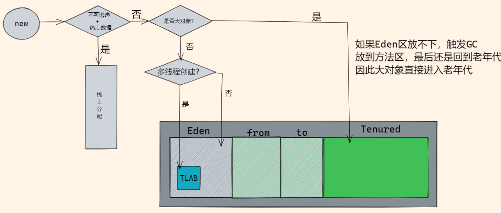
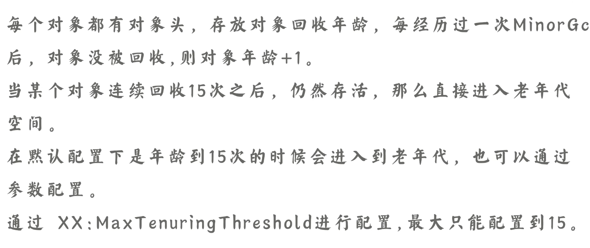
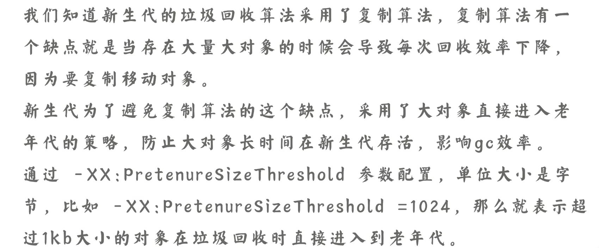
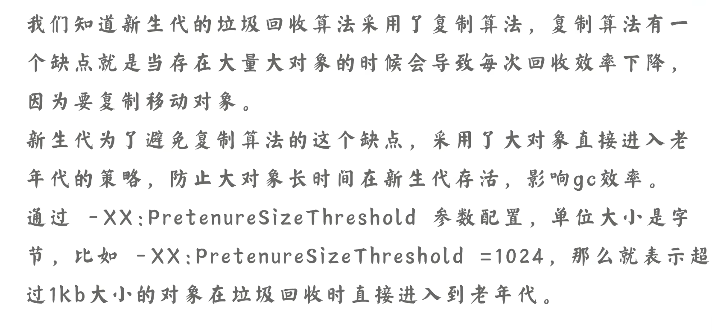
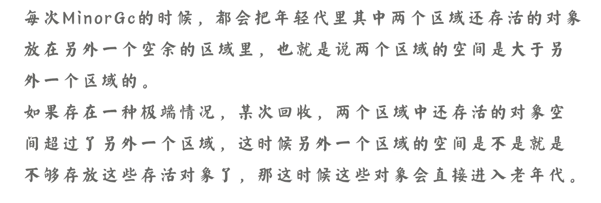

# 对双亲委派机制的理解？

JVM有

- 用户自定义类加载器(可以加载指定路径下的类)，继承应用程序类加载器，自己实现；
- 应用程序类加载器(加载当前classpath下的类)；
- 扩展类加载器(加载lib\ext目录下的jar包和class文件)；
- 启动类加载器(加载Java核心类库，rt.jar/resource.jar) c++编写；

双亲委派的原理：

进行类加载时，就算要加载的类不是父类加载器负责的范围，也要委托给父类加载器去加载，一直向上委托给启动类加载器，如果加载不到该类，再依次向下委托给子类加载器去加载，如果一直到用户自定义类加载器也没有加载到，那么会抛出ClassNotFoundException

双亲委派的作用：

- 双亲委派机制可以避免类的重复加载，父类加载到该类的话，会直接返回，子类不会重复加载

- 双亲委派机制保护了Java的核心类库不被自定义的类替换掉

双亲委派的实现：

1. 判断该类是否被加载过
2. 如果没有被加载，如果父类不为空，也就是还没有到达最顶端的类加载器，就将加载请求委托给父类加载器
3. 如果父类为空，也就是已经到达了启动类加载器，由启动类加载器来加载这个类
4. 如果没有加载到，向下委派给子类加载器去加载，一直到最底层，如果加载不到就会抛出ClassNotFoundException

# 如何打破双亲委派机制？

打破双亲委派也就是说：让类加载器可以加载不属于自己加载范围的jar包或class文件

1. **继承ClassLoader，重写loadClass()**方法,实现自定义类加载

   可以自定义要加载的类使用哪个类加载器；改变源码中委托给父类加载器的逻辑，

2. **线程上下文类加载器**，将启动类加载器负责加载的类交给应用类加载器来加载

   通过**Thread**类**setContextClassLoader**()方法设置当前类使用的类加载器的类型

   如：java.jdbc.Driver接口，接口的加载是由启动类加载器负责，但是它由其他数据库厂商去实现，因此就有启动类加载的类由应用类加载器来调用的情况

   

Tomcat中打破双亲委派，实现不同应用之间的资源隔离

- 可能部署多个war包，不同程序之间可能依赖同一个类库的不同版本，需要保证每一个程序的类库都是独立相互隔离的
- 防止web容器自身的类库和应用程序的类库混淆

# JIT优化

Java是半解释半编译型的语言；编译型语言：编译器将源代码一次性翻译为机器码来执行(c/c++)；解释型语言：通过解释器将源代码一句一句翻译为机器码来执行；解释型语言开发效率高(python,js)

- 解释就是JVM启动时，根据一定规则对字节码逐行翻译为对应平台的机器码去执行
- 编译就是JIT编译器将字节码翻译为机器码后，将热点代码进行缓存，执行效率高

某个方法或者代码块的运行比较频繁，JIT就会将这些代码作为热点代码缓存到方法区中，编译为机器码，进行一些优化。

HotSpot这款虚拟机就是热点虚拟机，重要的功能就是对热点代码进行缓存优化

虽然JIT执行效率高，但是编译的过程需要时间，所以运行程序时，先由解释器去逐行翻译执行，再由JIT去编译执行；

# 逃逸分析

**在方法内部的对象，如果只在方法内部使用，那么认为这个对象没有逃逸，如果这个对象作为另一个方法的参数，或者被return，或者被其他线程引用，认为发生逃逸**

如果对象只在方法内使用，会将对象的分配方式改为栈上分配，减少临时对象在堆中的分配，减少在堆内存小的情况下，可以很好地优化GC的频率

**逃逸方式**

- 方法逃逸：方法内的临时对象被返回；或者作为参数被传递；
- 线程逃逸：对象被其他线程访问到，也认为发生逃逸

**逃逸分析的好处**：

- **栈上分配**：一般不可逃逸的对象所占空间较大，使用栈上的空间，对象会随方法在栈中弹出而销毁，减少了在堆中的GC频率
- **同步消除(锁消除)**：如果定义了同步方法，但是在运行时是单线程访问的，逃逸分析后的机器码会消除同步锁
- **标量替换**：如果一个对象不可逃逸，并且这个对象是可分解的，程序执行的时候可能不会创建这个对象，而是直接创建它被这个方法使用的成员变量来代替。拆散后的变量便可以被单独分析和优化，可以各自分别在**栈帧或寄存器上分配空间**，原本的对象就无需整体分配空间了。：

# G1是如何分配对象的？

1. 快速分配——TLAB
2. 慢分配

先进行快速分配，失败的话进行慢分配，如果不能成功分配对象就会触发垃圾回收

# G1什么时候回收垃圾？

1. 分配内存发现内存不够时回收，优先回收垃圾最多的Region区域
2. 显式调用system.gc()；

没有设置**DisableExplicitGC**(默认false)时：表示这个函数触发的都是Full GC

设置了**ExplicitGCInvokesConcurrent**时，表示可以进行并发的混合回收

# TLAB线程本地分配缓冲区

堆是线程共享的区域，从堆中分配对象必须要锁定整个堆，避免被其他线程影响

TLAB是为了解决这个问题，在多线程中分配对象时，从堆中的Eden区分配一个固定大小的内存区域作为线程私有的缓冲区，也就是TLAB；可以减少对堆的锁定

TLAB是Eden区的一块内存，所有TLAB对所有线程是可见的，每个线程有一个TLAB的数据结构，保存中待分配内存区间的起始地址和结束地址，分配的时候只能在这个区间分配，类似ConcurrentHashMap的segment

**虽然TLAB在分配对象的时候是无锁分配，但是在为每个线程分配TLAB线程本地分配缓冲区时，还是需要锁定整个堆的，G1中使用CAS来并行分配**

**TLAB分配对象的步骤**：

1. 从线程的TLAB分配空间，如果成功就返回
2. 不能分配的话，尝试一个新的TLAB缓冲区，再分配对象

# finalize()	方法

如果是局部收集，如针对新生代的Minor GC，接下来就线性遍历新生代中的所有对象，对没有打上标记的对象进行回收。但这个时候的对象并不是非死不可，如果判定对象有必要（对象重写了finalize且未执行过）执行finalize方法的话，则将对象放到名为F-Queue的队列中等待Finalizer线程去执行，如果**对象在finalize方法中成功拯救自己**，则将对象从回收集合中移除出去。

# 对象什么时候进入老年代？

## 对象年龄达到15--15次minor gc后依然存活

新生代：老年代 = 1:2

Eden:S0:S1 = 8:1:1

## 动态对象年龄判断

除了15次Minor GC后依然存活的对象会进入老年代，还有一个动态对象年龄判断

## 大对象直接进入老年代

## Survivor区域对象空间不足

 

