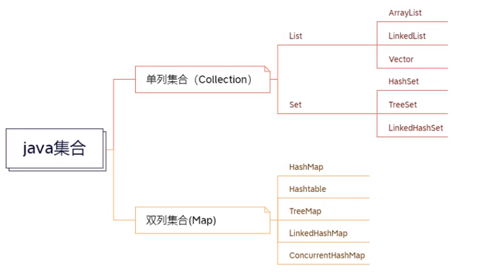

## 1. 概述
 当我们需要保存一组一样（类型相同）的元素的时候，我们应该使用一个容器 来存储，数组就是这样一个容器。  数组有什么缺点？ 

**数组**一旦定义，**长度将不能再变化**。 

然而在我们的开发实践中，经常需要保存一些变长的数据集合，于是，我们需 要一些能够**动态增长长度的容器**来保存我们的数据。 

 而我们需要对数据的保存的逻辑可能各种各样，于是就有了各种各样的数据结 构。Java中对于各种数据结构的实现，就是我们用到的**集合** 

```java
Object [] objs = {false,10,'a',"hello",new Date()};
        /*
            虽然Object可以表示任何数据类型
            但实际操作时需要向下转型
            带来不便与安全隐患
            Object obj = new Integer();
            String str = (String)obj;
         */
        for (Object obj:objs) {
            if(obj instanceof String){
                String s = (String) obj;
                System.out.println(s.length());
            }else{
                System.out.println("wwwwwwwwww");
            }
        }
```

集合体系




## 2.  泛型

 早期的Object类型可以接收任意的对象类型，但是在实际的使用中， 会有类型转换的问题。也就存在这隐患，所以Java提供了泛型来解决这个安全问题 .

 泛型，即“参数化类型”。一提到参数，最熟悉的就是定义方法时有形参，然后 调用此方法时传递实参 

 参数化类型，就是将类型由原来的具体的类型参数化，类似于方法中的变量参数， 此时类型也定义成参数形式（可以称之为类型形参），然后在使用/调用时传入具 体的类型（类型实参）。 

语法:

```java
publ ic class Demo<T> {
    private T p;
	publ ic T getP() {
		return p;
	}
	publ ic void setP(T p) {
		this.p = p;
	}
```


1. 泛型的类型参数只能是类类型（包括自定义类)
2. 泛型的类型参数可以有多个。 
3. 如果没有定义具体类型,默认为Object 

​	不适用泛型

```java
		Collection c = new ArrayList();
                   c.add("hello");
                   c.add(100);
                   c.add(new Date());
                    //不指明类型
```

使用泛型

```java
		//集合中只能存储引用类型
        //建议使用泛型,明确数据类型
        Collection<Integer> c = new ArrayList<>();
        int a = 10;
        c.add(10);
        c.add(a);//此处的a不是基本数据类型,而是默认调用了valueOf()自动装箱为Integer类
        c.add(999);
        System.out.println(c);
        System.out.println(c.size());//返回元素数
        System.out.println(c.contains(29));//若包含指定元素,返回true
        c.remove(10);//删除指定元素
        System.out.println(c);
        c.clear();//清空
        System.out.println(c);
        System.out.println(c.isEmpty());//判断是否为空
```


```java
public class GenericityDemo<T, I extends Number> {
    /*
    泛型  : 参数化类型 或
           类型参数化
     */
    T name;//

    public GenericityDemo(T name) {
        this.name = name;
    }

    public GenericityDemo() {}

    public T getName() {
        return name;
    }

    public void setName(T name) {
        this.name = name;
    }

    public static void main(String[] args) {
        /*
            具体类型必须为类类型,可以有多个
            若没有传入具体的类类型,默认使用Object
         */
        GenericityDemo<String, Number> demo2 = new GenericityDemo();
        GenericityDemo<String,Integer> demo3 = new GenericityDemo<>();
        demo2.setName("name");
        System.out.println(demo2.getName());
        demo3.setName("11231231");
        System.out.println(demo3.getName());

    }
}
```


## 3. Collection接口


Collection接口中定义了一些集合的公有方法

```java
boolean add(Object element);
boolean addAll(Collection c);//将指定集合中所有元素添加到此集合
boolean remove(Object element);//删除指定元素,如果存在的话,存在返回true
boolean removeAll(Collection c);//删除指定集合中所有元素 不包含时,删除相交的元素
void clear();//清空集合
int size();//返回该集合元素数
boolean isEmpty();//判断集合是否为空
boolean contains(Object element);//包含指定元素返回true
boolean containsAll(Collection c);//包含指定集合中的元素返回true
boolean retainAll(Collection c);//求交集,集合数据发生变化返回true,不变返回false
```


### 3.1 List接口

1. 有序的集合，存储元素和取出元素的顺序是一致的（存储123 取出123）
2. 有索引，包含了一些带索引的方法
3. 允许存储重复的元素

####  ArrayList

数组列表,数据采用数组方式存储

常用方法:

| 方法名                                     | 作用                                                        |
| :----------------------------------------- | :---------------------------------------------------------- |
| `add( E element)`                          | 末尾添加元素                                                |
| `add(int index, E element)`                | 指定位置添加元素                                            |
| `get(int index)`                           | 返回指定位置的元素                                          |
| `indexOf(Object o)`                        | 返回指定元素在集合中第一次出现的索引,不包含指定元素返回-1   |
| `lastIndexOf(Object o)`                    | 返回指定元素在集合中最后一次出现的索引,不包含指定元素返回-1 |
| `remove(int index) `                       | 删除并返回指定位置元素                                      |
| `removeRange(int fromIndex, int toIndex) ` | 删除指定区间的元素(只能在ArrayList的子类中使用)             |
| ` remove(Object o) `                       | 删除指定元素第一次出现(若存在)                              |
| ` removeIf(Predicate<? super E> filter)`   | 条件删除                                                    |
| `set(int index, E element)`                | 修改指定位置元素                                            |
| `subList(int fromIndex,  int toIndex)`     | 截取并返回指定区间的元素                                    |
向ArrayList中添加元素

扩容


```java
import java.util.ArrayList;
import java.util.LinkedList;

/*
    List接口继承Collection接口
    有序(安插入顺序排列)  元素可重复              Set 无序不重复
    插入后会有索引,通过索引访问元素

    ArrayList
    底层是数组     查询快  修改(在中间增删)慢
    LinkedList
    底层是双向链表  查询慢  修改(在中间增删)快
    Vector
    底层是数组     查询快  修改(在中间增删)慢   线程安全

    ArrayList();                     //默认不创建底层数组,当添加第一个元素时,创建一个长度为10的数组
    ArrayList(int initialCapacity)   //创建对象时创建指定长度的数组
    ArrayList(Collection collection);//将一个实现了Collection接口的类,构造成一个ArrayList类

    add();                          末尾添加元素
    add(int index,E e);             指定位置添加元素
	get();

 */
public class ArrayListDemo {
    public static void main(String[] args) {

        ArrayList<Integer> list1 = new ArrayList();
        ArrayList<Integer> list2 = new ArrayList(5);

        for (int i = 0; i < 9; i++) {
            list1.add(i+1);//末尾添加元素
        }

        System.out.println(list1);//[1, 2, 3, 4, 5, 6, 7, 8, 9]
        list1.add(1,10);//指定位置添加元素
        System.out.println(list1.get(0));//1    返回指定索引的元素
        System.out.println(list1);//[1, 10, 2, 3, 4, 5, 6, 7, 8, 9]
        System.out.println(list1.remove(0));//1   删除指定索引元素,并返回元素值
    
        /*
        public E get(int index) {
            rangeCheck(index);//先检查,再返回
            return elementData(index);
        }
         */

        /*  添加方法底层实现(自动扩容)
        public boolean add(E e) {
            ensureCapacityInternal(size + 1);  // 检测是否还有位置
            elementData[size++] = e;
            return true;
        }

        判断元素是否放得下
        if (minCapacity - elementData.length > 0)
            grow(minCapacity);                      //扩容方法

         private void grow(int minCapacity) {
            // overflow-conscious code
            int oldCapacity = elementData.length;                  //原容量
            int newCapacity = oldCapacity + (oldCapacity >> 1);    //扩容为原来的1.5倍(原容量+原容量/2)
            if (newCapacity - minCapacity < 0)
                newCapacity = minCapacity;
            if (newCapacity - MAX_ARRAY_SIZE > 0)             //判断数组索引是否大于Int的最大值:2147483647-8
                newCapacity = hugeCapacity(minCapacity);
            // minCapacity is usually close to size, so this is a win:
            //              原数组         新长度
            elementData = Arrays.copyOf(elementData, newCapacity);      //数组赋值
        }
         */
    }
}
```

removeIf()

```java
package day2.list.arraylist;

import java.util.ArrayList;
import java.util.List;
import java.util.function.Predicate;

/*
E get(int index);
ArrayList :直接返回
LinkedList:先检查,再返回(慢)

 */
public class ArrayListDemo2 {
    public static void main(String[] args) {

        ArrayList<String> list = new ArrayList();
        list.add("a");
        list.add("b");
        list.add("c");
        list.add("d");
        list.add("x");
        list.add("x");
        list.add("x");
        list.add("x");


        //条件删除                                匿名内部类
        System.out.println(list.removeIf(new Predicate<String>() {
            @Override
            public boolean test(String s) {
                //删除集合中的所有符合条件的元素
                return s.equals("x");
            }
        }));//true
        System.out.println(list);//[a, b, c, d, e, f]

        /*
        list.set(0, "B");//替换指定位置的值
        System.out.println(list);
        */

        /* 
        List<String> li = list.subList(2, 5);//从原集合中复制一段,原集合不变
        System.out.println(li);
		*/
    }
}
```

排序1:

```java

import java.util.ArrayList;
import java.util.Comparator;

public class SortDemo1 {
    public static void main(String[] args) {
        ArrayList<String> list = new ArrayList();
        list.add("b");
        list.add("d");
        list.add("f");
        list.add("e");
        list.add("a");
        list.add("c");

        //          匿名内部类
        list.sort(new Comparator<String>() {
            @Override
            public int compare(String o1, String o2) {
                return o1.compareTo(o2);//
            }
        });
        System.out.println(list);
    }
}

```

排序2

```java
import java.util.Comparator;
import java.util.function.Predicate;
//实现Comparator接口,实现其compare方法
public class SortDemo2 implements Predicate<String>, Comparator<String> {

    /**
     * 条件判断
     * @param s 字符串
     * @return  boolean
     */
    @Override
    public boolean test(String s) {
        return s.equals("x");
    }

    /**
     * 比较字符的 ASCLL 码值
     * @param o1 字符串1
     * @param o2 字符串2
     * @return int
     */
    @Override
    public int compare(String o1, String o2) {
        return o1.compareTo(o2);
    }
}

```

```java
import day2.list.SortDemo2;
import java.util.ArrayList;
/*
removeRange()只能在ArrayList的子类中使用
 */
public class ArrayListChild extends ArrayList
{
    public static void main(String[] args) {
        ArrayListChild list = new ArrayListChild();
        list.add("x");
        list.add("e");
        list.add("a");
        list.add("f");
        list.add("d");
        list.add("b");
        list.add("x");
        list.add("x");
        list.add("c");
        
        //list.removeRange(0,4);//删除指定区间
        
        //排序
        list.sort(new SortDemo2());
        //条件删除
        list.removeIf(new SortDemo2()) ;
        System.out.println(list);
        
        //输出结果  [a, b, c, d, e, f]
    }
}

```


#### LinkedList

链表的常用方法

```java
add(int index,Object element)
addFirist(Object element)
addLast(Object element)
get(int index)
removeFirst()
removeLast()
remove(int index)
getFirst()
getLast()
```


```java
package day2.list.linkedlist;
import java.util.LinkedList;
public class LinkedListDemo {
    public static void main(String[] args) {
        LinkedList<String> list = new LinkedList<>();
        list.add("b");
        list.addLast("d");
        list.addFirst("a");
        list.add(2,"c");
        list.add("x");
        list.add("x");
        System.out.println("链表:"+list);
        System.out.println("第一个元素:"+list.getFirst());
        System.out.println("最后一个元素:"+list.getLast());
        System.out.println("索引为2的元素"+list.get(2));

        list.removeFirst();
        System.out.println("删除第一个元素后:"+list);
        list.removeLast();
        System.out.println("删除最后一个元素后:"+list);
        list.remove(2);
        System.out.println("删除索引为2的元素后:"+list);

        /*
        链表的get()底层实现
        传入一个索引,若索引小于集合长度一半,从头结点开始查找,直到找到这个位置的值
                  若索引大于集合长度一半,从尾结点开始查找,直到找到这个位置的值

            Node<E> node(int index) {
            // assert isElementIndex(index);
            if (index < (size >> 1)) {
                Node<E> x = first;
                for (int i = 0; i < index; i++)
                    x = x.next;
                return x;
            } else {
                Node<E> x = last;
                for (int i = size - 1; i > index; i--)
                    x = x.prev;
                return x;
            }
        }

        public E get(int index) {
            checkElementIndex(index);
            return node(index).item;
        }

        private void checkElementIndex(int index) {
            if (!isElementIndex(index))
                throw new IndexOutOfBoundsException(outOfBoundsMsg(index));
         }
         */
    }
}

```


####  Vector 

```java
package day2.list.vector;
import day2.list.SortDemo2;
import java.util.ArrayList;
import java.util.Vector;
/*
    Vector 同步锁  线程安全  底层是数组  访问快,修改慢
 */
public class VectorDemo {
    public static void main(String[] args) {
                    ArrayList<String> list = new ArrayList<>();
                    list.add("x");
                    list.add("x");
                    list.add("x");
                    list.add("x");

        Vector<String> v = new Vector<>();
        v.add("a");
        v.add("c");
        v.add("e");
        v.add("b");
        System.out.println("排序前:"+v);
        v.sort(new SortDemo2());//按规则排序
        System.out.println("排序后:"+v);
        v.addAll(list);
        System.out.println("将集合list加到v后:"+v);
    }
}
```

运行结果:


#### list的遍历

```java 
ArrayList<Integer> list  = new ArrayList<>();
        list.add(1);
        list.add(2);
        list.add(3);
        list.add(4);
        list.add(1);
```


##### for循环遍历

```java 
//for循环可修改集合
for (int i = 0; i < list.size(); i++) {
    if(list.get(i)==1){
        list.remove(i);
    }
}
System.out.println(list);
```


##### foreach遍历

```java 
//foreach不可修改集合
for (Integer item:list) {
    if(item==1){
        list.remove(item);
    }
    //java.util.ConcurrentModificationException
    System.out.println(item);
}
```


##### Stream流遍历

```java
Stream<Integer> s = list.stream();
//方式1
s.forEach(integer -> System.out.println(integer));

/*
//方式2
s.forEach(new Consumer<Integer>() {
    @Override
    public void accept(Integer integer) {
        System.out.println(integer);
    }
});*/
```


##### Iterator(迭代器)遍历

```java
//迭代器遍历
Iterator<Integer> it = list.iterator();
while (it.hasNext()){
    Integer item =  it.next();
    if(item==1){
    	it.remove();	
	}
}
System.out.println(list);
```

```java
package day2.list.iteration;
import java.util.ArrayList;
import java.util.ListIterator;

public class ListIteratorDemo {
    public static void main(String[] args) {
        ArrayList<Integer> list  = new ArrayList<>();
        list.add(1);
        list.add(2);
        list.add(3);
        list.add(4);
        list.add(5);

        ListIterator<Integer> listIterator = list.listIterator();
        //向后遍历
       while(listIterator.hasNext())
            System.out.println(listIterator.next() + ", 下一索引:" + listIterator.nextIndex() +
                    ", 上一索引:" + (listIterator.previousIndex()-1) + "; ");
        System.out.println();

       //向前遍历                                      从指定位置开始
        ListIterator<Integer> listIterator1 = list.listIterator(list.size());
        while (listIterator1.hasPrevious()){
            System.out.println(listIterator1.previous()+", 上一索引:"+listIterator1.previousIndex()+";");
        }
        System.out.println(list);
        //NoSuchElementException  表示请求元素不存在*/
    }
}
```


### 3.2  Set接口

  Set接口继承了Collection接口。 

Set中所存储的元素是不重复的,但是是无序的, 

Set中的元素是没有索引的 

####  HashSet

 HashSet类中的元素不能重复，即彼此调用equals方法比较，都返回false。 

底层数据结构是哈希表+链表 

哈希表依赖于哈希值存储 

```java
package day2.set;
import java.util.HashSet;
/*
    Set接口
    实现该接口的集合,无重复元素,值没有索引
    HashSet:无序(底层方法对其元素自动排序)
            底层:哈希表+链表+红黑树
            //于 JDK 8 以后添加了红黑树
    TreeSet:有序(按照值(编码)的顺序)
            底层:红黑树
 */
public class HashSetDemo {
    public static void main(String[] args) {
        /*
        public HashSet() {
            map = new HashMap<>();
        }
         */
        HashSet<String> hs = new HashSet<>();
                        hs.add("d");
                        hs.add("c");
                        hs.add("b");
                        hs.add("a");
        System.out.println(hs);
        /*
            HashSet添加元素时,判断值是否重复
            添加时调用hashCode(),equals()
            添加时既要比较内容是否相等,既要保证效率,又要保证安全
            1.hashCode() :计算出一个哈希值,比较哈希值非常快,但很不安全("通话"与"重地"哈希值相同)
            2.equals()   :当哈希值相同时,再调用equals()判断值是否相等
         */
                        hs.add("通话");
                        hs.add("重地");
        System.out.println(hs);

        /*
        计算哈希值
         */
        int hashValue1 = "通话".hashCode();
        int hashValue2 = "重地".hashCode();
        System.out.println(hashValue1+":"+hashValue2);
        System.out.println(hashValue1==hashValue2);

        int hashValue3 = "aaa".hashCode();
        int hashValue4 = "aba".hashCode();
        System.out.println(hashValue3+":"+hashValue2);
        System.out.println(hashValue3==hashValue4);
    }
}
```


自定义Student类

```java
package day2.set;
import java.util.Objects;
public class Student {

    private String name;
    private int age;

    public Student(String name, int age) {
        this.name = name;
        this.age = age;
    }

    public String getName() {
        return name;
    }

    public void setName(String name) {
        this.name = name;
    }

    public int getAge() {
        return age;
    }

    public void setAge(int age) {
        this.age = age;
    }


    @Override
    public int hashCode() {
        System.out.println("hashCode");
        final int prime = 31;
        int result = 1;
        result = prime * result + age;
        result = prime * result + ((name == null) ? 0 : name.hashCode());
        System.out.println("result="+result);
        return result;
    }
    
    @Override
    public boolean equals(Object obj) {
        System.out.println("equals");
        if (this == obj)
            return true;
        if (obj == null)
            return false;
        if (getClass() != obj.getClass())
            return false;
        Student other = (Student) obj;
        if (age != other.age)
            return false;
        if (name == null) {
            if (other.name != null)
                return false;
        } else if (!name.equals(other.name))
            return false;
        return true;
    }

    @Override
    public String toString() {
        return "Name: "+getName()+" Age: "+getAge();
    }
}
```

测试类

```java
package day2.set;
import java.util.HashSet;
public class StudentTest {
    public static void main(String[] args) {

        Student s1 = new Student("Anny", 18);
        Student s2 = new Student("Bill", 19);
        Student s3 = new Student("Dell", 20);
        Student s4 = new Student("Anny", 18);
        Student s5 = new Student("Lucy", 21);

        HashSet<Student> hs = new HashSet<>();
                         hs.add(s1);
                         hs.add(s2);
                         hs.add(s3);
                         hs.add(s4);
                         hs.add(s5);
        System.out.println("有效元素："+hs.size()+"个");
        //若自定义类未重写hashCode()和equals() ,自动调用Object中的方法

        /*
         //"".hashCode();
         String , Integer这些类重写了hashCode()
         都是根据对象中包含的内容来计算哈希值
         */
    }
}
```


####  TreeSet

 可以给Set集合中的元素进行指定方式的排序。

存储的对象必须实现Comparable接口。 


TreeSet底层数据结构是二叉树(红黑树是一种自平衡的二叉树) 

```java
	TreeSet<String> treeSet = new TreeSet<>();
                        treeSet.add("d");
                        treeSet.add("d");
                        treeSet.add("b");
                        treeSet.add("c");
                        treeSet.add("a");
                        treeSet.add("a");
                        treeSet.add("y");
                        treeSet.add("x");
      System.out.println(treeSet);//[a, b, c, d, x, y]
```


```java 
//让上面的Student实现Comparable接口,重写compareTo()方法
public class Student implements Comparable<Student>{
    @Override
    public int compareTo(Student o) {
    	return this.age-o.age;
	}
}
```

测试类

```java
Student s1 = new Student("Anny", 27);
        Student s2 = new Student("Bill", 13);
        Student s3 = new Student("Dell", 22);
        Student s4 = new Student("Anny", 27);
        Student s5 = new Student("Lucy", 21);
        TreeSet<Student> students =new TreeSet<>();
        /*
        java.lang.ClassCastException: day2.set.Student cannot be cast to java.lang.Comparable
        类型转换错误
        向TreeSet中添加元素时调用进行排序比较,以及去重
        树形结构比较排序,自定义类需实现Comparable接口,重写compareTo()方法
        自定义类
         */
                         students.add(s1);
                         students.add(s2);
                         students.add(s3);
                         students.add(s4);
                         students.add(s5);


        //增强for
        System.out.println("foreach遍历");
        for(Student s : students){
            System.out.println(s);
        }

        //迭代器遍历
        System.out.println("迭代器遍历");
        Iterator<Student> studentIterator = students.iterator();
        while (studentIterator.hasNext()){
            Student std = studentIterator.next();
            System.out.println(std);
        }

        //流遍历
        System.out.println("流遍历");
        Stream stream = students.stream();
        stream.forEach(new Consumer() {
            @Override
            public void accept(Object o) {
                System.out.println(o);
            }
        });
```


## 4. Map接口

- 将键映射到值的对象

-  一个映射不能包含重复的键

- 每个键最多只能映射到一个值 

 Map接口和Collection接口的差异:

- Map是双列的,Collection是单列的
- Map的键唯一,Collection的子接口Set的实现类的元素唯一
- Map集合的数据结构针对键有效，跟值无关;Collection集合的数据结构是针对元素有效 

Map接口常用方法

| 方法                                     | 作用                                |
| ---------------------------------------- | ----------------------------------- |
| `clear()`                                | 从 Map 中删除所有键值对             |
| `remove(Object key)`                     | 从 Map 中删除键和关联的值           |
| `remove(Object key, Object value)`       | 删除指定的键值对                    |
| `replace(K key, V value)`                | 替换已有键的值                      |
| `replace(K key, V oldValue, V newValue)` | 键映射指定值时,替换原来值           |
| `size()`                                 | 返回集合中键值对的对数              |
| `put(K key, V value)`                    | 将指定值与指定键相关联              |
| ` putAll(Map m)`                         | 将指定 Map 中的所有映射复制到此 map |
| `  isEmpty()`                            | 判断Map中是否包含键值对             |
| `containsKey(Object key)`                | 判断集合是否包含指定的键            |
| `containsValue(Object value)`            | 判断集合是否包含指定的值            |
| `get(Object key)`                        | 根据键获取值                        |
| `values()`                               | 获取集合中所有的值                  |
| `keySet()`                               | 获取集合中所有键的集合              |
| `entrySet()`                             | 获取所有键值对                      |
| `forEach(BiConsumer action)`             |      遍历                               |


### HashMap
HashMap底层实现


```java
package day2.map;
import java.util.Collection;
import java.util.HashMap;
import java.util.Map;
import java.util.Set;

/*
    Map
    双列存储
    key(键值不能重复)
    value(可以重复)

    HashMap:key值不能重复,排列顺序是不固定的,可以存储一个为null的键
    TreeMap: 有序,键值所在类须实现Comparable
    HashTable(线程安全),不能存储为null的键
 */
public class HashMapDemo1 {
    public static void main(String[] args) {
        Map<Integer,String> map = new HashMap<>();
                            map.put(98, "b");
                            map.put(97, "a");
                            map.put(97, "x");
                            map.put(100, "d");
                            map.put(99, "c");
                            map.put(null, "e");

        System.out.println("map:"+map);
        System.out.println("键为101的值:"+map.get(101));//根据key值查找value,键不存在返回null
        System.out.println("键值对个数:"+map.size());
        //map.clear();清空
        System.out.println("map为空:"+map.isEmpty());//判断Map是否为空
        map.remove(100);//根据键删除指定键值对
        System.out.println("删除键为100的键值对:" +map);
        map.replace(97, "x","aa");//替换已有键对应值
        System.out.println("替换后:"+map);

        Collection<Integer> keyCollection = map.keySet(); //存储所有键
        Collection<String> valueCollection = map.values();//存储所有值

        System.out.println("所有键:"+keyCollection);
        System.out.println("所有值:"+valueCollection);
    }
}

```


```java
package day2.map;

import java.util.HashMap;
import java.util.Map;
import java.util.Set;
import java.util.function.BiConsumer;

/*
    HashMap
    底层存储结构
        哈希表+链表/红黑树

        put底层实现
        public V put(K key, V value) {
            return putVal(hash(key), key, value, false, true);
        }
 */
public class HashMapDemo2 {
    public static void main(String[] args) {
        HashMap<Integer,String> map = new HashMap<>();
                            map.put(98, "b");
                            map.put(97, "a");
                            map.put(97, "a");
                            map.put(100, "d");
                            map.put(99, "c");

        /*
        Map遍历
        1.keySet()
        2.entrySet()
        3.forEach()
         */

        //方法一:keySet() 1.获取所有键的集合 2.遍历键的集合 3.根据键找值(map.get(key))
        // 返回map中所有键,键不能重复(用set)
        Set<Integer> keySet = map.keySet();
        //System.out.println(keySet);//[97, 98, 99, 100]
        System.out.println("====keySet()遍历:====");
        for(Integer key:keySet){
            System.out.println("key="+key+" & value="+map.get(key));
        }

        //方法二:entrySet() 1.获取所有键值对 对象的集合 2.遍历集合,获取每一个键值对 对象 3.根据键值对对象找键和值
        // 将map底层中存储键值的Entry对象,封装到一个Set集合中
        Set<Map.Entry<Integer,String>> entrySet = map.entrySet();
        System.out.println("====entrySet()遍历:====");
        for (Map.Entry<Integer,String> entry : entrySet){
            System.out.println("key="+entry.getKey()+" & value="+entry.getValue());
        }

        /*97:a
        98:b
        99:c
        100:d*/

        //方法三:
        /*
        forEach(BiConsumer<? super K,? super V> action)
        对此映射中的每个条目执行给定的操作，直到所有条目都被处理或操作引发异常。
         */
        System.out.println("====forEach()遍历:====");
        map.forEach(new BiConsumer<Integer,String>(){
            @Override
            public void accept(Integer integer, String s) {
                System.out.println("key="+integer+" & value="+s);
            }
        });
    }
}
```

运行结果:


###  TreeMap

```java
package day2.map;

import java.util.TreeMap;
/*
    TreeMap
    适用于按自然顺序or自定义顺序遍历key
    根据key值排序,key值需要实现Comparable接口
                       重写compareTo()方法
                根据compareTo()的逻辑,对key值排序

    key是红黑树结构  : 保证键的唯一性与排序
 */
public class TreeMapDemo1 {
    public static void main(String[] args) {

        //按照键的顺序排序,用哪个类型的类作为键,那么必须实现Comparable
        TreeMap<Integer,String> treeMap = new TreeMap<>();
                                treeMap.put(100, "d");
                                treeMap.put(97, "a");
                                treeMap.put(97, "a");
                                treeMap.put(99, "c");
                                treeMap.put(98, "b");
        System.out.println(treeMap);

        TreeMap<String, String> tmap = new TreeMap<>();
                                tmap.put("b","b");
                                tmap.put("a","a");
                                tmap.put("d","d");
                                tmap.put("c","c");
                                tmap.put("c","c");
        System.out.println(tmap);
    }
}
```

运行结果:


### HashTable

```java
package day2.map
import java.util.Hashtable;
public class HashTableDemo {
    public static void main(String[] args) {

        /*
            底层
            也是
            哈希表+链表(红黑树)实现
            是线程安全的  synchronized  与StringBuffer,Vector同
            public synchronized V put(K key, V value)
         */
        Hashtable<String,String> hashtable = new Hashtable<>();
                                 hashtable.put("b","b" );
                                 hashtable.put("a","a" );
                                 hashtable.put("c","c" );
                                 //hashtable.put(null, "a");
                                 //不能存储为null的键 否则报空指针异常NullPointerException
        System.out.println(hashtable);
    }
}
```

运行结果:


## 5. Collections类

常用方法

```java

    //Collections是集合类的工具类,与数组的工具类Arrays类似

    addAll(Collection<? super T> c, T... elements)    
    //将所有指定的元素添加到指定的集合。
    binarySearch(List<? extends Comparable<? super T>> list, T key) 
    //使用二叉搜索算法搜索指定对象的指定列表。
    copy(List<? super T> dest, List<? extends T> src)  
    //将所有元素从一个列表复制到另一个列表中。
    disjoint(Collection<?> c1, Collection<?> c2)  
    //如果两个指定的集合没有共同的元素，则返回 true 。
    sort(List<T> list)                          
    //根据其元素的natural ordering对指定的列表进行排序。
    sort(List<T> list, Comparator<? super T> c) 
    //根据指定的比较器引起的顺序对指定的列表进行排序。
    swap(List<?> list, int i, int j)      
    //交换指定列表中指定位置的元素。
    emptyList() 
    //返回空列表（immutable）。
    fill(List<? super T> list, T obj)     
    //用指定的元素代替指定列表的所有元素。
    max(Collection<? extends T> coll)   
    //根据其元素的 自然顺序返回给定集合的最大元素。
    min(Collection<? extends T> coll)   
    //根据其元素的 自然顺序返回给定集合的最小元素。
    replaceAll(List<T> list, T oldVal, T newVal)  
    //将列表中一个指定值的所有出现替换为另一个。
    reverse(List<?> list)   
    //反转指定列表中元素的顺序。
```

测试类

```java
package day2.collections;
//	学生类
public class Student {

    private String name;
    private int  age;

    public Student() {
        super();
    }

    public Student(String name, int age) {
        super();
        this.name = name;
        this.age = age;
    }

    public String getName() {
        return name;
    }

    public void setName(String name) {
        this.name = name;
    }

    public int getAge() {
        return age;
    }

    public void setAge(int age) {
        this.age = age;
    }

    @Override
    public String toString() {
        return "Student{" +
                "name='" + name + '\'' +
                ", age=" + age +
                '}';
    }
}
```

collections的方法演示

```java
package day2.collections;
import java.util.*;
public class CollectionsDemo {
    public static void main(String[] args) {
        ArrayList<String> list1 = new ArrayList<>();
        String[] string = {"e","f","g","h"};

        list1.add("b");
        Collections.addAll(list1,string );
        Collections.addAll(list1, "a","c","d");
        System.out.println("list1: "+list1);

        //排序
        Collections.sort(list1);
        System.out.println("排序后:"+list1);

        //交换两个索引的值
        Collections.swap(list1, 0, 1);
        System.out.println("list1交换位置后: "+list1);//[a, b, c, d, e, f, g, h]

        //二分查找
        int index = Collections.binarySearch(list1, "f");
        System.out.println("元素为f的索引:"+index);

        //用指定元素填充集合所有元素
        Collections.fill(list1, "x");
        System.out.println("用x填充list1:"+list1);

        

        /*
        ArrayList<String> list2 = new ArrayList<>();
        Collections.copy(list2, list1);
        //Exception in thread "main" java.lang.IndexOutOfBoundsException: Source does not fit in dest


        ArrayList默认元素0个,当add,remove时,size()改变
        进行集合复制时,必须声明目的集合的元素个数  个数:目的集合>=原集合
        否则 出异常 IndexOutOfBoundsException

        注意:指定参数为15,只是表示可以容纳15个元素,并不是已经有了15个元素
         */

        ArrayList<String> list2 = new ArrayList<>(10);
        for (int i = 0; i < 10; i++) {
            list2.add("s");
        }
        System.out.println("复制前:"+list2);
        Collections.copy(list2, list1);
        System.out.println("复制后:"+list2);


        ArrayList<Student> studentList = new ArrayList<>();
        Student s1 = new Student("jim1", 21);
        Student s2 = new Student("jim2", 22);
        Student s3 = new Student("jim3", 23);
        Student s4 = new Student("jim4", 24);
        Student s5 = new Student("jim5", 25);
                studentList.add(s2);
                studentList.add(s1);
                studentList.add(s5);
                studentList.add(s4);
                studentList.add(s3);

        System.out.println("排序前: "+studentList);

        //排序-->按年龄大小排序
        Collections.sort(studentList, new Comparator<Student>() {
            @Override
            public int compare(Student o1, Student o2) {
                return o2.getAge()-o1.getAge();
            }
        });

        System.out.println("排序后: "+studentList);


        List<Object> list3 = Collections.emptyList();//返回一个空集合,不能使用
    }
}
```

运行结果:


