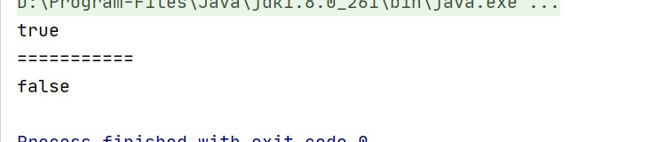

# 包装类
## 前言

<font color=#999AAA >Java为基本数据类型提供了对应的类，这些类称作包装类。数据的包装类可以提供该类最大、最小值查阅和类型转化的功能</font>

<hr style=" border:solid; width:100px; height:1px;" color=#000000 size=1">


在介绍Java提供的包装类之前,我们先自己定义一个包装类,以便于我们在使用Java包装类时,更容易理解

```java
package Test.apidemo;
//定义一个int类型的包装类
public class Demo {

    private final int Int;//int型变量

    //构造器
    public Demo(int i) {
        Int = i;
    }
    //求最大值
    public int Max(Demo d){//传入参数为对象
        if(Int>d.Int){
            return Int;
        }
        return d.Int;
    }
    //求最大值
    public int Max(int i){
        if(Int>i){
            return Int;
        }
        return i;
    }
}
```

```java
package Test.apidemo;
//测试例
public class DemoTest {
    public static void main(String[] args) {
        Demo d = new Demo(10);
        Demo d1 = new Demo(20);
        System.out.println(d.Max(d1));//两对象中的内容最大值
        System.out.println(d1.Max(30));//对象内容和基本数据类型中最大值
    }
}
```

运行结果:


## Java包装类

看到这,对于包装类应该有一个初步的认识了,接下来我们测试Java为我们提供的一些包装类

```java
package Test.apidemo;
public class IntegerDemo1 {
    public static void main(String[] args) {
        Integer i1 = new Integer(10);//int 型参数
        Integer i2 = new Integer("10");//String 型参数

        //Integer类的value变量可以表示的范围:
        // Object.MIN/MAX_VALUE
        System.out.println(Integer.SIZE);//32
        System.out.println(Integer.BYTES);//4
        System.out.println(Integer.MIN_VALUE);//-2147483648
        System.out.println(Integer.MAX_VALUE);//2147483647
        System.out.println("============================");

        //比较大小:obj.compareTo()  Object.compare()
        //返回 -1 :左边小  0:相等  1:左边大
        System.out.println(i1.compareTo(i2));//0
        System.out.println(Integer.compare(i1,i2));//0
        System.out.println("=============================");

        //判断相等:obj.equals()
        System.out.println(i1.equals(i2));//true
        System.out.println(i1.equals(1));//true
        System.out.println("=============================");

        //判断最大/小值max:Integer.max/min
        System.out.println(Integer.max(i1,15));//15
        System.out.println(Integer.min(i1,5));//5
        System.out.println("=============================");

        //转二进制
        System.out.println(Integer.toBinaryString(i1));//1010
        //转十六进制
        System.out.println(Integer.toHexString(i1));//a
        //转八进制
        System.out.println(Integer.toOctalString(i1));//12

    }
}

```

运行结果:


## 装箱/拆箱

 装箱 &拆箱

- 自动装箱时编译器调用valueOf将原始类型值转换成对象，同时自动拆箱时，编译器通过调用类似intValue(),doubleValue()这类的方法将对象转换成原始类型值。
- 自动装箱是将boolean值转换成Boolean对象，byte值转换成Byte对象，char转换成Character对象，float值转换成Float对象，int转换成Integer，long转换成Long，short转换成Short，自动拆箱则是相反的操作。

 

```java
package Test.apidemo;

import jdk.nashorn.internal.ir.IdentNode;

//自动装箱与拆箱
public class IntegerDemo2 {
    public static void main(String[] args) {
        int x =10;
        String str1 = "10";

        Integer n = new Integer(x);
        int y = n.intValue();//取出对象n中包含int的值

        int z = Integer.parseInt(str1);//将String 类型转为 int型
        String s = n.toString();//将int型转为String型

        Integer i1 = Integer.valueOf(x);
        Integer i2 = Integer.valueOf("10");
        Integer i3 = Integer.valueOf("10",1);

    }
}
```

<hr style=" border:solid; width:100px; height:1px;" color=#000000 size=1">

```java
package Test.apidemo;
public class IntegerDemo3 {
    public static void main(String[] args) {
        int num=100;
        /*
        基本类型转引用类型
        Integer i = Integer(num);
        Integer i = Integer.valueOf(num);//返回一个指定值的对象
        */

        Integer i=num;//默认调用Integer.valueOf()自动装箱
        int numNew=i;  //默认调用intValue()      自动拆箱
       //int numNew = i.intValue();将引用类型转为基本类型,默认调用intValue方法取出包含的int值

       	System.out.println(num);
        System.out.println(i);
        System.out.println(numNew);//100
    }
}
```

运行结果:


自动装箱&拆箱的问题

```java
package JavaSE.java_api.day1;

public class IntegerDemo3 {
    public static void main(String[] args) {
        /*
            自动装箱遇到的问题

            ==两边是基本数据类型时,判断两边值是否相等
            ==两边是引用数据类型时,判断两对象地址是否相等

            //多个参数值相同时,返回同一个对象
            public static Integer valueOf(int i) {
                当参数范围在-128~127之间时,从缓冲数组中取出一个对象并返回
                if (i >= IntegerCache.low && i <= IntegerCache.high)
                    return IntegerCache.cache[i + (-IntegerCache.low)];
                return new Integer(i);
                //范围不在区间内,创建一个新的对象并返回
            }

         */

        Integer i1=Integer.valueOf(127);//装箱
        int x = i1.intValue();//拆箱   
        Integer i2=127;//自动装箱; 默认调用valueOf()返回一个指定值的Integer对象
        //int x= i2;//自动拆箱; 默认调用intvalue() 返回对象中的int值
        System.out.println(i1==i2);
        System.out.println("===========");

        Integer i3=128;//默认调用valueOf()
        Integer i4=Integer.valueOf(128);
        System.out.println(i3==i4);
    }
}
```

运行结果:




