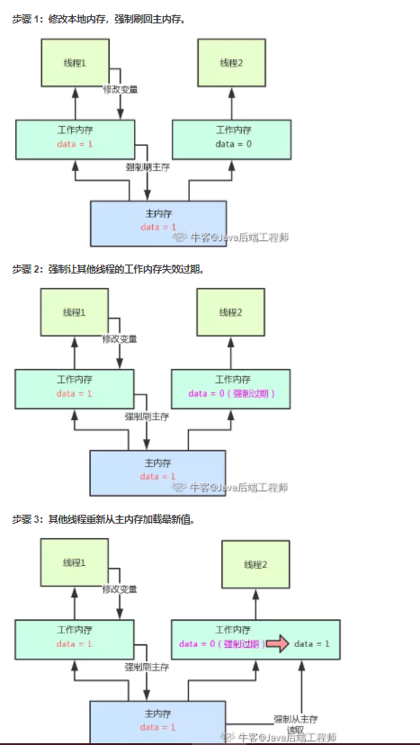
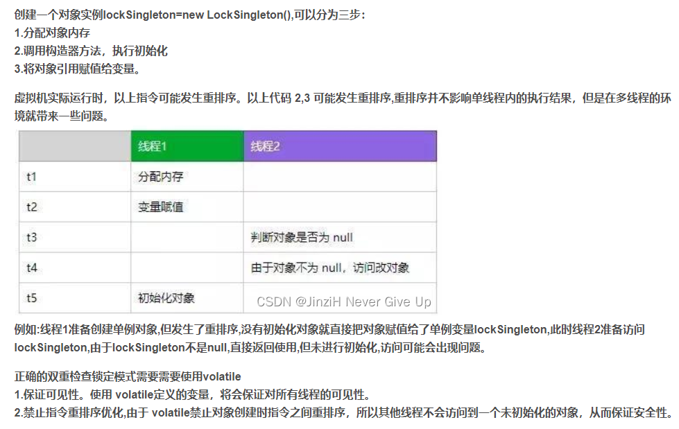
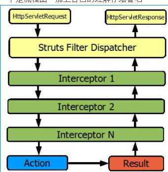

# 七大原则

1. **开闭原则**: 是总纲，告诉我们要对扩展开放(继承抽象类，接口)，对修改关闭(封装，私有化部分属性和方法)；

2. **里氏替换原则**: 告诉我们不要破坏继承体系；(子类继承父类时，除添加新的方法完成新增功能外，尽量不要重写父类的方法)

3. **依赖倒置原则**:告诉我们要面向接口编程；

   （1）每个类尽量提供接口或抽象类，或者两者都具备。
   （2）变量的声明类型尽量是接口或者是抽象类。
   （3）任何类都不应该从具体类派生。
   （4）使用继承时尽量遵循里氏替换原则

4. **单一职责原则**: 告诉我们实现类/方法要职责单一；(一个类只负责一项职责，一个方法只负责处理一项事情)

5. **接口隔离原则**： 告诉我们在设计接口的时候要精简单一；(和单一职责原则差不多，只是单一职责是侧重于约束类和方法。而借口隔离侧重约束接口)

6. **迪米特法则**：告诉我们要降低耦合度；

   应该尽量减少对象之间的交互，如果两个对象不必直接通信，那么这两个对象就不应该发生任何直接的相互作用，如果其中一个对象需要调用另外一个对象的某个方法时，可以通过第三者转发这个调用。就是通过引入一个合理的第三者来降低先有对象之间的耦合度。

7. **合成复用原则**：告诉我们要优先使用组合或者聚合关系复用，少用继承关系复用。(合成复用原则是通过将已有的对象纳入新对象中，作为新对象的成员对象来实现的，新对象可以调用已有对象的功能，从而达到复用。)


# 设计模式

## 单例模式

**单例（Singleton）模式的定义：指一个类只有一个实例,且该类能自行创建这个实例的一种模式。**

作用:单例模式是保证系统实例唯一性的重要手段。用于一个全局类对象在多个地方被使用的场景下,保障了整个系统只有一个对象被使用,很好的节约了资源

实现方法:将类的实例化方法私有化来防止程序通过其他方式创建该类的实例,提供一个全局唯一获取该类实例的方法帮助用户获取类的实例。

实现单例模式很简单,每次获取前先判断系统是否已经存在单例对象,没有就创建,有就返回这个对象。单例模式常见的写法有懒汉式单例和饿汉式单例。

### 懒汉式单例

**定义:类加载时没有生成单例,第一次调用 getlnstance 方法时创建这个单例。**

```java
public class LazySingleton {

    //定义一个私有的静态对象instance,静态方法和属性属于类,能保障单例对象的唯一性
    private static LazySingleton instance;

    //私有化构造方法,只能在本类中被访问,其他类中不能通过构造方法直接创建对象
    private LazySingleton() {
    }

    //提供一个全局唯一获取实例的方法
    public static synchronized LazySingleton getInstance(){
        if(instance==null){
            instance=new LazySingleton();
        }
        return instance;
    }
}
```

**懒汉模式在获取对象实例时做了加锁操作,因此是线程安全的**

### 饿汉式单例

**定义:该模式的特点是类一旦加载就创建一个单例**，**在调用 getInstance 方法之前单例已经存在。**

```java
public class HungrySingleton {
    //类加载完成后该类的实例便已经存在
    private static HungrySingleton instance=new HungrySingleton();
    //私有化构造方法
    private HungrySingleton(){
    }
    //类加载后实例就存在,不会出现线程安全问题,不需要加锁
    public static HungrySingleton getInstance(){
        return  instance;
    }
}
```

**懒汉式单例和饿汉式单例的区别**
**1.懒汉模式在类中定义了单例但是并未实例化,实例化是在方法中实现的,而饿汉模式定义的时候就进行了实例化**

**2.懒汉模式需要在获取实例的方法上加锁保证线程安全,饿汉模式不需要加锁。**

### 双重检索

**懒汉模式用到了synchronized，会导致很大的性能开销，并且加锁其实只需要在第一次初始化的时候用到，之后的调用都没必要再进行加锁。**

**双重校验锁在懒汉模式的基础上做了进一步的优化,给静态对象加上volatile来保证有序性,第一次获取对象时通过synchronize(Singleton.class)保障操作的唯一性。**

```java
public class LockSingleton {
    private  volatile static LockSingleton lockSingleton;
    private LockSingleton(){}
    public static LockSingleton getInstance(){
        if(lockSingleton==null){
            synchronized (LockSingleton.class){
                if (lockSingleton==null){
                    lockSingleton=new LockSingleton();
                }
            }
        }
        return lockSingleton;
    }
}
```

**执行双重检查是因为，如果多个线程同时了通过了第一次检查，并且其中一个线程首先通过了第二次检查并实例化了对象，那么剩余通过了第一次检查的线程就不会再去实例化对象。**

**除了第一次创建实例的时候会出现加锁的情况，后续的所有调用都会避免加锁而直接返回，解决了性能消耗的问题。**

### volatile原理

**任意一个线程修改了 volatile 修饰的变量，其他线程可以马上识别到最新值。**

  **volatile可以保证线程可见性且提供了一定的有序性，但是无法保证原子性。**

**在JVM底层volatile是采用“内存屏障”来实现的。**观察加入volatile关键字和没有加入volatile关键字时所生成的汇编代码发现，**加入volatile关键字时，会多出一个lock前缀指令，lock前缀指令实际上相当于一个内存屏障（也成内存栅栏），内存屏障会提供3个功能：**

（1）**它确保指令重排序时不会把其后面的指令排到内存屏障之前的位置，也不会把前面的指令排到内存屏障的后面；即在执行到内存屏障这句指令时，在它前面的操作已经全部完成；**

（**2）它会强制将对缓存的修改操作立即写入主存；**

**（3）如果是写操作，它会导致其他CPU中对应的缓存行无效。**



**volatile为什么不能保证原子性？以i++为例**

**i++需要执行三步：**

  **1、线程读取i**
**2、temp = i + 1**
**3、i = temp**

**当 i=5 的时候A,B两个线程同时读入了 i 的值， 然后A线程执行了 temp = i + 1的操作， 要注意，此时的 i 的值还没有变化，然后B线程也执行了 temp = i + 1的操作，注意，此时A，B两个线程保存的 i 的值都是5，temp 的值都是6， 然后A线程执行了 i = temp （6）的操作，此时i的值会立即刷新到主存并通知其他线程保存的 i 值失效， 此时B线程需要重新读取 i 的值那么此时B线程保存的 i 就是6，同时B线程保存的 temp 还仍然是6， 然后B线程执行 i=temp （6），所以导致了计算结果比预期少了1**  


**单例模式的双重锁为什么要加volatile？**



### 单例模式和单例Bean

**单例模式表示JVM中某个类的对象只会存在唯⼀⼀个。** 

**⽽单例Bean并不表示JVM中只能存在唯⼀的某个类的Bean对象。** 


**Spring中Bean是线程安全的吗：**

**Spring本身并没有针对Bean做线程安全的处理，所以：** 

1. **如果Bean是⽆状态的，那么Bean则是线程安全的** 

2. **如果Bean是有状态的，那么Bean则不是线程安全的** 


**另外，Bean是不是线程安全，跟Bean的作用域没有关系，Bean的作用域只是表示Bean的生命周期范围，对于任何生命周期的Bean都是⼀个对象，这个对象是不是线程安全的，还是得看这个Bean对象本身。**


**单例池:**

**为了实现单例bean，就有了单例池，每次去获取这个bean的时候，就直接从单例池里面去获取。**

**取不到的话，调用后面的singletonFactory的createBean方法创建单例bean（这里的createBean是抽象方法，具体实现交给了各种scope的实现类负责），**

**创建成功以后，存入singletonObjects，并将引用返回。**

**单例池：spring源码中的定义为Map<String, Object> singletonObjects = new ConcurrentHashMap<>(256)。其意义即为存储spring生成的单例Bean。**


## 原型模式

**spring中的原型Bean用的就是原型模式.**

**实际上，Spring最基本的scope只有两种，即singleton和prototype。**

- singletonScope，即单例Bean，顾名思义具有单例模式的所有特性，`在spring容器里面只会初始化出一个bean实例`，存于缓存中。后续的请求都公用这个对象。最简单的创建单例bean的方式，就是直接在类名上面加@Service,@Controller这些注解。
- prototypeScope，即原型Bean，`每次请求时都会创建新的bean实例`直接使用。**创建原型Bean，需要显示指定scope属性。**


**单例模型和原型模式对于性能的影响：**

**使用原型模式会对性能产生影响，对那些初始化过程需要消耗巨大资源的尤其如此。**


**通过@Autowire注解创建的bean都是启动时被创建和初始化的，这个过程称为预加载，如果我们需要延迟Bean的加载时机就可以使用@lazy注解，使用bean的时候才会去初始化，而不是在IOC容器启动时，这样就可以节省资源。**

## 代理模式

### 代理模式概述

**什么是代理模式：在有些情况下，一个客户不能或者不想直接访问另一个对象，这时需要找一个中介帮忙完成某项任务，这个中介就是代理对象。例如，购买火车票不一定要去火车站买，可以通过 12306 网站或者去火车票代售点买。又如找保姆、找工作,买东西等都可以通过找中介完成。**

**代理模式的基本结构：**

1. **抽象主题（Subject）类：通过接口或抽象类声明真实主题和代理对象实现的业务方法。** 

2. **真实主题（Real Subject）类：实现了抽象主题中的具体业务，是代理对象所代表的真实对象，是最终要引用的对象。** 

3. **代理（Proxy）类：提供了与真实主题相同的接口，其内部含有对真实主题的引用，它可以访问、控制或扩展真实主题的功能。**


**以58同城找保姆举例:我们要定义一个接口里面存放着做饭和洗衣服的业务方法(抽象主题),保姆(真实主题)需要实现这个接口(很容易理解.保姆需要会做饭和洗衣服),58同城(代理类)也需要实现这个接口,它可以增加一些额外的处理，如给保姆培训和接保姆等。我们访问时只需要访问代理类即可。**

### 静态代理

**静态代理就是按照代理模式书写的代码，其特点是代理类和目标类在代码中是确定的，因此称为静态。**

**特点：**

1. 代理类和目标类在代码中是确定的，因此称为静态,显然不够灵活。
2. 如果被代理的目标对象非常多(例如58又要代理保姆对象,又要代理家教,又要代理水电工)，则静态代理类就非常臃肿，难以胜任
3. 如果接口增加一个方法，除了所有实现类需要实现这个方法外，所有代理类也需要实现此方法，增加了代码维护的复杂度。

### **动态代理**

**动态代理中，代理类并不是在 Java 代码中实现，而是在运行时期生成**，相比静态代理，动态代理可以很方便的对委托类的方法进行统一处理，如添加方法、调用次数、添加日志功能等等，**动态代理分为 jdk 动态代理和 cglib 动态代理** 


### **JDK代理** 

**通过反射来实现的，借助 Java 自带的 java.lang.reflect.Proxy。** 

**其步骤如下：**

1. 编写一个委托类的接口，即静态代理的
2. 实现一个真正的委托类，即静态代理的
3. 创建一个动态代理类，实现 InvocationHandler 接口，并重写该 invoke方法
4. 在测试类中，生成动态代理的对象。 

**动态代理总结：**虽然相对于静态代理，动态代理大大减少了我们的开发任务， 同时减少了对业务接口的依赖，降低了耦合度。但是还是有一点点小小的遗憾 


**缺点：它无法摆脱仅支持 interface 代理的缺点，它们已经注定有一个共同的父类叫 Proxy。** 

**实现：mybatis里面用的就是jdk代理，只写接口不用写实现类。**

**原理：**

**1.mybatis的mapper接口的代理类在代理mapper接口的时候，代理对象会实现mapper接口**

**2.在执行代理对象的对应接口方法的时候，会去调用handler也就是mapperProxy的invoke方法，这个方法的三个参数分别是：代理对象本身，接口的方法对象，接口方法的参数列表。**

**3.在执行invoke方法的时候直接不执行接口的那个method，因为那个method没有任何实现，而去执行sqlSession里面的逻辑。sqlSession里面的执行逻辑才是mybatis的核心逻辑实现。**

### **Cglib代理** 

**JDK 实现动态代理需要实现类通过接口定义业务方法。**


**所以对于没有接口的类。就需要用到CGlib代理**

CGLib 采用了非常底层的字节码技术，**其原理是通过字节码技术为一个类创建子类（父子类）**，**并在子类中采用方法拦截的技术拦截所有父类方法的调用。但因为采用的是继承，所以不能对 final 修饰的类进行代理。**


**JDK 动态代理与 CGLib 动态代理均是实现 Spring AOP 的基础，例如@Transactional事务这个注解底层就是用CGlib代理来实现的。** 


**Cglib 子类代理实现方法:** 

1. 需要引入 cglib 的 jar 文件,但是 Spring 的核心包中已经包括了 Cglib 功能,所以直接引入 spring-core-xxx.jar 即可. 
2. 引入功能包后,就可以在内存中动态构建子类 
3. 代理的类不能为 final,否则报错 
4. 目标对象的方法如果为 final/static,那么就不会被拦截,即不会执行目标对象额 外的业务方法.

CGLIB 创建的动态代理对象比JDK 创建的动态代理对象的性能更高，但是 CGLIB创建代理对象时所花费的时间却比 JDK 多得多。所以对于单例的对象，因为无需频繁创建对象，用 CGLIB 合适，反之使用 JDK 方式要更为合适一些。

**同时由 于 CGLib 由于是采用动态创建子类的方法，对于 final 修饰的类无法进行代理。**

## 工厂模式

工厂模式概述：**通俗的来讲,就是用工厂方法代替new操作创建一个实例化对象的方式。**

**实现方式:在接口中定义了创建对象的方法,而将具体的创建对象的过程在子类中实现。**

简单工厂模式：如果要创建的产品不多，只要一个工厂类就可以完成。

抽象工厂模式：在**简单工厂模式上添加了一个创建不同工厂的抽象接口(抽象类或接口实现)**,**该接口可叫超级工厂。**

### Spring中的工厂模式

Spring 官方文档对 bean 的解释是： 在 Spring 中，**构成应用程序主干并由Spring IOC容器管理的对象称为bean**。bean是一个**由Spring IOC容器实例化、组装和管理的对象**。

**BeanFactory：是IOC容器的核心接口， 它定义了IOC的基本功能**

**BeanFactory是Spring 的“心脏”。它就是 SpringIOC 容器的真面目。Spring使用BeanFactory 来实例化、配置和管理 Bean。**


**缺点：BeanFactorty接口提供了配置框架及基本功能，但是无法支持spring的aop功能和web应用。**


**ApplicationContext： 应用上下文，继承了BeanFactory接口，拥有BeanFactory所有的功能,它是Spring的一个功能丰富的容器，提供了更多面向实际应用的功能。**

**如果说BeanFactory是Spring的心脏，那么ApplicationContext就是完整的躯体了。**


**区别：BeanFactory主要是面对 spring 框架的基础设施，面对 spring 自己。Applicationcontex 主要面对与 spring 开发者。**

## 装饰器模式

**例如javaSE当中的IO中就有用到装饰器模式，例如缓冲流，它就是装饰模式的一种，它给普通的流套上一层更高级的管道。**

**缓冲流的特点就是令输入输出流具有1个缓冲区, 显著减少与外部设备的IO次数, 而且提供一些额外的方法。**

**同理，缓存输出流可以理解为：现在要往一个地方发一堆快递，如果一件一件或者拿麻袋发，效率非常低。可以把收到的快递暂时存到一个大卡车（数组缓冲区）上面，等到快递数量到达8192时一次性将快递发送过去（写出到目标文件中）。**


## 责任链模式

**拦截器是AOP和责任链模式的一个实现，拦截器栈就是将拦截器按一定的顺序连接成一条链，在访问被拦截的方法或者字段时，拦截器链中的拦截器就会按照之前定义的顺序进行调用。在此链式的执行过程中,任何一个拦截器都可以直接返回,从而终止余下的拦截器。**



## Spring用了哪些设计模式

**1.工厂模式：BeanFactory**

**2.单例模式：单例Bean**

**3.原型模式：原型Bean**

**4.代理模式：AOP（mybatis只写接口就可以执行sql，用的是JDK代理，而事务的话底层用的是CGlib）**

**5.等等**


