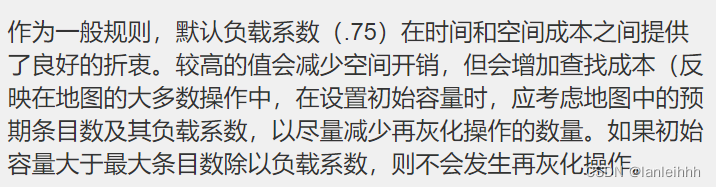

# 说说对ArrayList的理解

ArrayList是List集合的一个实现类，其底层实现是数组`transient Object[] elementData;`

- 数组的查询是直接通过索引，查询速度比较快，时间复杂度是O(1)，增删的话，增删越靠近前面的，越慢，需要移动后面所有元素

- 扩容机制：当构造方法中没有指定数组的大小时，其默认初始容量是10。当超过这个默认值的时候，一定有一个扩容机制，其扩容机制是，当集合中元素的个数大于集合容量的时候，也就是add的时候集合放不下了，就会触发扩容机制，扩容后的新集合容量是旧集合容量的1.5倍，源码：`int newCapacity = oldCapacity + (oldCapacity >> 1);`。 

- 线程问题：ArrayList是线程不安全的，在add()方法的时候，首先会检查一下数组的容量是否够用，如果够用，那么就会执行elementData[size++] = e;方法，该语句执行了两大步，第一大步是，将e放到elementData缓冲区，第二大步是，将size的大小进行加1操作，也就是说，这个操作并非原子性操作。当在并发的情况时，就会出现问题。


# 说说对Vector的理解

- Vector也是List的一个实现类，其底层也是一个数组`protected Object[] elementData;`，底层ArrayList差不多，就是加了synchronized的ArrayList，线程是安全的，效率没有ArrayList高，扩容时增加为原来的1倍，而ArrayList是增加1.5倍，一般不建议使用。

# 说说对LinkedList的理解

- LinkedList也是List的一个实现类，其底层是双向链表，其内部有一个next指针指向下一个节点，一个prev指针，指向上一个节点，由于是链表的数据结构，所以在查询的时候相对就比较慢了，时间复杂度是O(n)，因为当我们需要查询某个元素的时候，需要从第一个节点开始遍历，直到查询结束。而他的增删就比较快了，如果增加一个N节点，直接将后一个节点的prev指向N节点，N节点的next指向后一个节点，前一个节点的next指向N节点，N节点的prev指针指向前一个节点即可，时间复杂度为O(1)，空间复杂度一般比ArrayList大，因为每个节点都要存储两个指针。 

-  线程问题：LinkedList也是线程不安全的，其添加元素的操作，通过linkLast方法在尾部进行添加的，添加完之后，并把size的大小加1。其他的不说，单单一个size++就不是原子性了。简单的a加1操作会执行三步：1：把a的值加载到内存、2：将内存中的值，存储到变量中、3：然后进行加1操作。

# RandomAccess接口

 RandomAccess、Cloneable、 java.io.Serializable 这几个都是没有具体实现的标志接口

1. List实现的标记接口，表明这个List支持快速随机访问。
2. 遍历集合List时，如果List实现了RandomAccess接口，使用for循环遍历更快，没有实现的使用迭代器遍历更快

RandomAccess在代码中的使用：

```java
public static <T> int binarySearch(List<? extends T> list, T key, Comparator<? super T> c) {
    if (c==null)
        return binarySearch((List<? extends Comparable<? super T>>) list, key);
	//如果这个list实现了RandomAccess接口，使用下标查找
    if (list instanceof RandomAccess || list.size()<BINARYSEARCH_THRESHOLD)
        return Collections.indexedBinarySearch(list, key, c);
    //没有实现RandomAccess接口，使用迭代器查找
    else
        return Collections.iteratorBinarySearch(list, key, c);
}
```

# ArrayList 与 LinkedList 区别

ArrayList
基于数组实现，在内存中的存储是连续的，实现了`RandomAccess`这样一个标志接口，实现快速随机访问，可以通过下标访问。

但是长度固定，容量满后会扩容为原来的1.5倍(原容量+原容量>>1)

- 1.7之前初始化容量为10的数组；1.7后第一次执行add()方法时，才创建容量为10的数组

- ArrayList添加元素到指定位置，和删除元素，都会拷贝数组；删除时，将待删除位置后的元素拷到当前位置，再对最后一个元素置为null，交给GC回收，数据量大时，效率很低

LinkedList
基于链表实现，在内存中存储不连续，适合使用迭代器进行访问，LinkedList额外实现了Deque接口，可以作为双端队列来使用


- 查找：ArrayList更快，时间复杂度O(1)，LinkedList O(n)
- 插入、删除：LinkedList更快，时间复杂度 O(1)，ArrayList O(n)，需要对插入或删除后的元素进行移动，

# Iterator怎么使用，一般用来干什么

1. 先从集合容器返回一个Iterator对象
2. while循环，iterator.hasNext()检查还有没有元素
3. iterator.next()获取迭代器中第一个元素
4. iterator.remove()删除当前遍历过的元素，准备查找下一个

Iterator是用来遍历Collection接口下的集合类，如果不用Iterator的话，遍历ArrayList使用for循环，遍历LinkedList使用while循环，内部的访问逻辑也不相同，如果需要转换ArrayList和LinkedList，需要重写代码，而使用Iterator统一遍历方式，后期维护修改的时候，逻辑都是相同的，容易维护

# Iterator 和 ListIterator 有什么区别？

- Iterator 可以遍历 Set 和 List 集合，而 ListIterator 只能遍历 List。
- Iterator 只能单向遍历，而 ListIterator 可以双向遍历（向前/后遍历）。
- ListIterator 实现 Iterator 接口，然后添加了一些额外的功能，比如添加一个元素、替换一个元素、获取前面或后面元素的索引位置。

# foreach能删除数据吗？

在foreach循环中删除数据会报并发修改异常**ConcurrentModificationException**；

使用foreach遍历时，会生成一个iterator来遍历元素，内部会保存一个List修改元素的次数，如果遍历的时候删除/增加元素，List中的modCount发生变化，与iterator的预期修改次数不一致，就会抛出并发修改异常；

foreach可以修改对象的值(改变对象的引用就好了)，不能修改变量的值；

- 如果要在foreach循环中删除list中的元素，要使用itrator迭代器，借助itrator的remove方法删除元素，若使用list的remove方法则会抛出异常。所以要循环遍历删除的话，最好使用iterator，或者原始for循环。
- 如果要在foreach循环中添加list元素，则要另外new一个list。因为直接对list使用add，会抛出异常，而itrator并没有刻意向list中添加元素的方法，所以也无法借助iterator。所以可以采取另外new一个list，然后借助list接口的addAll方法，将原来的list整个加入到新list中，此时循环旧的list，调用新的list的add方法添加元素就可以达到目的。

# lambda表达式可以修改外部变量吗？

不管是修改对象的引用还是修改基本类型的值都是不可以的。

Lambda其实是一个匿名方法，既然是方法那么就是在栈上分配内存，栈是私有的，不能共享数据，所以无法修改其他栈帧中的变量


- 使用数组或者全局变量可以被lambda表达式修改；这两种方式都是存储在堆中的
- 全局变量必须考虑线程安全的问题，如果是基本类型，可以使用`java.util.concurrent.atomic`下的线程安全的包装类，如：AtomicInteger 


在Java8之前，如果在匿名类内部引用函数局部变量，必须将其声明为final，即不可变对象。

Java8 规定在lambda表达式以及匿名类内部，如果引用某局部变量，则直接将其视为final。所以不能修改引用值。


# Collection 和 Collections 有什么区别？

- Collection 是一个集合接口（集合类的一个顶级接口）。它提供了对集合对象进行基本操作的通用接口方法。Collection接口在Java 类库中有很多具体的实现。Collection接口的意义是为各种具体的集合提供了最大化的统一操作方式，其直接继承接口有List与Set。 
- Collections则是集合类的一个工具类，其中提供了一系列静态方法，用于对集合中元素进行排序、搜索以及线程安全等各种操作。

# 说说List和Set的区别

- List的存储顺序是按照存入的顺序来的；而Set是根据哈希值来的 
- List可以存储相同的元素，Set不可以存储重复元素

# 说说对HashSet、LinkedHashSet、TreeSet的理解

## HashSet

- HashSet是Set集合的一个实现类，其底层实现是HashMap的key，初始化容量是16，负载因子是0.75，扩容机制，是变为原来的2倍。 

- HashSet存储元素的顺序并不是按照存入时的顺序（和List不同）而是按照哈希值来存的所以取数据也是按照哈希值取得。

  元素的哈希值是通过元素的hashcode方法来获取的,

  HashSet首先判断两个元素的哈希值，如果哈希值一样，接着会比较equals方法 

  如果 equals结果为true ，HashSet就视为同一个元素。

  如果equals 为false就不是同一个元素。 

  哈希值相同equals为false的元素是怎么存储呢,就是在同样的哈希值下顺延（可以认为哈希值相同的元素放在一个哈希桶中）。也就是哈希一样的存一列。

## LinkedHashSet

LinkedHashSet是对在HashSet的基础上维护了一个双向链表，使得LinkedHashSet存取有序。

## TreeSet

TreeSet()是使用二叉树的原理对新add()的对象按照指定的顺序排序（升序、降序），每增加一个对象都会进行排序，将对象插入的二叉树指定的位置。

# 对HashMap的理解？

- JDK1.8是通过数组+链表+红黑树组成。所有的数据都是通过一个Node节点进行封装，其中Node节点中封装了hash值，key，value，和next指针。
- hash是通过key计算出的hashCode值进行对数组容量减一求余得到的（官方的求余方式是通过&运算进行的）。不同的key计算出来的hash值可能相同，
- 解决冲突是通过拉链法（链表和红黑树）进行处理。正是因为这种存储形势，所以HashMap的存取顺序是无序的。 
-  懒加载机制，在put值的时候会判断数组是否为空，如果是就初始化数组，而不是new的时候就初始化。 
-  HashMap是Map的一个实现类，其默认初始化容量大小是16。扩容机制是根据扩容因子来扩容的，当容量的使用量达到总容量的0.75时，就会触发扩容，举例说就是，当总容量是16时，使用量达到12，就会触发扩容机制。 
- 当我们put一个值的时候，通过key来计算出hash值，计算出来的hash值做为数组的索引，Node节点中封装了hash值，key，value和next。当链表的长度小于8的时候，处理冲突的方式是链表。大于等于8的时候，就会触发红黑树方式存储。 
- 当元素个数小于等于6的时候，会触发红黑树转化为链表的形式，为什么不是小于等于7，是因为给一个过度，也就是防止添加一个刚好为8，删除一个刚好为7，这样来回转化。

# 对LinkedHashMap、TreeMap的理解？

- LinkedHashMap解决了HashMap不能保证存取顺序的问题。内部增加了一个链表用于维护元素存取顺序。

- TreeMap实现SortedMap接口，能够把它保存的记录根据键排序，默认是按键值的升序排序。

# HashMap和HashTable区别？

1. HashMap线程安全；HashTable非线程安全(方法加了synchronized锁)
2. HashMap运行key和value为空；HashTable不允许key和value为空
3. HashMap中数组默认大小16，扩容为原来的2倍；HashTable中数组默认大小是11，扩容是原来的2倍+1
4. HashMap继承自AbstractMap；HashTable继承自Dictonary
5. hashmap需要异或运算或重新计算hash值；HashTable直接使用key的hashCode

# HashMap中数组的容量为什么是2的次方数(整数倍)？

1. `h & (length -1)` 和 `h % length`结果相同，使用`h & (length -1)`是因为比取模运算的性能更高。但等效的前提是length必须是2的次方数
2. 防止哈希冲突

# HashMap为什么扩容为2倍？

1. 减少扩容后元素的移动（只看原来的hash值新增的bit位是1还是0，是0位置不变，是1变为“原长度+原位置”）
2. 使元素均匀分布，减少hash冲突


# 负载因子为什么是0.75 ？

1. 负载因子过大，如1，虽然==空间利用率高==，但是容易发生哈希冲突，导致链表过长（1.7）or 红黑树更加复杂（jdk1.8），==查询效率不好==
2. 负载因子过小，如0.5，插入的元素少，哈希冲突也减少，链表的长度or红黑树的高度会降低，==查询效率高，但是空间利用率太低==
3. 0.75是对时间和空间成本做出的权衡

```java
HashMap源码注释
 * As a general rule, the default load factor (.75) offers a good tradeoff
 * between time and space costs.  Higher values decrease the space overhead
 * but increase the lookup cost (reflected in most of the operations of the
 * <tt>HashMap</tt> class, including <tt>get</tt> and <tt>put</tt>).  The
 * expected number of entries in the map and its load factor should be taken
 * into account when setting its initial capacity, so as to minimize the
 * number of rehash operations.  If the initial capacity is greater
 * than the maximum number of entries divided by the load factor, no
 * rehash operations will ever occur.
```




# HashMap有什么线程安全的方式？

1. **Collections.synchronizedMap()返回一个新的map**

   通过Collections.synchronizedmap()封装所有不安全的hashmap方法,就连tostring,hashcode都进行了封装,封装的关键有两处

   1.使用synchronized来进行互斥

   2.使用了代理模式new了一个新的类,这个类同样实现了map接口

   在hashmap中synchronized锁住的是对象,所以第一个申请得到锁,其他线程将进入阻塞,等待唤醒.

2. **使用线程安全的ConcurrentHashMap**

   使用了新的锁机制,把hashmap进行了拆分,拆分成了多个独立的块.在高并发的情况下减少了所冲突的可能.使用的是nonfairsync. 这个特性调用cas指令来确保原子性和互斥性.当如果多个线程恰好操作到同一个segment上面,那么只会有一个线程得到运行.

# HashMap在扩容上有什么优化？

- JDK1.7，每次扩容需要对元素进行rehash算法，计算元素在新哈希表中的位置；

- JDK1.8后借助2倍扩容机制，不需要重新计算hash；

  只需要看原来的hash值新增的bit位是0还是1，（因为每次都是奇数和哈希值进行`^`运算）如果是0，运算后索引不变，还是原来位置，如果是1，索引变成“原索引+原容量”。

  元素的位置要么是在原位置,要么是在元位置在移动2次幂的位置.

  节省了计算hash的时间，也降低了hash冲突


# 为什么不一开始使用红黑树？

红黑树的查找和插入的时间复杂度是O(log2N)，链表查找是O(N);

红黑树需要左旋、右旋、变色来保持平衡，数据量小的时候不适合红黑树

元素个数>8时，链表的性能降低，红黑树的性能更好

