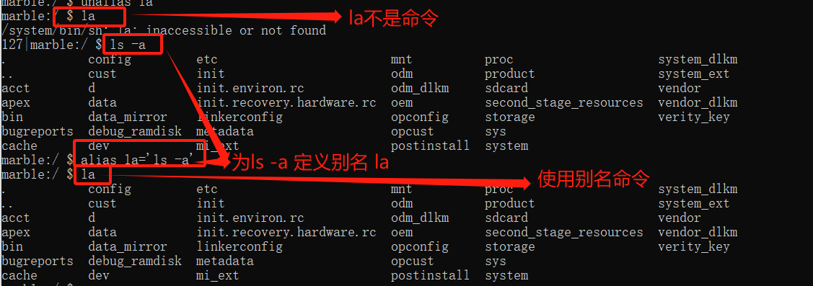
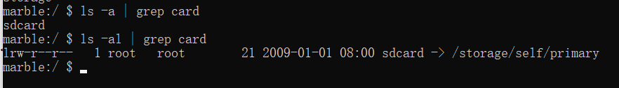
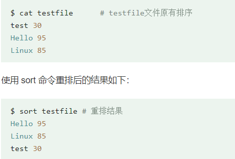
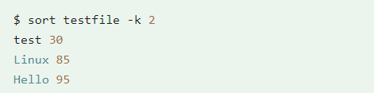
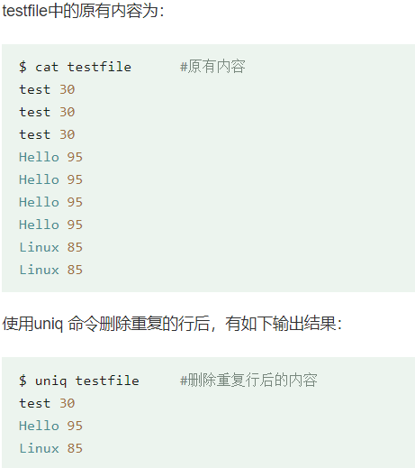
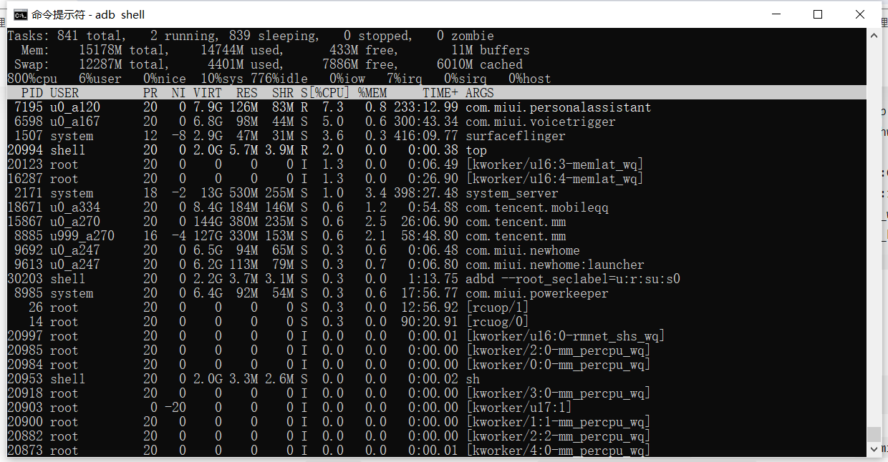

# Linux命令

## alias

Alias命令可以帮助用户定义并使用自定义命令别名。通过alias命令，它可以将长串的命令或者参数简化成一个短的别名，从而提高命令行的效率和便利性。

语法：`alias [name[=value]] `

其中name表示别名，value表示要定义别名的命令值。当用户输入name时，系统会自动将其转换为value。



注意：

- **别名定义可能会覆盖原有的命令别名或系统命令**
- **别名定义只对当前的shell会话有效，如果需要在每个新的shell会话中都能使用别名，需要将别名定义添加到~/.bashrc或~/.bash_profile等配置文件中**

Alias常用技巧

1. 定义多个命令别名可以用分号隔开

   ```shell
   alias lls='ls -l;ls -a' 
   ```

   这个例子中，我们定义了一个名为“lls”的命令别名，当执行“lls”命令时，系统会先执行“ls -l”命令，然后再执行“ls -a”命令。

2. 定义一个带参数的命令别名可以用单引号或者双引号括起来

   ```shell
   alias gr="grep --color=auto" 
   ```

   当执行“gr keyword file”命令时，系统会自动将其转换为“grep --color=auto keyword file”命令

3. 使用“alias”命令时可以不带任何参数，这时系统会显示当前所有已经定义的命令别名
4. 定义一个名为“..”的命令别名可以让用户快速切换到上级目录   `alias ..='cd ..' `

## xargs

xargs ( eXtended ARGuments）是给命令传递参数的一个过滤器，也是组合多个命令的一个工具。

管道实现的是将前面的输出`stdout`作为后面的输入`stdin`

它擅长**将stdin转换成命令行参数**，xargs能够处理管道或者stdin并将其转换成特定命令的命令参数。xargs也可以将单行或多行文本输入转换为其他格式，例如多行变单行，单行变多行。**xargs的默认命令是echo，空格是默认定界符。**这意味着通过管道传递给xargs的输入将会包含换行和空白，不过通过xargs的处理，换行和空白将被空格取代。xargs是构建单行命令的重要组件之一

linux命令可以从两个地方读取要处理的内容：

1. 通过命令行参数。
2. 标准输入。

xargs 一般是和管道一起使用

语法：

```shell
somecommand |xargs -item  command
```

```shell
find /sbin -perm +700 |ls -l       #这个命令是错误的
find /sbin -perm +700 |xargs ls -l   #这样才是正确的
```

### xargs -d

**`-d`是指定分割符**


### xargs -0

**指定固定的`\0`作为分割符。等价于`xargs -d "\0"`**

**xargs默认是以空白字符（空格、换行符、制表符）来分割记录的，实际上ls的数据便是 '`./1`' 和 '`file.txt`' , '`./2`' 和 '`file.txt`' 。**

```shell
yugong@yugong-virtual-machine:~/zsy$ find ./ -name '*.txt' | xargs ls -l
ls: 无法访问'./1': 没有那个文件或目录
ls: 无法访问'file.txt': 没有那个文件或目录
ls: 无法访问'./2': 没有那个文件或目录
ls: 无法访问'file.txt': 没有那个文件或目录
```

**xargs -0表示xargs用NULL来作为分隔符**

```shell
yugong@yugong-virtual-machine:~/zsy$ find ./ -name '*.txt' -print0 | xargs -0 ls -l
-rw-rw-r-- 1 yugong yugong 0 6月  24 19:59 ./1 file.txt
-rw-rw-r-- 1 yugong yugong 0 6月  24 19:59 ./2 file.txt
```

分析：**第一个 -print0 指定结果集分隔为 null，第二个 -0 指定 xargs 分隔为 null**

**-print 在每一个输出后会添加一个回车换行符`'\n'`**

**-print0表示在每一个结果之后加一个NULL字符，而不是默认加一个换行符**。find的默认在每一个结果后加一个'\n'，所以输出结果是多行的。当使用了-print0之后，就变成一行了。

**xargs -0表示xargs用NULL来作为分隔符。**这样前后搭配就不会出现空格和换行符的错误了。选择NULL做分隔符，是因为一般编程语言把NULL作为字符串结束的标志，所以文件名不可能以NULL结尾，这样确保万无一失

## find 查找文件/目录

find [path] [expression]

**查找当前目录下是否有该文件/目录;**

```shell
alias myfind='find . -not \( -path ./out -prune \) -a -not \( -path ./.repo -prune \) -a -not \( -type d -a -name .git -type d -prune \) '
```

解析：

find . -not xxx 找到不是xxx的文件

find .not x -a -not y -a - not z 找到不是x 也不是 y也不是z的结果

x : -path ./out -prune ：

y：-path ./.repo -prune ：

z：-type d -a -name .git -type d -prune ： 类型是文件名为.git的目录，

```shell
alias ff='myfind \( -type f -o -type l \) -name '
```

在上一个命令基础上找到类型是普通文件或者链接文件的结果


### find -print0

**-print0表示在每一个结果之后加一个NULL字符，而不是默认加一个换行符**。find的默认在每一个结果后加一个'\n'，所以输出结果是多行的。当使用了-print0之后，就变成一行了。

> -print 在每一个输出后会添加一个回车换行符`'\n'`，而且 -print 是默认省略的。

```shell
yugong@yugong-virtual-machine:~/zsy$ find ./ -name '*.txt'
./1 file.txt
./2 file.txt
```

>**-print0** 表示在每一个结果之后加一个NULL字符`'\0'`，而不是默认加一个换行符。

```shell
yugong@yugong-virtual-machine:~/zsy$ find ./ -name '*.txt' -print0
./1 file.txt./2 file.txt
```


## grep 过滤

- `ls -a |grep target`：

- `ls -al |grep target`：




> Tip
>
> ls ：显示不隐藏的文件与文件夹
>
> ls -a //显示所有文件与文件夹，包括隐藏文件夹.和..等
>
> ls -l //显示不隐藏的文件与文件夹的详细信息
>
> ls -al //显示当前目录下的所有文件及文件夹包括隐藏的.和..等的详细信息


### fgrep

不支持正则表达式，只能匹配写死的字符串。但是速度快，效率高，fastgrep;

相当于`grep -F`

### 检索内容

```shell
alias xmlgrep='ff "*\.xml" -print0 | xargs -0 fgrep --color -wnI'
```

在ff命令基础上，找到文件后缀为xml的，将每个查询结果都追加一个NULL字符`\0`，并指定用NULL分隔输出一行

fgrep --color -wnI：

- --color ：将匹配到的内容以颜色高亮显示

- -w：被匹配的文本只能是单词，而不能是单词中的某一部分

- -n：显示行号

- -I：列出文件内容符合指定的样式的文件名称

```shell
alias gw='myfind -type f -print0 | xargs -0 fgrep --color -wnI'
```

在myfind命令基础上，找文件，打印一行


## Sed （stream editor）文本编辑工具

> Linux sed 命令是利用脚本来处理文本文件。
>
> sed 可依照脚本的指令来处理、编辑文本文件。
>
> Sed 主要用来自动编辑一个或多个文件、简化对文件的反复操作、编写转换程序等


数据的查找与替换

```shell
sed 's/要被取代的字串/新的字串/g'
```

示例：

```shell
alias tihuan='tihuan() { sed -i "s/\<$1\>/$2/g" `fgrep "$1" -rwl .`; }; tihuan'
```

解析：

-i：直接修改读取的文件内容，而不是输出到终端

`sed -i "s/\<$1\>/$2/g"`  表示将文件中`<$1>`字符串修改为`$2`字符串

`fgrep "$1" -rwl` 表示寻找字符串为`$1`的结果

定义函数tihuan，找到$1串的文件，并替换`<$1>`为`$2`


## awk：Linux的文本报告生成器（格式化文本）

按列处理结果

实际上一些性能指标就可以cat结合awk，再加上do while实时观察，比如我要实时观察代码里的vmpress的输出是否符合预期

```shell
while true; do usage=`cat
/dev/memcg/memory.usage_in_bytes`; sw_usage=`
cat /dev/memcg/memory.memsw.usage_in_bytes`;awk 'BEGIN{printf "usage is %d, and sw_usage is %d~ VMPRESS
is %.2f\n",('$usage'),('$sw_usage'),('$usage'*100/'$sw_usage')
}'   ; sleep 0.5; done;
```

## sort

Linux sort 命令用于将文本文件内容加以排序。

sort 可针对文本文件的内容，以行为单位来排序。


1. sort 命令默认将文件的第一列以 ASCII 码的次序排列

```shell
sort testfile 
```



2. 使用 **-k** 参数设置对第二列的值进行重排

   


## uniq

> uniq 命令用于检查及删除文本文件中重复出现的行列，**一般与 sort 命令结合使用**。
>
> uniq 可检查文本文件中重复出现的行列

### 删除文件中重复行（重复行相邻）

```shell
uniq testfile
```



### 删除文件重复行，并显示重复出现次数(重复行相邻)

```shell
uniq -c testfile 
```

```shell
$ uniq -c testfile      #删除重复行后的内容  
3 test 30             #前面的数字的意义为该行共出现了3次  
4 Hello 95            #前面的数字的意义为该行共出现了4次  
2 Linux 85            #前面的数字的意义为该行共出现了2次 
```

### 重复行不相邻，使用sort命令

重复的行并不相邻时，uniq 命令是不起作用的：

```shell
$ cat testfile      # 原有内容 
test 30  
Hello 95  
Linux 85 
test 30  
Hello 95  
Linux 85 
test 30  
Hello 95  
Linux 85 
```

这时就可以使用sort

```shell
$ sort  testfile | uniq  # 对testfile首列进行排序，再删除相邻重复行
Hello 95  
Linux 85 
test 30
```

```shell
sort testfile | uniq -c # 统计每一行在文件中出现次数 -c每列旁边显示该行重复出现的次数
```

### 找出文件中重复行

```shell
sort testfile | uniq -d # -d仅显示重复出现的行列
```


## vmstat 

用于查看[虚拟内存](https://so.csdn.net/so/search?q=虚拟内存&spm=1001.2101.3001.7020)

```shell
Usage:
 vmstat [options] [delay [count]]                 # delay：刷新时间间隔。如果不指定，只显示一条结果。 count：刷新次数。如果不指定刷新次数，但指定了刷新时间间隔，这时刷新次数为无穷。

Options:
 -a, --active           active/inactive memory        # 显示活跃和非活跃内存
 -f, --forks            number of forks since boot    # 显示从系统启动至今的fork数量 
 -m, --slabs            slabinfo                       # 显示slabinfo
 -n, --one-header       do not redisplay header         # 只在开始时显示一次字段名称
 -s, --stats            event counter statistics       # 显示内存相关的统计信息及多种系统活动数量
 -d, --disk             disk statistics                # 显示磁盘相关统计信息
 -D, --disk-sum         summarize disk statistics      # 显示磁盘的总计信息
 -p, --partition <dev>  partition specific statistics  # 显示指定磁盘分区统计信息
 -S, --unit <char>      define display unit            # 使用指定单位显示。参数有 k 、K 、m 、M ，分别代表1000、1024、1000000、1048576字节（byte）。默认单位为K（1024 bytes）
 -w, --wide             wide output                    # 更宽的显示信息
 -t, --timestamp        show timestamp                 # 显示时间
```

```shell
[root@master ~]# vmstat 
procs -----------memory---------- ---swap-- -----io---- --system-- -----cpu-----
 r  b   swpd   free   buff  cache   si   so    bi    bo   in   cs us sy id wa st
 1  0      0 431340  44840 211744    0    0     5     2  149    9  2  4 95  0  0    
 
[root@minion ~]# vmstat -a
procs -----------memory---------- ---swap-- -----io---- --system-- -----cpu-----
 r  b   swpd   free  inact active   si   so    bi    bo   in   cs us sy id wa st
 1  0      0 757496  64916  83772    0    0    85     7   56   42  1  3 96  0  0    
```

**procs**

- r：running 正在等待运行的进程数
- b：block process 在uninterruptible 睡眠中的进程数,等待IO

**memory**

- swpd ： swap used  已使用的swap空间(使用虚拟内存大小)
- free  ：  剩余的物理内存
- buff   ： 用作缓冲的内存大小
- cache  ： 用作缓存的内存大小
- inact   : 非活动的内数量（-a选项）
- active  :  活动的内存的数量（-a选项）

**swap**

- si ：swap in 每秒交换到内存的大小
- so ：swap out 每秒交换到磁盘的大小

**io**

- bi  ：block in 每秒读取的块数

- bo   ：block out 每秒写入的块数；

  如果这个值长期不为0，说明内存可能有问题，因为没有使用到缓存（当然，不排除直接I/O的情况，但是一般很少有直接I/O的）

**system**

- in     每秒的中断次数，包括时钟中断
- cs    进程上下文切换次数

**cpu**

- us  ： userspace 用户进程占用CPU时间比例
- sy   ： system 系统占用CPU时间比例
- id   ： idle CPU空闲时间比
- wa  ：iowati  IO等待时间比（IO等待高时，可能是磁盘性能有问题了）
- st   ： steal time 虚拟 CPU 等待实际 CPU 的时间的百分比


## top

top能够实时显示系统中各个进程的资源占用状况，其作用类似于windows系统中的任务管理器



- PID：进程ID，进程的唯一标识符
- USER：进程所有者的实际用户名。
- PR：进程的调度优先级。这个字段的一些值是'rt'。这意味这这些进程运行在实时态。
- NI：进程的nice值（优先级)。NI的值处于[-20, 19]，越小的值意味着越高的优先级。
- VIRT：进程使用的虚拟内存。默认是KB。
- RES：驻留内存大小。驻留内存是任务使用的非交换物理内存大小，默认是KB。
- SHR：SHR是进程使用的共享内存，默认是KB。
- S：这个是进程的状态。它有以下不同的值:
  - D – 不可中断的睡眠态。
  - R – 运行态
  - S – 睡眠态
  - T – 被跟踪或已停止
  - Z – 僵尸态
- CPU：自从上一次更新时到现在任务所使用的CPU时间百分比。
- MEM：进程使用的可用物理内存百分比。
- TIME：任务启动后到现在所使用的全部CPU时间，精确到百分之一秒。
- COMMAND：运行进程所使用的命令。

