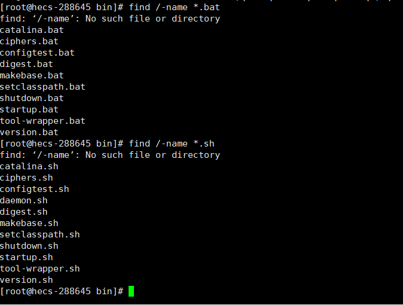
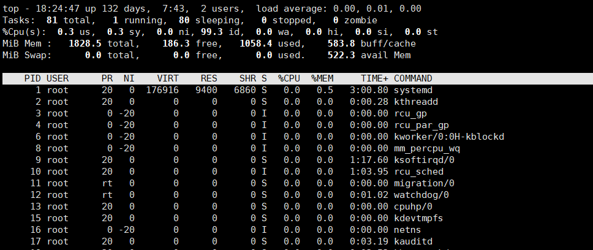
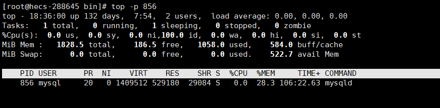
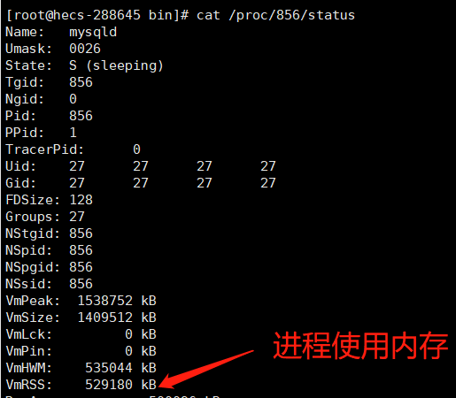

# 查找文件有哪些常用命令

- 
- **grep -r 字符串 路径**


1. 查找包含指定单词的文件

   ```sh
   grep -rwi 目录 -e "hello"
   # r:递归子目录，查询当前目录下所有子目录
   # w：word，单词，单词的范围是特殊符号分割出的字符串
   # i：不区分大小写
   ```

   

2. 查找包含指定非单词的文件

   ```sh
   grep -Ri /home/sharplee -e "你好"
   # 去掉w 单词即可
   ```

3. 查找非压缩文件中的指定内容：**zipgrep** 

   ```sh
   # zipgrep [参数] [文件]
   
   ```

4. 查找压缩文件中的指定内容

   ```sh
   
   ```

5. 查找指定后缀文件

   ```sh
   find /-name *.后缀名
   # find /-name *.sh 查找后缀为sh的文件
   ```



```lua
在文件中查找指定内容：
在压缩文件中查找指定内容： 
```


# 查询包含指定字符串的文件

有多个linux文件，需要查找那个文件中包含指定的字符串的文件名

```sh
grep -ril "指定的字符串" *
```

查找根目录下的文件包含指定的字符串的对应内容

```sh
find / -name "*" | xargs grep -i "指定的字符串"
```


# top命令-任务管理器

显示当前系统正在执行的进程的相关信息，包括进程ID、[内存](https://so.csdn.net/so/search?q=内存&spm=1001.2101.3001.7020)占用率、CPU占用率等



# 如何查看进程的内存占用

- **top -p 进程pid**



- **cat /proc/进程pid/status**


