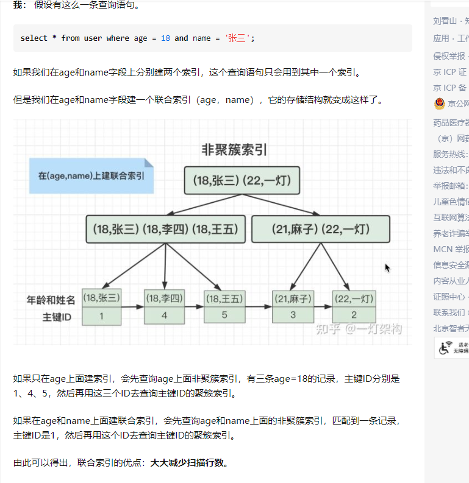
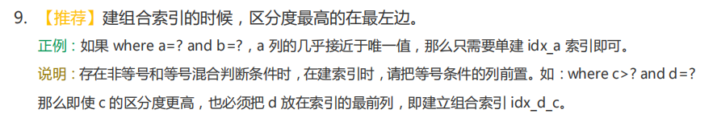
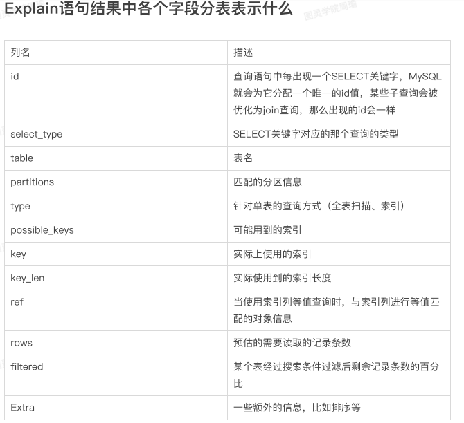
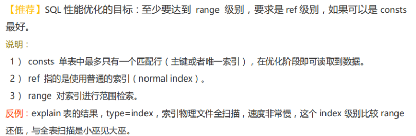
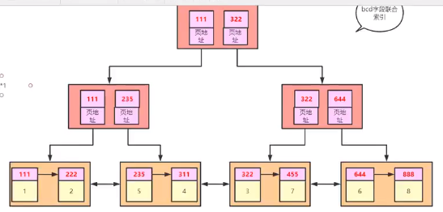
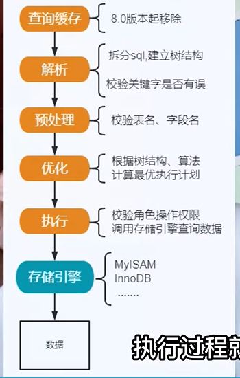

​	

## 查看索引命令

**show index from mytable**

## 索引优缺点

**索引优点**
1.有助于加快数据检索,降低数据库I/O成本,这也是创建索引的最主要的原因。
2.通过创建唯一性索引，可以保证数据库表中每一行数据的唯一性
3.可以加速表和表之间的连接，实现数据的参考完整性方面特别有意义。
4.在使用分组和排序子句进行数据检索时，同样可以显著减少查询中分组和排序的时间,降低了 CPU 的消耗。

**索引缺点**
1.创建索引和维护索引需要耗费时间,当数据量增大的时候更加明显
2.索引需要占物理空间
3.表中的数据进行增加、删除和修改的时候，索引也要动态的维护,提高了CPU的消耗

## 给字段加索引最好怎么加？

**建议创建索引的情况**

1.根据查询要求建立索引:**查询频率高**、实时要求高的字段应该创建索引,如主键、外键、经常需要连接查询的字段、**排序**的字段、查询指定范围的字段。

2.数据量大的大表应该创建索引

**不建议创建索引的情况**

1.对数据表查询时很少引用到的、大量重复的字段不应该创建索引。

2.数据量非常小的数据表,索引能够改进其数据访问的效率十分有限,不必创建索引。

3.对于一个基本表不应该建立过多的索引,数据表进行增删改时,索引也随之变化。索引需要占用文件目录和存储空间,而且需要维护,过多会使系统负担加重。

## 什么情况下使用复合索引更好？ 

组合索引也可以成为复合索引,一个索引包含多个列,组合索引比单值索引开销更小(对于相同的多个列建索引)

组合索引最左前缀原则：在使用组合索引的列作为条件时,必须要出现最左侧列为条件,否则索引不生效

## 什么情况下会导致索引失效？

1.组合索引最左前缀原则：在使用组合索引的列作为条件时,必须要出现最左侧列为条件,否则索引不生效

2.如果条件中有or，即使其中有条件带索引也不会使用(这也是为什么尽量少用or的原因)

3.like查询以%开头，例如%张三、%张三%

4.**字符串类型的字段，传入了int类型的参数时索引会失效**，**而int类型的字段传入字符串类型不会失效**。

例如手机号码是字符串类型，传入了13057900876 也就是int类型的变量，就会导致索引失效。

根据mysql官网上解释，字符串'1'、' 1 '、'1a'都能转换成int类型的1，**也就是说可能会出现多个字符串，对应一个int类型参数的情况，**那么mysql怎么知道该把int类型的1转换成哪种字符串，用哪个索引快速查值?

## 为什么使用模糊匹配会失效，你能给我解释一下底层原理吗？

**索引的本质是比较！**

索引其实就是排序，或者说排队更直观。
like '张三%'，实际你要找的是'张三XXX'，只要把所有'张三'开头的那部分内容返回即可，这部分是连续的，不需要全表扫描。
like '%张三'，实际你要找的是'XXX张三'，这部分在索引里是不连续的，如果要返回需要的结果，只能全表扫描。

## 联合索引的好处是什么


1. **减少索引建立的开销**。建了一个(a,b,c)的[复合索引](https://www.zhihu.com/search?q=复合索引&search_source=Entity&hybrid_search_source=Entity&hybrid_search_extra={"sourceType"%3A"article"%2C"sourceId"%3A"422635386"})，那么实际等于建了(a),(a,b),(a,b,c)三个索引，因为每多一个索引，都会增加写操作的开销和磁盘空间的开销。对于大量数据的表，这可是不小的开销！
2. **索引覆盖**。同样的有复合索引（a,b,c），如果有如下的`select a,b,c from table where a=1 and b = 1`，**那么MySQL可以直接通过遍历索引取得数据，而无需回表。**在真正的实际应用中，索引覆盖是主要的提升性能的优化手段之一
3. **减少扫描行数**。有1000W条数据的表，有如下`select * from table where a = 1 and b =2 and c = 3`,假设假设每个条件可以筛选出10%的数据，如果只有单值索引，那么通过该索引能筛选出1000W*10%=100w 条数据，然后再回表从100w条数据中找到符合b=2 and c= 3的数据；如果是复合索引，可以通过索引筛选出1000w *10% *10% *10%=1w，然后再回表。





## 联合索引究竟在什么场景下用？

**例如：查询英语四六级成绩的时候，可以给身份证、姓名和成绩建立联合索引，用户输入身份证和姓名，可直接在联合索引树上找到成绩，不需要回表查询。**可是身份证号就是唯一值（根据阿里开发手册推荐用法），好像也不用建联合索引。


## 最左前缀原则的原理

多个字段建立组合索引时，查询时，必须出现组合索引中最左边的字段，否则这条语句不走索引。

**为什么不符合最左前缀就不走索引？**


组合索引也是用B+树来存储的，也是有序的
对a.b两个字段建立组合索引

- a字段是排序的，而b字段相对于a的同一个记录中，b是排序的
  a=1时，b=1,2  排序
  a=2时，b=1,4  排序
  a=3时，b=1,2  排序

- 脱离了a字段，b就是1,2,1,4,1,2；不是排序的

因此，如果查询的时候，直接查询b字段，select * from table where b = ?，索引是有序的数据结构，这样查询，索引会失效，只有先查到a字段，才能查到a字段相同记录中b的排序情况

同理，对于（a, b, c）联合索引来说，查询 (a, b) 可以用到这个联合索引，但是查询 (b, c) 就没办法使用这个联合索引，因为 b 和 c 列的有序性都是依托于 a 列的存在的。

## 联合索引中范围查找，索引失效的原因？

a,b,c建立联合索引
select * from table where a = ? and **b > ?** and c = ?;

根据 a 找到 m行数据，在这m行数据中，根据b>?找到这n行数据，在这n行数据中，c的大小不是有序的，无法再走索引，所以失效了

只有前面的字段条件相同时，当前的字段才是有序的，才可以走索引，一旦前面的条件不是唯一的，当前字段就不是有序的了，无法走索引

## 覆盖索引

- 主键索引：叶子节点保存数据
- 辅助索引：叶子结点保存主键值

**回表**：使用辅助索引查找数据，先找到主键索引的值，再去主键索引中找到叶子结点上的数据
**覆盖索引**：辅助索引树上已经存在了需要查找的数据，这样就不会再去主键索引中查找了；


## Using where;Using index和Using index condition区别

- **Using where**：表示需要通过索引回表查询数据
- **Using index**：表示使用覆盖索引，不用回表
- **Using condition index**：会过滤索引后找到所有符合索引条件的数据行，随后用 where子句中的其他条件去过滤这些数据行


## 联合索引 、全表扫描

对a,b,c字段建立联合索引

执行`EXPLAIN SELECT a FROM test `，并没有where条件，执行计划中显示用到了索引，还是覆盖索引

没有where条件，有索引查找和全表扫描两种方式，对于这条SQL来说，使用索引比全表扫描效率更高

order by 导致索引失效
`EXPLAIN SELECT * FROM test ORDER BY a,b,c`

对于这条SQL的执行方式：

- 走(a,b,c)索引，不需要排序，但是需要回表
- 全表扫描，需要在内存中排序，但是不用回表


## Mysql慢查询该如何优化？ 

1. 检查是否⾛了索引，**如果没有则优化SQL利⽤索引** 
2. **检查所利用的索引，是否是最优索引** 
3. **检查所查字段是否都是必须的，是否查询了过多字段，查出了多余数据** 
4. **检查表中数据是否过多，是否应该进行分库分表了** 
5. **检查数据库实例所在机器的性能配置，是否太低，是否可以适当增加资源** 

## Explain和SQL优化




**比较重要的几个字段：**

**possible_keys： 代表可能用到的索引**

**key：实际上使用的索引**

**key_len:实际使用索引的长度**

**type所显示的是查询使用了哪种类型，type包含的类型包括如下图所示的几种：**


**从最好到最差依次是：**

```mysql
system > const > eq_ref > ref > range > index > all

1.system：表只有一行记录（等于系统表），这是const类型的特列，平时不会出现，这个也可以忽略不计
2.const：单表中最多只有一个匹配行（主键或唯一索引），在优化阶段即可读到数据
3.eq_ref：唯一性索引扫描，对于每个索引键，表中只有一条记录与之匹配。常见于主键或唯一索引扫描
4.ref：普通索引
5.range:范围查询，一般就是在你的where语句中出现between、< 、>、in等的查询，
6.index： 遍历索引树。这通常比ALL快，但是也没好到哪里去。
7.all：全表扫描，最差的情况下
```

**Extra：十分重要的额外信息**

**Using index：表示相应的select操作中使用了覆盖索引（Covering Index）**

**Using where：表明使用了where过滤**




## MySQL怎么判断走索引还是全表扫描

**我们在查询有索引的字段时，有时候会发现居然没有走索引，而是走了全表扫描，因为MySQL发现走全表扫描会比走索引更快，因此选择了全表扫描。**


**例如：我们给字段bcd加了联合索引，然后查询sql为select * from t1 where  b>1**



**例如你走了联合索引，就会找到七条符合条件的记录，然后要进行七次回表查询（因为是select *，还有其他字段不在当前索引树中），所以mysql认为与其你先走了索引然后进行许多次的回表查询，不如直接全表扫描快，于是就虽然你用了索引但是还是全表扫描了。**

**小结：mysql会进行成本计算，用了索引的成本是多少，全表扫描的成本是多少，如果用了索引但是回表太多就去全表扫描**

## 关系型和非关系型的区别，以及使用场景

**关系型数据库** ：**采用关系模型来组织数据的数据库，关系模型就是二维表格模型。一张二维表的表名就是关系，二维表中的一行就是一条记录，二维表中的一列就是一个字段。**

**优点**：**容易理解 ，使用方便，通用的 sql 语言 ，易于维护，丰富的完整性（实体完整性、参照完整性和用户定义的完整性）。** 


缺点：**磁盘 I/O 是并发的瓶颈 ，海量数据查询效率低 ，横向扩展困难**，无法简单的通过添加硬件和服务节点来扩展性能和负载能力， 需要对数据库进行升级和扩展时，需要停机维护和数据迁移 ，多表的关联查询以及复杂的数据分析类型的复杂 sql 查询，性能欠佳。因为要 保证 ACID. 


**非关系型数据库：分布式，一般不保证遵循 ACID 原则的数据存储系统。键值对存储， 结构不固定。** 

**优点：结构简单易扩展 ，高性能灵活的数据模型** 

缺点：**只适合存储一些较为简单的数据 ，不适合复杂查询的数据 ，不适合持久存储海量数据** 

**因此适合存储较为简单的数据。有一些不能够持久化数据，所以需要和关系型数据库结合。**


**例如自己存数据都是用的关系型MySql数据库，但是用到了非关系型数据库redis去做一个缓存以及分布式锁，自己的邮箱验证码和新闻就是存在redis中去的。**


## 左匹配，右匹配，inner join说一下区别

**区别：**
**1.left以 left join 左侧的表为主表，左表中的记录都会出现在查询结果中，如果右表没有相匹配的记录，则以 null填充。**
**2.right 以 right join 右侧表为主表，记录都会出现在查询结果中，如果左表没有相匹配的记录，则以 null填充。**

**3.inner join 查找的数据是左右两张表共有的**


**什么是小表驱动大表 ？**

**小表驱动大表指的是用小的数据集驱动大得数据集。**


1.当使用left join时，左表是驱动表，右表是被驱动表 ;
2.当使用right join时，右表时驱动表，左表是被驱动表 ;
3.当使用inner join时，**mysql会选择数据量比较小的表作为驱动表，大表作为被驱动表 ;**


例如：现有两个表A与B ，表A有200条数据，表B有20万条数据 ;
按照循环的概念举个例子

小表驱动大表 
 for(200条){
   for(20万条){
     ...
   }

大表驱动小表 
 for(20万){
   for(200条){
    ...
   }

**总结：**

**1.如果小的循环在外层，对于表连接来说就只连接200次 ;**
**2.如果大的循环在外层，则需要进行20万次表连接，从而浪费资源，增加消耗 ;**

**综上:**
**小表驱动大表的主要目的是通过减少表连接创建的次数，加快查询速度 。**

## 外键

使用外键的原因

**1.外键保证数据的完整性和一致性，不会得到孤立行。**

**2.可以获得良好的“级联删除，级联更新”行为，自动清理表**

**3.将数据完整性判断托付给了数据库完成，减少了程序的代码量**

**4.外键提供了一个非常重要的提示，说明在数据库中收集哪些统计信息最重要。**

不使用外键的原因

**1.数据库需要维护外键的内部管理。**

**2.外键等于把数据的一致性事务实现，全部交给数据库服务器完成，使数据库在每个CRUD操作上都额外工作，因为它必须检查外键一致性，这要消耗不少资源，如果进行大批量更新，这更是非常痛苦。**

**3.通过强制关系，外键指定了您必须添加/删除内容的顺序，例如如果学生关联了订单，必须先删除订单数据，在删除学生数据。**

**4.外键还会因为需要请求对其他表内部加锁而容易出现死锁情况。**

例如：外键约束带来的开销还包括锁开销，比如向子表中添加一条数据，外键约束会让innodb检查对应的父表。这里会需要对父表进行加锁操作，来确保这条记录不会在事务完成之前被删除。这就带来了额外的锁开销。甚至死锁。


## 数据库的隔离级别

1、脏读：事务A读取了事务B更新的数据，然后B回滚操作，那么A读取到的数据是脏数据。

2、不可重复读：事务 A 多次读取同一数据，事务 B 在事务A多次读取的过程中，对数据作了更新并提交，导致事务A多次读取同一数据时，结果不一致。

3、幻读：系统管理员A将数据库中所有学生的成绩从具体分数改为ABCDE等级，但是系统管理员B就在这个时候插入了一条具体分数的记录，当系统管理员A改结束后发现还有一条记录没有改过来，就好像发生了幻觉一样，这就叫幻读。

**小结：不可重复读的和幻读很容易混淆，不可重复读侧重于修改，幻读侧重于新增或删除。解决不可重复读的问题只需锁住满足条件的行，解决幻读需要锁表**

**注意：在innodb存储引擎下，引入mvvc之后已近解决了幻读问题。**

## Mysql锁有哪些，如何理解 

**按锁粒度分类：** 

1. **⾏锁：锁某⾏数据，锁粒度最⼩，并发度⾼** 
2. **表锁：锁整张表，锁粒度最⼤，并发度低** 
3. **间隙锁：锁的是⼀个区间** 

**还可以分为：** 

1. **共享锁：也就是读锁，⼀个事务给某⾏数据加了读锁，其他事务也可以读，但是不能写** 
2. **排它锁：也就是写锁，⼀个事务给某⾏数据加了写锁，其他事务不能读，也不能写** 

**还可以分为：** 

1. **乐观锁：并不会真正的去锁某⾏记录，⽽是通过⼀个版本号来实现的** 
2. **悲观锁：上⾯所的⾏锁、表锁等都是悲观锁** 


## MVCC实现原理

MVCC 的目的就是多版本并发控制，在数据库中的实现，就是为了解决`读写冲突`，它的实现原理主要是依赖记录中的 **3个隐式字段**，**undo日志** ，**Read View** 来实现的。所以我们先来看看这个三个 point 的概念。


**Read View：说白了 Read View 就是事务进行快照读操作的时候生产的读视图 (Read View)，在该事务执行的快照读的那一刻，会生成数据库系统当前的一个快照，记录并维护系统当前活跃事务的 ID (当每个事务开启时，都会被分配一个 ID , 这个 ID 是递增的，所以最新的事务，ID 值越大)。**


`undo log` ：**实际上就是存在 `rollback segment` 中旧记录链。**


**隐式字段：**每行记录除了我们自定义的字段外，还有数据库隐式定义的 `最近修改(修改/插入)事务 ID`, `回滚指针，指向这条记录的上一个版本`, `隐含的自增 ID（隐藏主键）` 等字段。


**正是 Read View 生成时机的不同，从而造成读已提交 , 可重复读级别下快照读的结果的不同；总之在 读已提交隔离级别下，是每个快照读都会生成并获取最新的 Read View；而在可重复读隔离级别下，则是同一个事务中的第一个快照读才会创建 Read View, 之后的快照读获取的都是同一个 Read View。**


## 索引的基本原理 

**索引用来快速地寻找那些具有特定值的记录。如果没有索引，⼀般来说执行查询时遍历整张表。** 

**索引的原理：就是把无序的数据变成有序的查询** 

1. **把创建了索引的列的内容进行排序** 
2. **对排序结果生成倒排表** 
3. **在倒排表内容上拼上数据地址链** 
4. **在查询的时候，先拿到倒排表内容，再取出数据地址链，从而拿到具体数据**


## 一次查询的执行流程是什么？




**mysql分为server层与存储引擎层，server层包含连接器、分析器、优化器、执行器。**

**接下来以一条sql查询语句执行过程介绍各个部分功能。客户端执行一条sql：**

**1、连接器：连接到数据库，身份验证，权限管理**

**2、分析器：执行之前，MySQL肯定需要知道你要做啥，先进行词法分析，把关键字识别出来，再进行语法分析，看你的SQL语句语法是否有错。**

**3、优化器：通过分析器，我们知道了SQL需要做什么，但是直接根据SQL去获得结果可能会消耗很大性能，因此还得需要经过优化器对其进行优化。生成执行计划、选择索引等操作，选取最优执行方案**

**4、执行器，打开表调用存储引擎接口，逐行判断是否满足查询条件，满足放到结果集，最终返回给客户端；若用到索引，筛选行也会根据索引筛选。**

## **说说** **redo log和**undo log 日志的过程

**redo log作用：确保事务的持久性。防止在发生故障的时间点，尚有脏页未写入磁盘，在重启mysql服务的时候，根据redo log进行重做，从而达到事务的持久性这一特性。**


**内容：**

物理格式的日志，**记录的是物理数据页面的修改的信息**，其redo log是顺序写入redo log file的物理文件中去的。什么时候产生：**事务开始之后就产生redo log，redo log的落盘并不是随着事务的提交才写入的，而是在事务的执行过程中，便开始写入redo log文件中。**

 

**undo log作用：如果因为某些原因导致事务失败或回滚了，可以借助该undo log进行回滚。**

 

内容：**可以认为当delete一条记录时，undo log中会记录一条对应的insert记录，反之亦然，当update一条记录时，它记录一条对应相反的update记录。**当执行rollback时，就可以从undo log中的逻辑记录读取到相应的内容并进行回滚。

## 为什么建议InnoDB表必须建立主键？

使用InnoDB创建的索引和数据都放在`idb`文件中，整个文件就是一颗B+树，而这颗B+树是按照主键来组织的，因此必须有主键
- 如果有主键，直接使用主键索引来组织整张表的数据
- 如果不建立主键，mysql会自动在列中找出一个没有重复数据的列建立唯一索引
- 找不到建立唯一索引的列，就会自动生成一个隐藏列建立唯一索引，来组织整张表

所以如果我们不手动建立主键索引的话，InnoDB最终还是会建立的，因此在创建表的时候就可以直接建立主键
## 为什么InnoDB推荐使用 int 整型的自增主键?
使用整形作为主键：
- 比uuid更省空间，int4字节，UUID16字节
- 比uuid之间比较大小，快了很多
- 如果主键字段过长，引用主键的辅助索引也会过长，浪费资源


使用自增：
- B+树本身是有序的数据结构，如果主键不是⾃增的，在进行增删数据的时候，要判断数据应该存放的位置，进行插⼊和删除，为了保持B+树有序的特性，会频繁地分裂来调整B+树，严重影响性能，所以主键需要是自增的，插⼊时，插⼊在索引数据页末尾。


## MySQL中带有自增主键，删除部分数据后，再将MySQL重启后，自增键是继续编还是重新编

如果id:1~10，删除id>5

MyISAM插入的新纪录是11

8.0之前：InnoDB新增数据的id是6;

8.0之后：InnoDB新增数据的id是11

原理：

MyISAM会将最大id保存在数据文件中，重启后重新读取。

8.0之前 InnoDB 将最大id保存在内存中，一旦重启，就会丢失最大id，重启后读取新的最大id，最大id+1为新增数据id

8.0之后 每次更改，最大id会记录在redo log中

## B+树索引 与 Hash索引

Hash索引
- 对索引的key进行一次hash计算，定位出数据的存储位置
- hash索引定位数据更高效
- 但是只能满足“=”、“IN”，不支持范围查询、模糊查询、排序操作、最左前缀原则

而B+树支持范围查询
因为B+树的叶子节点存储的是索引和数据，每个叶子节点之间都有双向指针指向，适合范围查找


## B树 与 B+ 树区别


数据库中范围查找是常态
- B树叶子结点之间没有指针指向，不适合区间范围查询，只能一个一个遍历，每遍历一个元素都会走一次根节点到叶子节点，效率低
- B+树叶子节点之间有指针指向，适合区间范围查询，找到区间的边界元素后，只需要遍历一次叶子节点就可以完成区间查询

节点存储数据
- B+树的叶子结点存储索引和数据，非叶子节点只存储冗余的索引，不存储指向磁盘中数据的地址，相比B树可以存储更多的索引。每次读到内存中的数据也更多，减少了磁盘IO。每次查询的路径都是从根节点到叶子节点，查询效率稳定
- B树结点存储索引和数据在磁盘中的地址。


## MyISAM 和 InnoDB的区别


1. **InnoDB ⽀持事务，MyISAM 不⽀持事务。**
2. **InnoDB ⽀持外键，MyISAM 不⽀持。**
    对⼀个包含外键的 InnoDB 表转为 MYISAM 会失败；
3. **InnoDB 是聚簇索引，MyISAM 是非聚簇索引。**
   - 聚簇索引的文件存放在主键索引的叶子节点上，因此 InnoDB 必须要有主键，通过主键索引效率很⾼。
   但是辅助索引需要两次查询，先查询到主键，然后再通过主键查询到数据（回表）。所以主键不应该过大，如果主键太大，引用主键的辅助索引这些也都会很大。
   - MyISAM 是非聚集索引，数据文件是分离的，索引保存的是数据文件的地址。主键索引和辅助索引是独立的。

4. **InnoDB 不保存表的具体行数**，执行 select count(*) from table 时需要全表扫描。

   **MyISAM 用⼀个变量保存了整个表的行数**，执行上述语句时只需要读出该变量即可，速度很快；

6. **InnoDB 支持行锁，MyISAM 支持表锁。**


事务、并发是数据库必不可少的，因此，MySQL5.5之后默认存储引擎由MyISAM变成了InnoDB

**大部分小公司，或者早期的公司，用的是简单的MYISAM，他们对于性能的要求本来就不高，表的数据比较少，MYISAM此时“显得‘很块，如果数据量大了，公司发展了，业务逻辑关系复杂了。此时考验数据库的是缓存的设计，优化器的设计，一个这么简单的MYISAM引擎，怎么可能快得过InnoDB呢。**

**MYISAM是借助操作系统来缓存数据的，操作系统是不知道优化数据库访问的，而InnoDB是用自己的缓存功能来加速访问的，要知道优化越靠近应用/数据侧才越有效果。**

**建议不要用MYISAM，锁粒度大只是一个小问题，关键是它会时不时莫名其妙地表损坏，修复也不是100%就能修成功。而且这玩意已经被官方放弃多年了，所有新的代码都是基于InnoDB的，遇到点Bug就得跪。**


**MYISAM引擎设计简单，数据以紧密格式存储，所以某些读取场景下性能很好。**


## InnoDB是如何支持范围查找 走索引的？


- 查找id>6的，先走索引查到id=6的叶子结点，返回该结点后面的所有数据
- 查找id<6，先走索引查找到id=6的叶子结点，返回该阶段之前的所有数据
- B+树叶子节点直接维护了双向指针，可以向前或者向后查找


## 数据库事务的ACID靠什么保证？
- A：原子性由`undo log日志`保证，它记录了需要回滚的日志信息，回滚时撤销已经执行成功的SQL（记录了与执行的SQL相反的操作）
- C：一致性由`原子性、隔离性、持久性`共同保证
- I ：隔离性由`MVCC`多版本并发控制来保证
- D:持久性由`redolog日志`来保证，MySQL的InnoDB在修改数据的时候，同时在内存和redolog日志中记录一份数据，只要日志成功，就算SQL执行失败，数据也不会丢失。宕机的时候可以从redo log中恢复数据。


## InnoDB是如何实现事务的？

Buffer Pool、LogBuffer、redo log、undo log

对于update语句

1. 先根据条件找到数据所在的页，并缓存在Buffer Pool中
2. 执行update语句，修改Buffer Pool里的数据
3. 针对update语句，生成一个redo log对象，存入LogBuffer中
4. 针对update语句，生成一个undo log日志，用于事务回滚
5. 如果事务提交，会将redo log对象进行持久化，将Buffer Pool里修改的数据页持久化到磁盘中
6. 如果事务回滚，利用undo log日志进行回滚


## 脏读、幻读、不可重复读

- **脏读**：**事务B读取到事务A未提交的数据**；A事务在访问数据number=10；并将number修改为20；B事务这时也访问到number，读取到20，但是A事务发生了回滚，number真正的值还是10，B事务访问到错误的数据就是脏读

- **幻读**：**并发增删时，一次事务中前后数据量发生变化，读取到的与预期不一致**；

  A事务delete清空了数据，B事务有插入了数据，A事务读取到的与预期的数据量不一样；

  A事务插入了数据，B事务删掉了，A事务读取的数据量与预期的数据量不一致

- **不可重复读**：**并发更新时，同一次事务中前后查询不一致**；在事务A第一次读取到num=10；事务B进来修改为num=20,；事务A读取到两次数据不一样，就是不可重复读，也就是**原始读取不可重复**


| 事务隔离级别                   | 脏读     | 不可重复读 | 幻读           |
| ------------------------------ | -------- | ---------- | -------------- |
| **读未提交(read uncommitted)** | **可能** | **可能**   | **可能**       |
| **读已提交(read committed)**   | 不可能   | **可能**   | **可能**       |
| **可重复读(repeatable read )** | 不可能   | 不可能     | 对InnoDB不可能 |
| **串行化(serializable)**       | 不可能   | 不可能     | 不可能         |

## 为什么InnoDB不会出现幻读？


## undo log什么时候被销毁？销毁了版本链不是断掉了？

在提交事务或回滚事务时，undo log被删除，undo log版本链不是立即删除，要确保版本链数据不再被“引用”后再进行删除


## MySQL的主从同步

MySQL通过将主节点的binlog同步到从结点完成主从同步

主从集群只会由 主节点 同步到 从节点，不会反过来，由此引出了**读写分离**的问题

要保证主从数据一致，写操作只能在主节点完成，读操作在主从都可以

也可以两个节点互为主从，但是性能太低


主从同步是怎么做的？

- Master(主节点)发生变化后，记录到Binary log中
- Slave(从节点)启动一个单独的IO线程连接Master，请求Master变化的二进制日志
- Slave IO线程将获取到的二进制日志保存到字节的Relay log日志中
- Slave有一个SQL 线程定时检查Relay log是否变化，发生变化了就更新数据


读写分离是在MySQL主从集群的基础上，由具体的业务来实现的


## int(1)与int(10)有区别吗？

### 不使用zerofill，int(1)与int(10没有区别)，括号内宽度无论定义多少，都是存储10位数

- **无符号unsigned 的int类型为2^32-1=4294967295（40亿+）**

  

- **signed 的 int 为2^31−1=2147483647(21亿+)**

  

### 使用zerofill，插入数据 没有达到定义的宽度，会进行补0


int后面的数字不表示字段的长度，int(n)一般加上zerofill，才有自动补0指定宽度的效果。

**zerofill的应用场景：插入等长的自增数字编号时，例如：001,002,...999**


## alter 与 modify的区别

- modify：只能修改字段的属性(修改字段为主键、修改字段的数据类型)，是alter下其中一个功能
- alter：修改字段，增删字段；包括 add添加字段，drop删除字段，change，modify四个功能

### add

```mysql
-- 添加到第一列
alter table date_test add column id int default 0 first;

-- 新增字段到 id 字段之后
alter table date_test add column name int default 0 after id;

-- 添加索引 
ALTER TABLE date_test add index INDEX_NAME (name);
```

注意：

- 在 mysql 中，只有 first 和 after，没有 befor，所以要么就添加到第一列，要么添加到某列之后
- 如果不设置默认值 0，那默认值则为 null
- first 或 after 需放在语句最后，不然报错

### drop

```mysql
-- 删除字段
alter table 表名 drop id;

-- 删除索引
alter table 表名 drop index emp_name;
```

### change

```mysql
-- 修改字段名称
alter table 表名 change 列名 新列名 int;

-- 修改字段属性
alter table 表名 列名 列名 类型 (相同的列名要写两次)
```

### modify

```mysql
-- 修改字段 id 为自增主键
alter table date_test modify id int auto_increment primary key;

-- 修改字段数据类型
alter table date_test modify sid varchar(20);
```

### 修改表名：

```mysql
-- 1.alter修改
alter table 旧表名 rename as 新表名
alter table 旧表名 rename  新表名

-- 2.rename修改
rename table 旧表名 to 新表名;
```


## Delete 与 Truncate区别


delete和truncate都是删除表数据的

- **delete可以按条件删除，truncate只能删除表中所有数据**

  ```mysql
  # delete - 条件删除
  DELETE FROM student WHERE id = 1;
  
  #  truncate - 删除整个表的数据
  TRUNCATE TABLE student;
  ```

- **delete是DML语言，操作时原数据会放到rollback segmengt，可以回滚，Truncate是DDL语言，操作时不会进行存储，不能回滚**

- **delete可以触发delete触发器，truncate不能触发任何delete触发器**

- **delete是逐行删除，不会改变表的结构(DML数据操作语言)，但是速度没有truncate块，truncate是删除整张表，重新新建一个表(DDL数据定义语言)**

- **高水位重置：**

  **delete删除数据，并没有降低表的高水位，数据库容量只上升，不下降；就算表中数据删除了很多，查询效率还是一样的**

  **truncate删除数据，会重置高水位线，数据库容量也会重置，进行查询等DML操作时，速度会有所提升**


