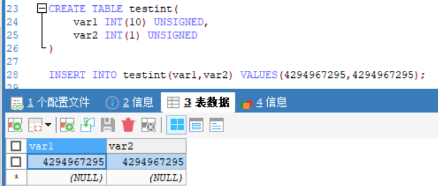
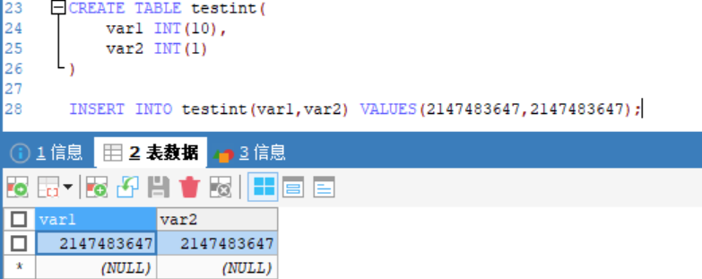
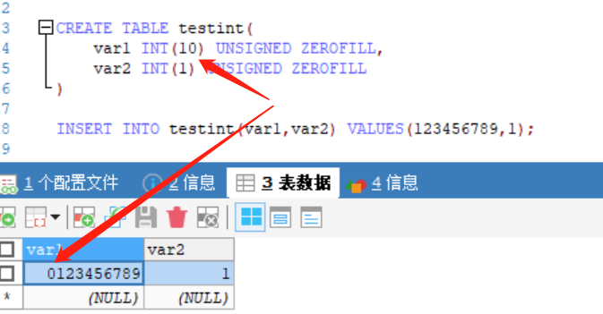

## 为什么建议InnoDB表必须建立主键？
使用InnoDB创建的索引和数据都放在`idb`文件中，整个文件就是一颗B+树，而这颗B+树是按照主键来组织的，因此必须有主键
- 如果有主键，直接使用主键索引来组织整张表的数据
- 如果不建立主键，mysql会自动在列中找出一个没有重复数据的列建立唯一索引
- 找不到建立唯一索引的列，就会自动生成一个隐藏列建立唯一索引，来组织整张表

所以如果我们不手动建立主键索引的话，InnoDB最终还是会建立的，因此在创建表的时候就可以直接建立主键
## 为什么InnoDB推荐使用 int 整型的自增主键?
使用整形作为主键：
- 比uuid更省空间，int4字节，UUID16字节
- 比uuid之间比较大小，快了很多
- 如果主键字段过长，引用主键的辅助索引也会过长，浪费资源

使用自增：
- B+树本身是有序的数据结构，如果主键不是⾃增的，在进行增删数据的时候，要判断数据应该存放的位置，进行插⼊和删除，为了保持B+树有序的特性，会频繁地分裂来调整B+树，严重影响性能，所以主键需要是自增的，插⼊时，插⼊在索引数据页末尾。

## B+树索引 与 Hash索引
Hash索引
- 对索引的key进行一次hash计算，定位出数据的存储位置
- hash索引定位数据更高效
- 但是只能满足“=”、“IN”，不支持范围查询、模糊查询、排序操作、最左前缀原则

而B+树支持范围查询
因为B+树的叶子节点存储的是索引和数据，每个叶子节点之间都有双向指针指向，适合范围查找

## 最左前缀原则的原理
多个字段建立组合索引时，查询时，必须出现组合索引中最左边的字段，否则这条语句不走索引。

**为什么不符合最左前缀就不走索引？**

组合索引也是用B+树来存储的，也是有序的
对a.b两个字段建立组合索引

- a字段是排序的，而b字段相对于a的同一个记录中，b是排序的
a=1时，b=1,2  排序
a=2时，b=1,4  排序
a=3时，b=1,2  排序

- 脱离了a字段，b就是1,2,1,4,1,2；不是排序的

因此，如果查询的时候，直接查询b字段，select * from table where b = ?，索引是有序的数据结构，这样查询，索引会失效，只有先查到a字段，才能查到a字段相同记录中b的排序情况

同理，对于（a, b, c）联合索引来说，查询 (a, b) 可以用到这个联合索引，但是查询 (b, c) 就没办法使用这个联合索引，因为 b 和 c 列的有序性都是依托于 a 列的存在的。

## B树 与 B+ 树区别

数据库中范围查找是常态
- B树叶子结点之间没有指针指向，不适合区间范围查询，只能一个一个遍历，每遍历一个元素都会走一次根节点到叶子节点，效率低
- B+树叶子节点之间有指针指向，适合区间范围查询，找到区间的边界元素后，只需要遍历一次叶子节点就可以完成区间查询

节点存储数据
- B+树的叶子结点存储索引和数据，非叶子节点只存储冗余的索引，不存储指向磁盘中数据的地址，相比B树可以存储更多的索引。每次读到内存中的数据也更多，减少了磁盘IO。每次查询的路径都是从根节点到叶子节点，查询效率稳定
- B树结点存储索引和数据在磁盘中的地址。

## MyISAM 和 InnoDB的区别

1. InnoDB ⽀持事务，MyISAM 不⽀持事务。
2. InnoDB ⽀持外键，MyISAM 不⽀持。
对⼀个包含外键的 InnoDB 表转为 MYISAM 会失败；
3. InnoDB 是聚簇索引，MyISAM 是非聚簇索引。
	- 聚簇索引的文件存放在主键索引的叶子节点上，因此 InnoDB 必须要有主键，通过主键索引效率很⾼。
	但是辅助索引需要两次查询，先查询到主键，然后再通过主键查询到数据（回表）。所以主键不应该过大，如果主键太大，引用主键的辅助索引这些也都会很大。

 	- MyISAM 是非聚集索引，数据文件是分离的，索引保存的是数据文件的地址。主键索引和辅助索引是独立的。
4. - InnoDB 不保存表的具体行数，执行 select count(*) from table 时需要全表扫描。
	- MyISAM 用⼀个变量保存了整个表的行数，执行上述语句时只需要读出该变量即可，速度很快；
6. InnoDB 最小的锁粒度是行锁，MyISAM 最小的锁粒度是表锁。

事务、并发是数据库必不可少的，因此，默认存储引擎由MyISAM变成了InnoDB

## InnoDB是如何支持范围查找 走索引的？

- 查找id>6的，先走索引查到id=6的叶子结点，返回该结点后面的所有数据
- 查找id<6，先走索引查找到id=6的叶子结点，返回该阶段之前的所有数据
- B+树叶子节点直接维护了双向指针，可以向前或者向后查找

## 联合索引中范围查找，索引失效的原因？

a,b,c建立联合索引
select * from table where a = ? and **b > ?** and c = ?;

根据 a 找到 m行数据，在这m行数据中，根据b>?找到这n行数据，在这n行数据中，c的大小不是有序的，无法再走索引，所以失效了

只有前面的字段条件相同时，当前的字段才是有序的，才可以走索引，一旦前面的条件不是唯一的，当前字段就不是有序的了，无法走索引

## 覆盖索引
- 主键索引：叶子节点保存数据
- 辅助索引：叶子结点保存主键值

**回表**：使用辅助索引查找数据，先找到主键索引的值，再去主键索引中找到叶子结点上的数据
**覆盖索引**：辅助索引树上已经存在了需要查找的数据，这样就不会再去主键索引中查找了；

## Using where;Using index和Using index condition区别
- **Using where**：表示需要通过索引回表查询数据
- **Using index**：表示使用覆盖索引，不用回表
- **Using condition index**：会过滤索引后找到所有符合索引条件的数据行，随后用 where子句中的其他条件去过滤这些数据行

## 联合索引 、全表扫描
对a,b,c字段建立联合索引

执行`EXPLAIN SELECT a FROM test `，并没有where条件，执行计划中显示用到了索引，还是覆盖索引

没有where条件，有索引查找和全表扫描两种方式，对于这条SQL来说，使用索引比全表扫描效率更高

order by 导致索引失效
`EXPLAIN SELECT * FROM test ORDER BY a,b,c`

对于这条SQL的执行方式：
- 走(a,b,c)索引，不需要排序，但是需要回表
- 全表扫描，需要在内存中排序，但是不用回表

## 数据库事务的ACID靠什么保证？
- A：原子性由`undo log日志`保证，记录了需要回滚的日志信息，回滚就是撤销已经执行成功的SQL（记录了与执行的SQL相反的操作）
- C：一致性由`原子性、隔离性、持久性`共同保证
- I ：隔离性由`MVCC`多版本并发控制来保证
- D:持久性由`内存+redo log日志`来保证，MySQL的InnoDB在修改数据的时候，同时在内存和redo log日志中记录这次操作，宕机的时候可以从redo log中恢复数据。

## InnoDB是如何实现事务的？

Buffer Pool、LogBuffer、redo log、undo log

对于update语句

1. 先根据条件找到数据所在的页，并缓存在Buffer Pool中
2. 执行update语句，修改Buffer Pool里的数据
3. 针对update语句，生成一个redo log对象，存入LogBuffer中
4. 针对update语句，生成一个undo log日志，用于事务回滚
5. 如果事务提交，会将redo log对象进行持久化，将Buffer Pool里修改的数据页持久化到磁盘中
6. 如果事务回滚，利用undo log日志进行回滚

## MySQL的主从同步

MySQL通过将主节点的binlog同步到从结点完成主从同步

主从集群只会由 主节点 同步到 从节点，不会反过来，由此引出了**读写分离**的问题

要保证主从数据一致，写操作只能在主节点完成，读操作在主从都可以

也可以两个节点互为主从，但是性能太低

主从同步是怎么做的？

- Master(主节点)发生变化后，记录到Binary log中
- Slave(从节点)启动一个单独的IO线程连接Master，请求Master变化的二进制日志
- Slave IO线程将获取到的二进制日志保存到字节的Relay log日志中
- Slave有一个SQL 线程定时检查Relay log是否变化，发生变化了就更新数据

读写分离是在MySQL主从集群的基础上，由具体的业务来实现的

## int(1)与int(10)有区别吗？

### 不使用zerofill，int(1)与int(10没有区别)，括号内宽度无论定义多少，都是存储10位数

- **无符号unsigned 的int类型为2^32-1=4294967295（40亿+）**

  

- **signed 的 int 为2^31−1=2147483647(21亿+)**

  

### 使用zerofill，插入数据 没有达到定义的宽度，会进行补0

int后面的数字不表示字段的长度，int(n)一般加上zerofill，才有自动补0指定宽度的效果。

**zerofill的应用场景：插入等长的自增数字编号时，例如：001,002,...999**

## 
