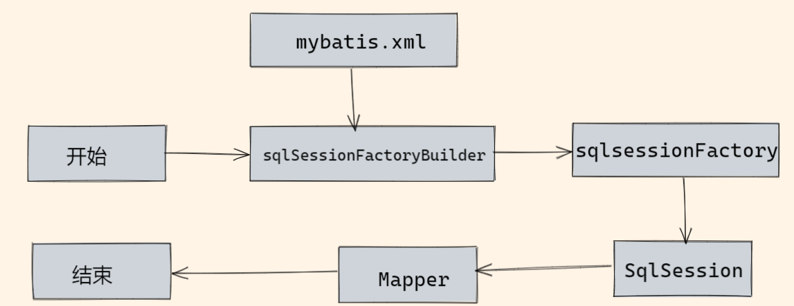

## 1.MyBatis优点

1. 在xml文件编写，降低了与Java代码的耦合，可以复用
2. 编写原生态SQL，灵活度高，适合要求性能高，需求变化多的项目
3. 与JDBC相比，减少了冗余代码，不用手动连接和关闭
4. JDBC支持的数据库MyBatis都支持，与spring很好集成
5. 支持Java对象属性与数据库字段的映射

## 2.MyBatis缺点

1. 与Hibernate相比，mybatis 无法做到数据库无关性，如果需要实现支持多种数据库的软件，则需要自定义多套 sql 映射文件，工作量大，对开发人员的SQL编写能力也有一定要求
2. SQL语句依赖数据库，数据库的移植性差

## 3.对象的属性名与表中的字段名不一样时怎么办？

1. **在SQL中定义字段的别名，让别名和Java对象的属性名一致**

   ```xml
   <select id=”selectorder” parametertype=”int” resultetype=＂me.gacl.domain.order＂>
       select 
           order_id id, 
           order_no orderno ,
           order_price price 
       form　orders 
       where order_id=#{id};
   </select>
   ```

2. **使用resultMap来进行一对一映射**

   ```xml
   <select id="findDeptList" resultMap="deptMap">
       SELECT
       d.id,
       d.name dname,
       e.name ename,
       a.account
       FROM dept d LEFT JOIN employee e ON d.id=e.dept_id
       LEFT JOIN admin a ON d.admin_id=a.id
   </select>
   
   <!--使用resultMap组装查询结果-->
   <resultMap id="deptMap" type="Dept">
       <id column="id" property="id"></id>
       <result column="dname" property="name"></result>
       <association property="admin" javaType="Admin">
           <result property="account" column="account"></result>
       </association>
       <collection property="employeeList" javaType="list" ofType="Employee">
           <result column="ename" property="name"></result>
       </collection>
   </resultMap>
   ```

## 4.MyBatis中模糊查询 like 语句该怎么写?*


### ①Java代码中拼接通配符%

```java
string wildcardname = “%smi%”;
list<name> names = mapper.selectlike(wildcardname);
```

```xml
<select id=”selectlike”>
	select * from foo where bar like #{value}
</select>
```

### ②SQL中拼接通配符：有SQL注入风险

**这种写法大括号里面不能注明*jdbcType=VARCHAR*，不然会报错**

```xml
<select id=”selectlike”>
	select * from foo where bar like '%${name}%'
</select>
```

### ③使用#{...}

```xml
<select id=”selectlike”>
	select * from foo where bar like "%"#{value}"%"
</select>
```

注意：**因为#{...}解析成sql语句时候，会在变量外侧自动加单引号' '，所以这里 % 需要使用双引号" "，不能使用单引号 ' '，不然会查不到任何结果。**

### ④使用concat连接参数与通配符%

```xml
<select id="findUserByLikeName3" parameterType="java.lang.String" resultMap="user">
    select * from t_user where name like concat('%',#{name,jdbcType=VARCHAR},'%')
</select>
```

## 5.Mapper映射文件和DAO接口对应，DAO接口的工作原理是什么？DAO里的方法能重载吗？

### 工作原理

DAO接口的工作原理是JDK动态代理，MyBatis运行时会使用JDK动态代理为DAO接口生成代理对象，代理对象会拦截接口方法，转去执行MapperStatement代表的SQL，然后将执行结果返回。


### 不能重载

- 接口的方法名就是映射文件中的StatementId，接口方法的参数就是传递给SQL语句的参数

  DAO接口没有实现类，调用接口方法时，接口`全限名+方法名`作为**key**，定位到对应的MapperStatement，在MyBatis中，insert、delete、update、select标签都会被解析成一个唯一的MapperStatement对象

  DAO接口中的方法使用**"全类名+方法名"**的保存和寻找策略。通过DAO的全类名，可以在指定的namespace下找到唯一的StatementId对应的的接口方法，所以不能重载

## 6.MyBatis是如何进行分页的？分页插件的原理？

### 如何分页？

MyBatis使用RowBounds对象进行分页，针对ResultSet结果集执行的内存分页，根据 RowBounds 中设置的 limit 和 offset 属性来返回需要的数据


或者使用分页插件

### 分页插件原理？

使用MyBatis提供的插件接口，实现自定义插件，在插件的拦截方法里面拦截要执行的SQL，然后重写SQL，更具dialect添加对应的物理分页语句和物理分页参数


## 7.MyBatis有几种分页方式?

1. **数组分页**

   将查询出的数组，保存在临时数组中，通过List的subList()方法取出从指定下标开始到指定长度的数据，实现分页

2. **limit分页**

   select * from table limit index, pageSize;

3. **拦截器分页**

   使用拦截器 拦截原始SQL，给SQL加上分页查询的条件和关键字，拼接成新的SQL交给MyBatis去执行

4. **RowBounds分页**

   MyBaits提供RowBounds类实现逻辑分页，RowBounds有offset、limit。获取所有的ResultSet，从ResultSet中的offset开始获取limit条记录

   传参时传入 RowBounds(int offset, int limit) 对象，即可完成分页

## 8.MyBatis 中 #{} 和 ${}的区别

- `#{}` 是占位符；预编译处理。`${}` 拼接符,${}在动态解析的时候，会将我们传入的参数当做String字符串填充到我们的语句中
-  Mybatis 在处理 `#{}` 时，参数以字符串传入，会将 SQL 中的` #{}` 替换为 ? 号，调⽤ PreparedStatement 的 set ⽅法来赋值；
- 使⽤#{} 可以有效的防⽌ SQL 注⼊，提⾼系统安全性；
- `#{}`的变量替换是在DBMS中，`${}`的替换是在动态SQL解析阶段

## 9.MyBatis中的标签属性

除了最常见的insert、delete、update、select外

- 将查询结果集与Java对象各个属性映射的`<resultMap>`，将参数与字段映射的`<parameterMap>`
- 动态SQL`<if>、<choose>...<when>...<ohterwise>、<where>、<set>、<trim>、<foreach>`
- `<sql>`SQL片段标签
- `<include>` 引入SQL片段
- <`selectKey>`不支持自增的主键生成策略标签

## 10.MyBatis的xml文件中，不同的Mapper文件，id能否重复？

namespace 作为 Map<String，MapperStatement>中的key使用

- 配置了namespace ，namespace不重复，namespace+id构成的key也就不重复，所以此时id可以重复
- 没有配置namespace，id重复也就是key重复，会导致数据覆盖，所以不能重复

## 11.Mybatis 是如何将 sql 执行结果封装为目标对象并返回的？都有哪些映射形式？

在定义了Java对象属性与数据库表的列名之间的映射关系后，MyBatis通过反射创建对象，使用反射给对象的属性一一赋值，然后返回，找不到映射关系的属性无法完成赋值，所以必须将属性名与列名建立标准的映射关系。


映射形式：

1. 使用<resultMap>标签，将表中的列和Java对象属性名进行映射
2. 给列名定义别名，别名定义为对象的属性名；列名不区分大小写，

## 12.如何获取自动生成的(主)键值?

- insert方法有一个Int返回值------插入的行数

- 采用自增策略，自动生成的键值在insert执行完后会被设置到传入的参数对象中

- `<insert>`标签中使用 **useGeneratedKeys**  和  **keyProperty** 两个属性来获取自动生成的主键值。

  ```xml
  <insert id=”insertname” usegeneratedkeys=”true” keyproperty="id”>
  	insert into names(name) values (#{name})
  </insert>
  ```

  

## 13.在 mapper 中如何传递多个参数?

### 方法1：顺序传参法

```xml
public User selectUser(String name, int deptId);

<select id="selectUser" resultMap="UserResultMap">
    select * from user
    where user_name = #{0} and dept_id = #{1}
</select>
```

**\#{}里面的数字代表传入参数的顺序。**

这种方法不建议使用，sql层表达不直观，且一旦顺序调整容易出错。

### 方法2：@Param注解传参法

```xml
public User selectUser(@Param("userName") String name, int @Param("deptId") deptId);

<select id="selectUser" resultMap="UserResultMap">
    select * from user
    where user_name = #{userName} and dept_id = #{deptId}
</select>
```

\#{}里面的名称对应的是注解@Param括号里面修饰的名称。

这种方法在参数不多的情况还是比较直观的，推荐使用。

### 方法3：Map传参法

```xml
public User selectUser(Map<String, Object> params);

<select id="selectUser" parameterType="java.util.Map" resultMap="UserResultMap">
    select * from user
    where user_name = #{userName} and dept_id = #{deptId}
</select>
```

\#{}里面的名称对应的是Map里面的key名称。

这种方法适合传递多个参数，且参数易变能灵活传递的情况。

### 方法4：Java Bean传参

```xml
public User selectUser(User user);

<select id="selectUser" parameterType="com.jourwon.pojo.User" resultMap="UserResultMap">
    select * from user
    where user_name = #{userName} and dept_id = #{deptId}
</select>
```

\#{}里面的名称对应的是User类里面的成员属性。

这种方法直观，需要建一个实体类，扩展不容易，需要加属性，但代码可读性强，业务逻辑处理方便，推荐使用。

## 14.MyBatis的动态SQL有什么用？执行原理？

作用

- 使用传统JDBC编写复杂的SQL时，需要严格注意标点，参数等，容易出现问题。MyBatis动态SQL可以在Mapper映射文件中，用标签来编写动态SQL

执行原理

- 更具表达式的值来完成逻辑判断，自动拼接SQL

## 15.Mybatis 是否支持延迟加载？如果支持，它的实现原理是什么？

**支持**

- Mybatis 仅支持 **association** 关联对象和 **collection** 关联集合对象的延迟加载，association 指的就是一对一，collection 指的就是一对多查询

- 在Mybatis 配置文件中，可以配置是否启用延迟加载 `lazyLoadingEnabled=true|false`

  ```xml
  <settings>
      <!--延迟加载的全局开关。 默认值false
  当开启时，所有关联对象都会延迟加载通过设置fetchType属性来覆盖该项的开关状态。-->
      <setting name="lazyLoadingEnabled" value="true"/>
      
      <!--延迟加载 lazyLoadTriggerMethods:指定对象的哪些方法触发一次延迟加载   默认值:equals,clone,hashCode,toString-->
  	<setting name="lazyLoadTriggerMethods" value=""/>
      
      
      <!-- aggressiveLazyLoading 
  				= true:积极加载
  				= false:按需加载     -->
      <setting name="aggressiveLazyLoading" value="false"/>
  </settings>
  ```

  

**原理**

- 调用的时候触发加载，而不是初始化的时候就家在信息

- 使用CGlib代理创建目标对象的代理对象，调用目标方法时，进入拦截器方法，如调用 employee.getDept().getName()，拦截器的invoke()方法发现employee.getDept()是NULL，会发送已经查询关联的Dept对象的SQL，查询到Dept对象，然后调用employee.setDept()进行赋值，然后完成 employee.getDept().getName()的调用。

  

## 16.使用 MyBatis 的 mapper 接口调用时有哪些要求？

1. 接口方法名和xml映射文件中的sql的id相同
2. 接口方法的参数类型与xml映射文件中的sql的parameterType的类型相同
3. 接口方法的返回值类型与xml映射文件中的sql的resultType类型相同
4. xml映射文件中的namespace是接口的全类名

## 17.Mybatis的注解有哪些?什么情况下使用注解

- @Mapper :DAO接口的注解，相当于xxxMapper.xml映射文件，告诉spring，该接口的实现类由MyBatis负责创建，将其实现类存储到spring容器

- @Insert ： 插入 sql , 和 xml insert sql 语法完全一样

  - 表自增主键 : 使用Option来对应着XML设置的select标签的属性，userGeneratordKeys表示要使用自增主键，keyProperty用来指定主键字段的字段名。自增主键会使用数据库底层的自增特性

    ```java
    @Options(useGeneratedKeys = true, keyProperty = "id")
    @Insert("INSERT INTO t_user (username, passwd) VALUES (#{username}, #{passwd})")
    int addUserGeneratedKey(User user);
    ```

  - 选择主键 :  从数据层生成一个值，并用这个值作为主键的值。

    ```java
    @Insert("INSERT INTO t_user (username, passwd) VALUES (#{username}, #{passwd})")
    @SelectKey(statement = "SELECT UNIX_TIMESTAMP(NOW())", keyColumn = "id", keyProperty = "id", resultType = Long.class, before = true)
    int addUserSelectKey(User user);
    ```

- @Select ： 查询 sql, 和 xml select sql 语法完全一样
- @Update ： 更新 sql, 和 xml update sql 语法完全一样
- @Delete ： 删除 sql, 和 xml delete sql 语法完全一样
- @Param ： 传入参数
- @Results ： 设置结果集合
- @Result ： 结果

## 18.MyBatis的编程步骤是什么样的

1. 创建sqlsessionFactory
2. 使用sqlsessionFactory创建sqlsession
3. 使用sqlsession执行对数据库的操作
4. 使用sqlsession.commit()提交事务
5. 使用sqlsessino.close()关闭会话


## 19.对MyBatis中sqlsession、sqlsessionFactory、sqlSessionFactoryBuilder的理解



1. sqlSessionFactoryBuilder对象主要是解析项目中的MyBatis全局xml配置文件，解析成流对象（InputStream字节流或Reader字符流 ）

2. sqlSessionFactoryBuilder根据MyBatis配置文件流创建一个Configuration对象

3. sqlSessionFactoryBuilder 根据 Configuration 对象创建一个DefaultSqlSessionFactory对象

4. DefaultSqlSessionFactory根据传入的参数，创建一个DefaultSqlSession对象

   


- sqlSessionFactoryBuilder：创建好SqlSessionFactory后就再不需要了
- SqlSessionFactory：程序运行期间一直存在
- SqlSession：线程不安全，用完要close


## 20.MyBatis中使用的设计模式

1、**建造者模式**，例如SqlSessionFactoryBuilder、XMLConfigBuilder、XMLMapperBuilder、XMLStatementBuilder、CacheBuilder；

- 建造者模式是在mybatis初始化mapper映射⽂件的过程中，为`<cache>`节点创建`Cache`对象的⽅式就是构造者模式；其中CacheBilder为建造者⾓⾊，Cache对象是产品⾓⾊

2、**工厂模式**，例如SqlSessionFactory、ObjectFactory、MapperProxyFactory；

3、**单例模式**，例如ErrorContext和LogFactory；

4、**代理模式**，Mybatis实现的核心，比如MapperProxy、ConnectionLogger，用的jdk的动态代理；还有executor.loader包使用了cglib或者javassist达到延迟加载的效果；

5、**组合模式**，例如SqlNode和各个子类ChooseSqlNode等；

6、**模板方法模式**，例如BaseExecutor和SimpleExecutor，还有BaseTypeHandler和所有的子类例如IntegerTypeHandler；

7、**适配器模式**，例如Log的Mybatis接口和它对jdbc、log4j等各种日志框架的适配实现；

8、**装饰者模式**，例如Cache包中的cache.decorators子包中等各个装饰者的实现；

9、**迭代器模式**，例如迭代器模式PropertyTokenizer；

