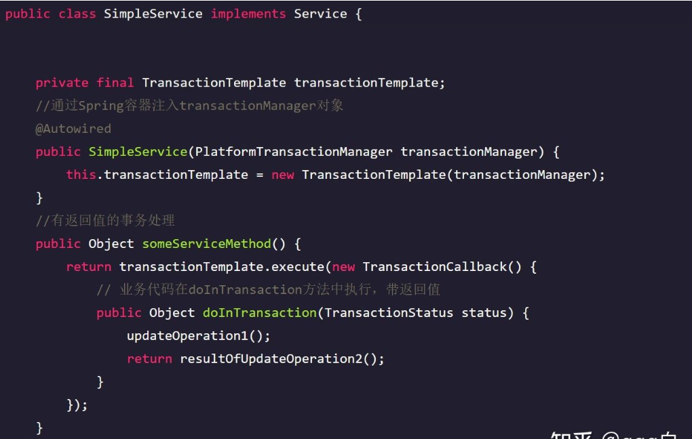

# 事务管理
<font color=#999AAA >事务:看作一次对数据的若干操作组成的一个序列,是一个整体的过程,要么成功要么都不成功(转账)
JdbcTemplate默认使用jdbc的事务,提交事务,自动的(执行完自动提交)
spirng中提供了事务管理
实现原理:AOP的思想
开发之前已经写好了一个功能,后来又要添加新的功能,那么必须修改源代码,这样很麻烦
AOP是OOP的延续,在OOP的基础上增加额外的功能,将业务代码与非业务代码分离</font>

## 编程式事务

通过编程代码在业务逻辑时需要时自行实现，粒度更小

注入TransactionTemplate事务管理对象，在提交事务or回滚事务时，用代码实现



## 声明式事务
声明式事务是基于AOP实现的，本质是对方法前后进行拦截

有xml和注解两种实现方式
配置事务管理器

```xml
<!-- 配置 spring 事务管理类, 并注入数据源 --> 
<bean id="transactionManager" class="org.springframework.jdbc.datasource.DataSourceTransactionManager"> 
	<property name="dataSource" ref="dataSource"></property> 
</bean>
```
### 基于xml实现

```xml
<tx:advice id="txadvice" transaction-manager="transactionManager">
    <tx:attributes>
        <tx:method name="save*" propagation="REQUIRED"/>
    </tx:attributes>
</tx:advice>
 
<aop:config>
	<aop:pointcut expression="execution(* com.ff.spring.service.UserService.*(..))" id="allmethod"/>
    <aop:advisor advice-ref="txadvice" pointcut-ref="allmethod"/>
</aop:config>
```


### 基于注解实现

**在service类上面（或者service类的方法上面）添加事务注解**
(1)@Transactional：这个注解可以添加到类也可以添加到方法
(2)如果把这个注解添加到类上面，这个类里面所有的方法都添加事务
(3)如果把这个注解添加到方法上面，则为这个方法添加事务

```xml
<!-- 开启注解事务管理 --> 
<tx:annotation-driven transaction-manager="transactionManager"/>
```

在service层控制事务

```java
@Service(value="userservice") 
@Transactional(propagation=Propagation.REQUIRED)
```
# 事务传播
一个事务方法被另一个事务方法调用时，该方法如何执行

7种传播行为

|事务传播行为|说明|
|--|--|
| PROPAGATION_REQUIRED | 如果当前没有事务，就新建一个事务，如果已经存在一个事务中，加入到这个事务中。  |
|PROPAGATION_SUPPORTS | 支持当前事务，如果当前没有事务，就以非事务方式执行|
| PROPAGATION_MANDATORY|使用当前的事务，如果当前没有事务，就抛出异常 |
|PROPAGATION_REQUIRES_NE W |新建事务，如果当前存在事务，把当前事务挂起 |
| PROPAGATION_NOT_SUPPOR TED| 以非事务方式执行操作，如果当前存在事务，就把当前事务 挂起|
|PROPAGATION_NEVER | 以非事务方式执行，如果当前存在事务，则抛出异常|
| PROPAGATION_NESTED| 如果当前存在事务，则在嵌套事务内执行。如果当前没有事 务，则执行与 PROPAGATION_REQUIRED 类似的操作|

重点了解这三个
1. PROPAGATION_REQUIRED：
	指定的方法必须在事务内执行
	当前存在事务就加入到事务中，没有事务新建一个事务
	是spring的默认传播行为
2. PROPAGATION_SUPPORTS：
	支持当前事务，若当前没有事务，就以非事务方式执行
	
4. PROPAGATION_REQUIRES_NEW：
	 总是新建一个事务，若当前存在事务，将当前事务挂起，直到新建事务结束

## 声明式事务不生效的场景
- @Transactional 应用在非 public 修饰的方法上
- @Transactional 注解属性 propagation 设置错误
- 同一个类中方法调用，导致@Transactional 失效
- 异常被 catch 捕获导致@Transactional 失效
- 数据库引擎不支持事务(MySQL中InnoDB是支持事务的)


