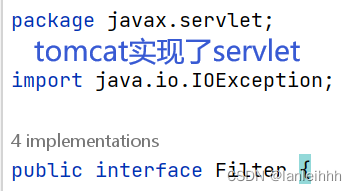
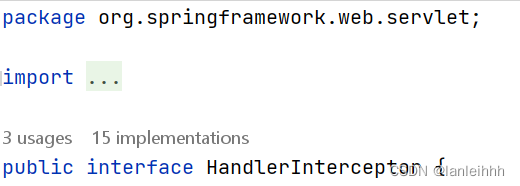
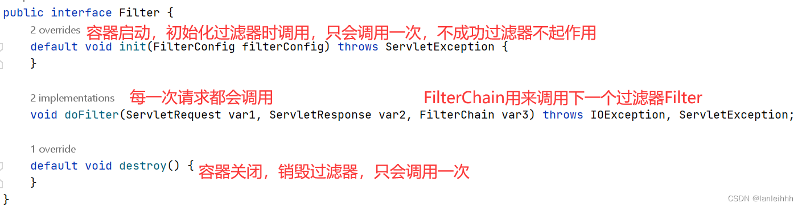
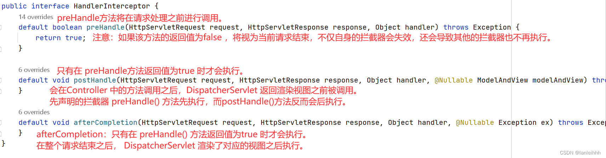

# 过滤器、拦截器、监听器

过滤器与拦截器都体现了AOP的思想

执行顺序：**过滤前-拦截前-Action处理-拦截后-过滤后**

|          |                        过滤器  Filter                        | 拦截器    Interceptor                                        |
| :------: | :----------------------------------------------------------: | :----------------------------------------------------------- |
| 实现方式 |                         基于函数回调                         | 基于Java反射(动态代理)                                       |
| 使用范围 | **servlet是tomcat等服务器实现的，需要依赖Tomcat等容器，只能用在web程序中** | **是spring组件； Java程序中都可以使用** |
| 触发时机 |                     到达servlet之前触发                      | 进入servlet之后，到达Controller之前触发                      |
| 请求范围 |               可拦截所有进入容器(Tomcat)的请求               | 只能拦截进入**controller的请求**或**静态资源请求**           |
| 应用场景 |        1.设置统一字符编码；2.过滤敏感字符；3.登录验证        | 1.登录验证；2.权限验证(判断用户是否有权限访问资源)；3.日志记录；4.过滤静态资源 |


## 过滤器

### 过滤器路径

过滤器的过滤路径通常有三种形式:

- 精确过滤匹配 ，比如/index.jsp /myservlet1
- 后缀过滤匹配，比如`*.jsp、*.html、*.jpg`
- 通配符过滤匹配`/*`，表示拦截所有。注意过滤器不能使用/匹配。 `/aaa/bbb/* `允许



```java
//登录验证过滤器
public class IsLoginFilter implements Filter {

    @Override
    public void doFilter(ServletRequest servletRequest, ServletResponse servletResponse, FilterChain filterChain) throws IOException, ServletException {
        //ServletRequest向下转型为,HttpServletRequest
        HttpServletRequest request = (HttpServletRequest) servletRequest;
        //获取session对象
        HttpSession session = request.getSession();
        session.setMaxInactiveInterval(10 * 60);//设置10分钟 后 session对象销毁
        //从session对象中拿到User对象
        SystemManager sm = (SystemManager) session.getAttribute("sm");
        if (sm == null) {// sm为null 代表服务器session对象已经销毁
            PrintWriter out = servletResponse.getWriter();
            out.println(222);//222 : 用户对象不存在,提示重新登录
        } else {//没有销毁就继续走下一个doFilter
            filterChain.doFilter(servletRequest, servletResponse);
        }
    }
}

/**
 * 通一编码过滤器
 */
class EncodFilter implements Filter {

    String str;

    @Override
    public void init(FilterConfig filterConfig) throws ServletException {
        str = filterConfig.getInitParameter("code");

    }

    @Override
    public void doFilter(ServletRequest servletRequest, ServletResponse servletResponse, FilterChain filterChain) throws IOException, ServletException {
        //设置编码格式
        servletRequest.setCharacterEncoding(str);
        //让请求继续
        filterChain.doFilter(servletRequest, servletResponse);
    }
}
```

### 使用过滤器的方法

1、在web.xml中配置

```xml
<!--过滤器-->
<filter>
    <filter-name>encod</filter-name>
    <filter-class>com.company.dormms.filter.EncodFilter</filter-class>
    <init-param>
        <param-name>code</param-name>
        <param-value>utf-8</param-value>
    </init-param>
</filter>

<filter-mapping>
    <filter-name>encod</filter-name>
    <url-pattern>/back/*</url-pattern>
</filter-mapping>

<filter>
    <filter-name>isLogin</filter-name>
    <filter-class>com.company.dormms.filter.IsLoginFilter</filter-class>
</filter>

<filter-mapping>
    <filter-name>isLogin</filter-name>
    <url-pattern>/back/build</url-pattern>
    <url-pattern>/back/buildManager</url-pattern>
</filter-mapping>
```

## 拦截器



```java
public class LoginInterceptor implements HandlerInterceptor {
    //* 当请求到达控制器之前被执行 true--继续向下执行,到达下一个拦截器,或控制器 false--不会继续向下执行*//*
    @Override
    public boolean preHandle(HttpServletRequest request, HttpServletResponse response, Object handler) throws Exception {
        HttpSession httpSession=request.getSession();
        Manage manage = (Manage) httpSession.getAttribute("manage");
        if(manage !=null){
            return  true;
        }else{
            response.getWriter().println(203);
            return  false;
        }
    }
    //*控制器方法执行之后执行*//*
    @Override
    public void postHandle(HttpServletRequest request, HttpServletResponse response, Object handler, ModelAndView modelAndView) throws Exception {

    }
    //*整个请求结束后执行*//*
    @Override
    public void afterCompletion(HttpServletRequest request, HttpServletResponse response, Object handler, Exception ex) throws Exception {

    }
}
```

使用：

```xml
<mvc:interceptors>
   <mvc:interceptor>
       <!--哪些请求进入拦截器-->
       <mvc:mapping path="/**"/>
       <!--哪些请求不进入拦截器-->
       <mvc:exclude-mapping path="/login/login"/>
       <mvc:exclude-mapping path="/**/*.html"/>
       <mvc:exclude-mapping path="/**/*.css"/>
       <mvc:exclude-mapping path="/img/**"/>
       <mvc:exclude-mapping path="/**/*.js"/>
       <bean id="loginId" class="com.ffyc.team.util.LoginInterceptor"></bean>
   </mvc:interceptor>
</mvc:interceptors>
```

## 监听器

当一个事件发生的时候，希望获得这个事件发生的详细信息，而并不想干预这个事件本身的进程，这就要用到监听器

可以监听request、session、application域的产生、销毁、属性变化

可以监听对象本身的创建销毁

可以监听对象属性的创建销毁

可以监听session中某个对象的状态变化