# Vue入门

## 引入Vue.js

引入Vue.js文件

 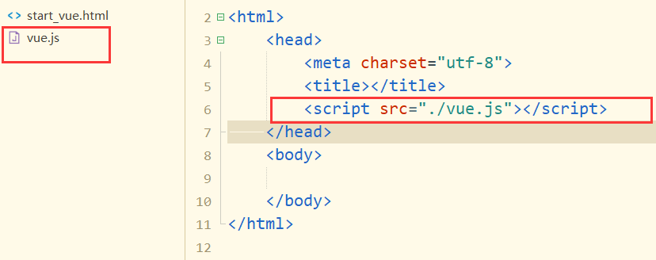

测试Vue对象是否存在

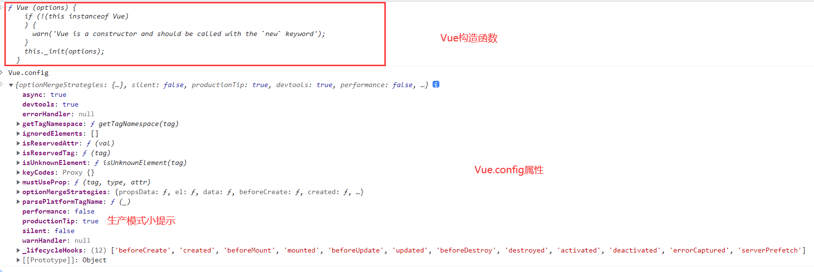

查看控制台信息

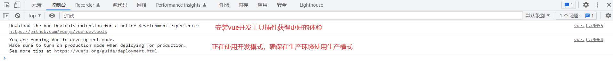

1. 安装vue-devtools插件

   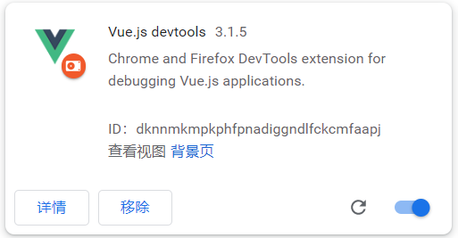

2. 去掉生产信息提示

   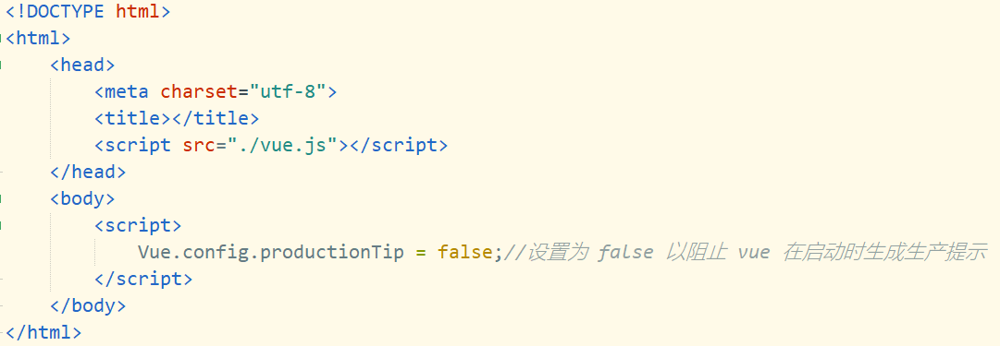

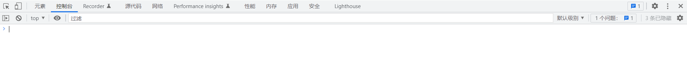

## 第一个Vue程序

### Vue实例绑定容器

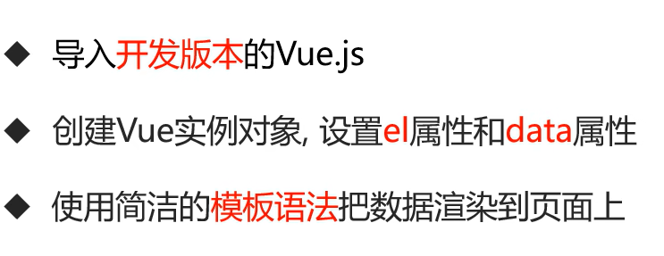

```html
<!DOCTYPE html>
<html>
	<head>
		<meta charset="utf-8">
		<title></title>
		<!-- 引入Vue -->
		<script src="./vue.js"></script>
	</head>
	<body>
		
		<!-- 1.构造一个容器 -->
		<div id="root">
			<!-- 3.{{}} 插值表达式 -->
			<h1>Hello,{{name}}</h1>
		</div>
		
		<script>
			Vue.config.productionTip = false;//设置为 false 以阻止 vue 在启动时生成生产提示
	
			//配置对象({}):
			// axios({
			// 	url:"",
			// 	...
			// })
			
			//2.创建一个Vue实例 传入一个配置对象 这里const vue可以省略，不用接收vue对象
			const vue = new Vue({
				//el:document.getElementById('root') 原始写法
				el:'#root',  //el:element,用于指定当前Vue实例为哪个容器服务，value通常为css选择器字符串
				data:{ //data中用于存储数据，数据供el指定的容器使用，值用对象来表示
					name:'Vue'
				}
			});
		</script>
	</body>
</html>
```

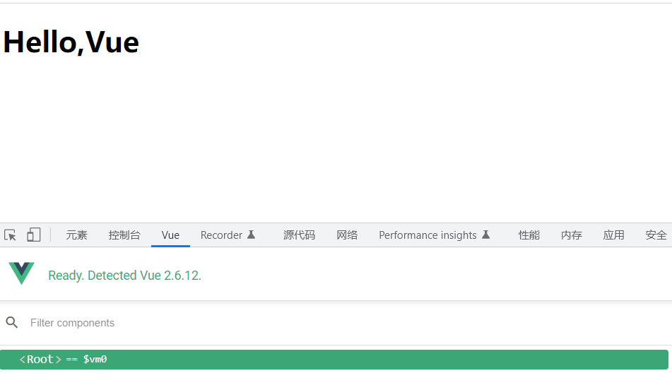

 	

### 容器与实例一 一对应

#### 一个Vue实例绑定多个容器：不合法

实例只能对相同class/name容器中的第一个容器起作用

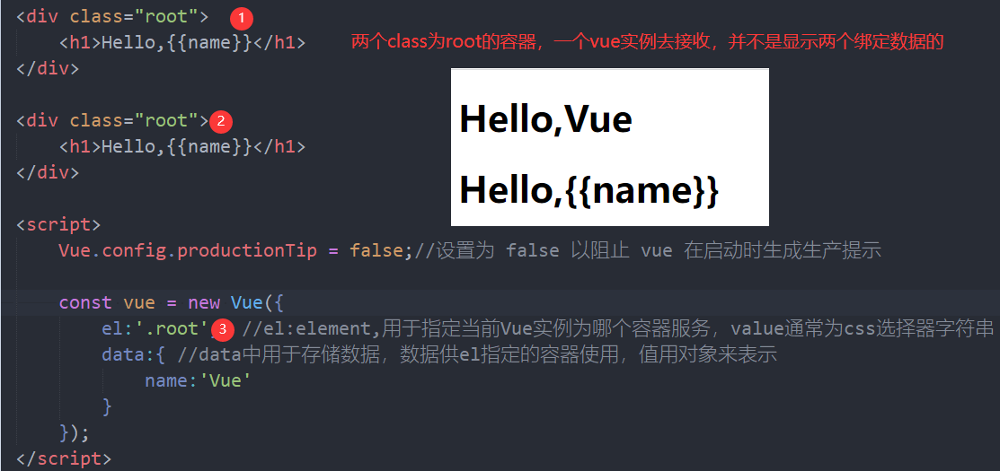

#### 多个Vue实例绑定一个容器：不合法

只有第一个实例会对容器起作用

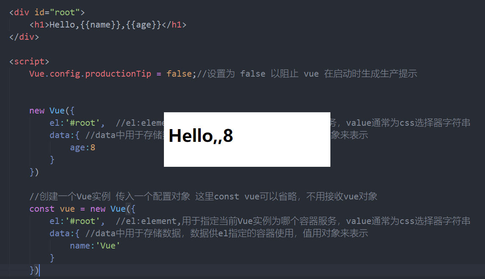

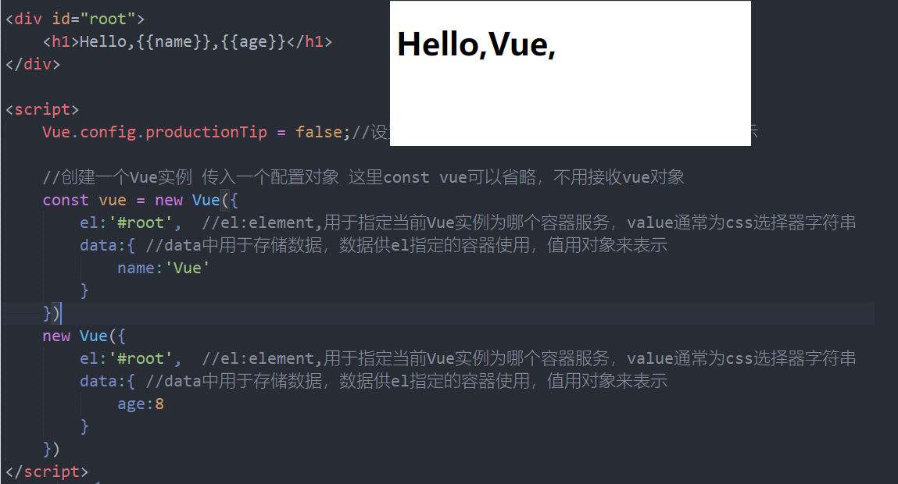

​			

## 计算属性与监视

### 计算属性

计算属性与方法：

- 调用计算属性：方法名
- 调用方法：方法名()

```vue
<div id="root">
    <h1>这是：{{curTime1()}}</h1>
    <h1>这是：{{curTime2}}</h1>
</div>

<script>
    Vue.config.productionTip = false;

    var vm = new Vue({
        el:'#root',
        data:{ 
            msg:'hello vue'
        },
        methods: {
            curTime1(){
                //返回当前时间戳
                return Date.now();
            }
        },
        computed: {//计算属性，与methods中的方法不能重名
            curTime2(){
                //返回当前时间戳
                return Date.now();
            }
        },
    })
</script>
```

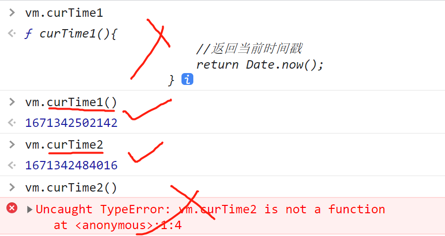

methods与computed中的方法名不能重复

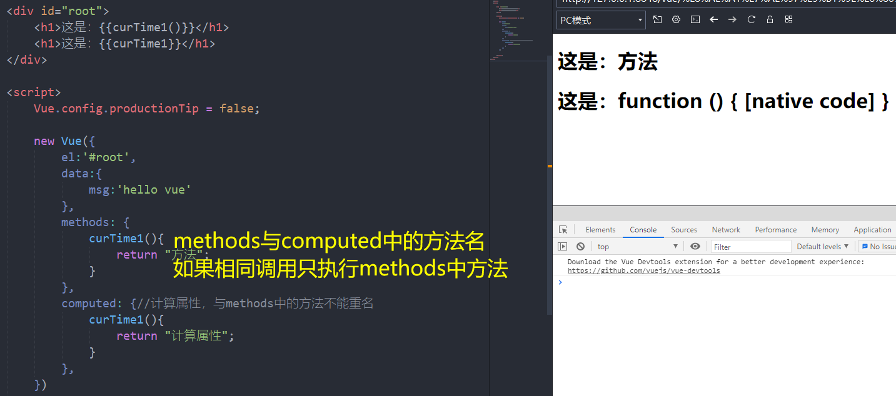

缓存：类似MyBatis的二级缓存，第一次请求返回结果，后续相同请求直接返回，当发生增删改时，删除缓存重新返回结果并刷新缓存

调用计算属性每次返回的都是同一个结果，把结果缓存起来，后续调用直接返回，而不执行逻辑(类似mybatis缓存)，减轻浏览器压力

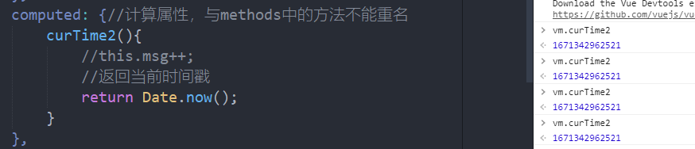

当计算属性中出现数据改变时，会重新执行方法，返回新的结果

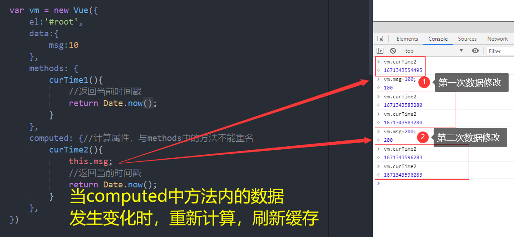

### 监视

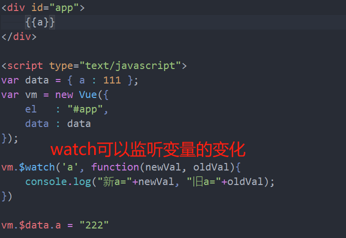

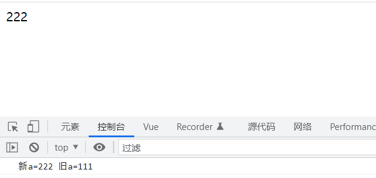


## 生命周期

```html
<!DOCTYPE html>
<html>
	<head>
		<meta charset="utf-8">
		<title></title>
		<script src="vue.js" type="text/javascript" charset="utf-8"></script>
	</head>
	<body>
		<div id="app">
			{{msg}}
		</div>
		<script type="text/javascript">
			Vue.config.productionTip = false; //设置为 false 以阻止 vue 在启动时生成生产提示
            
			var vm = new Vue({
				el: "#app",
				data: {
					msg: "hi vue",
				},
				//在实例初始化之后，数据观测 (data observer) 和 event/watcher 事件配置之前被调用。
				beforeCreate: function() {
					console.log('beforeCreate');
				},
				/* 在实例创建完成后被立即调用。
				在这一步，实例已完成以下的配置：数据观测 (data observer)，属性和方法的运算，watch/event 事件回调。
				然而，挂载阶段还没开始，$el 属性目前不可见。 */
				created: function() {
					console.log('created');
				},
				//在挂载开始之前被调用：相关的渲染函数首次被调用
				beforeMount: function() {
					console.log('beforeMount');

				},
				//el 被新创建的 vm.$el 替换, 挂载成功	
				mounted: function() {
					console.log('mounted');
				},
				//数据更新时调用
				beforeUpdate: function() {
					console.log('beforeUpdate');
				},
				//组件 DOM 已经更新, 组件更新完毕 
				updated: function() {
					console.log('updated');
				}
			});
			setTimeout(function() {
				vm.msg = "change ......";
			}, 3000);
		</script>
	</body>
</html>
```


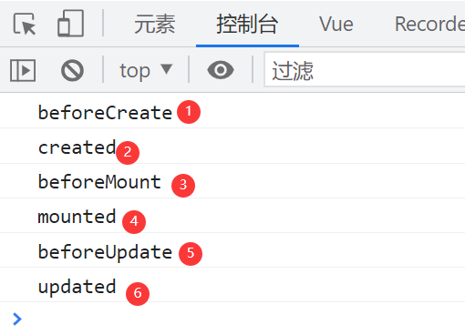

## 插值表达式

- {{xxx}}：

  功能: 用于解析标签体内容

  语法: {{xxx}} ，xxxx 会作为 js 表达式解析

- 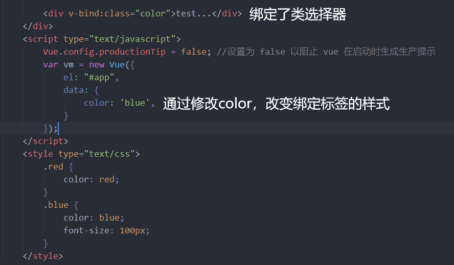

插值表达式

{{ }}中可以是Vue实例中的data里的数据，也可以是js表达式

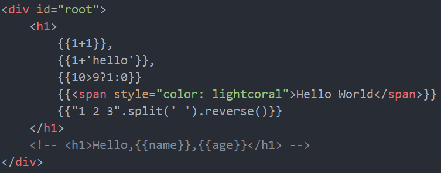


## 指令语法

- 指令语法：

  语法：v-xxx:

  功能: 解析标签属性、解析标签体内容、绑定事件

  举例：v-bind:href = 'xxxx' ，xxxx 会作为 js 表达式被解析


- **v-text：设置标签的文本值(textContent)。默认写法会替换全部内容,使用插值表达式可以替换指定内容**

- **v-html：设置标签的innerHTML。会解析标签进行渲染，而不是显示字符串文本**

- **v-on：**

  v-on指令的作用是:为元素绑定事件，v-on:click

  事件名不需要写on
  指令可以简写为@ ;@click='method()'
  绑定的方法定义在methods属性中

  内层的点击事件执行完，会触发父级事件，想要不执行父级事件，加上.stop

  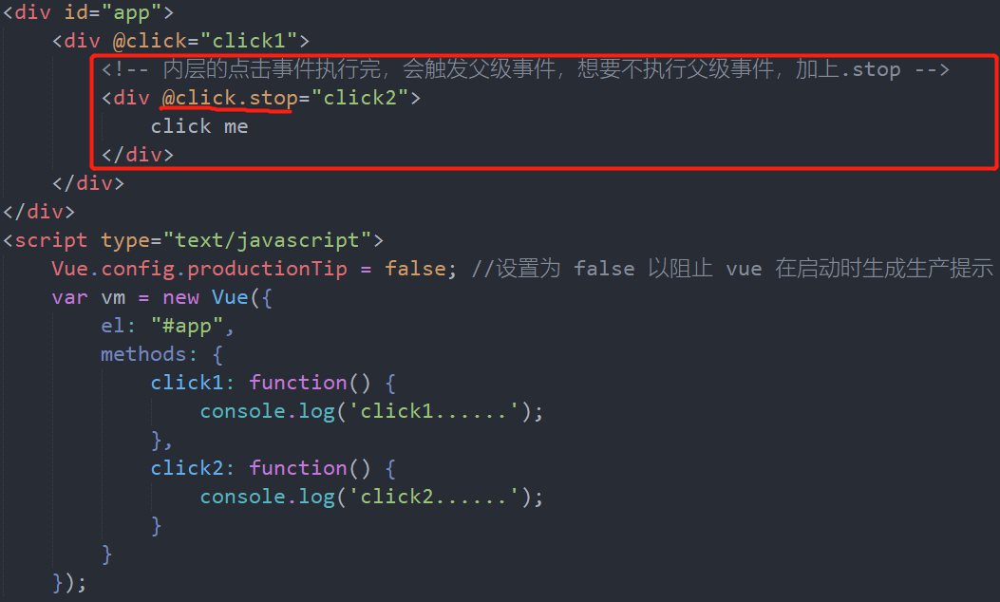

- **v-show：根据表达式的bool值，切换元素的显示和隐藏；操作标签的display属性；数据改变之后，对应元素的显示状态会同步更新**

  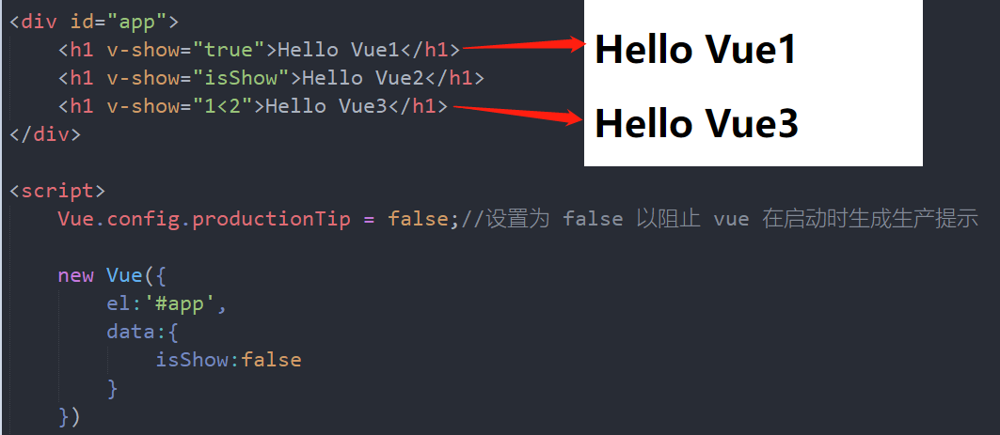

- **v-if：直接删除或添加html元素(性能开销大)，而v-show是操作display属性，都能实现隐藏效果**

  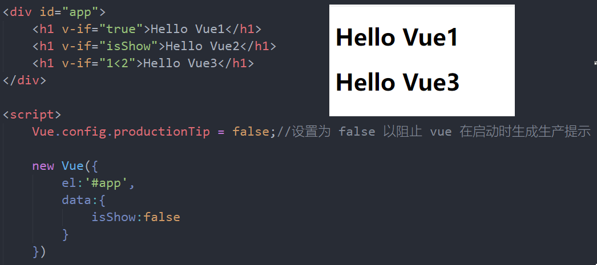

- **v-for：**

  1. alias in Array

  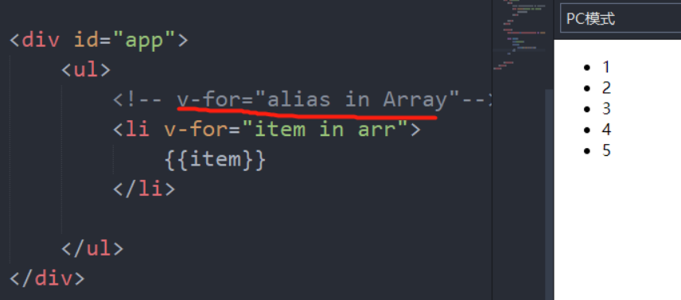

  2. 为数组索引指定别名

     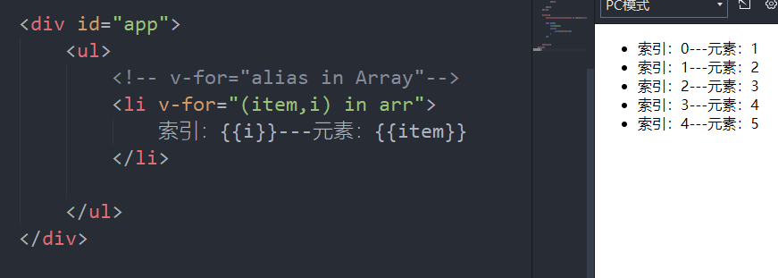

  3. 遍历对象数组

     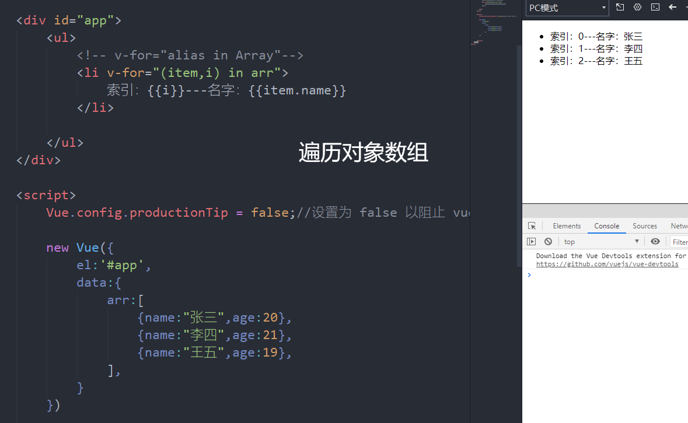

  4. v-for遍历对象:v-for="(val,key,i) in obj"

     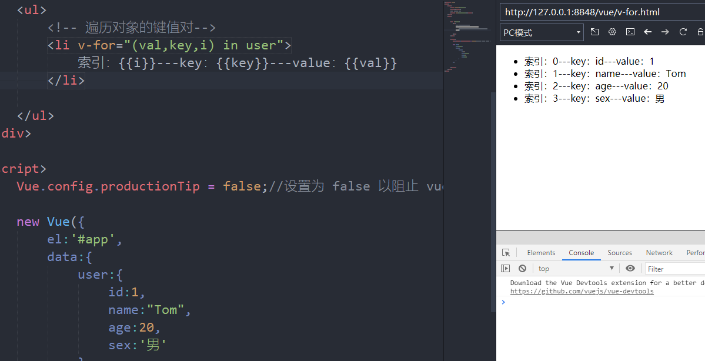

  5. 循环数字

     

- **v-bind**

  **v-bind:属性='表达式'**  “可以给任何属性绑定值”

如果我们用插值表达式在标签属性中动态插入值

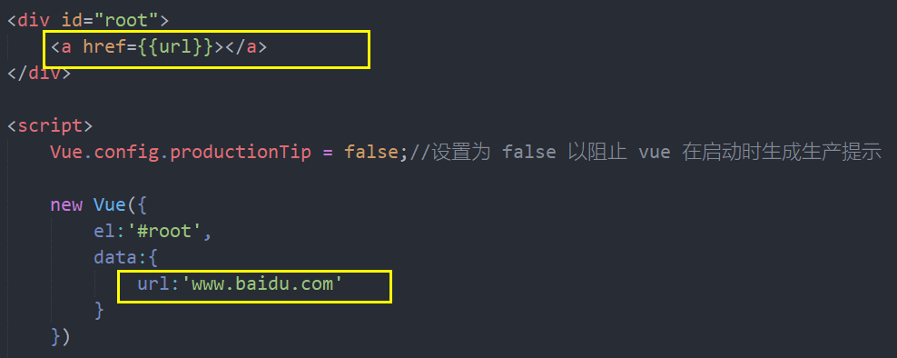

会报错：在标签属性中插值已经被移除，使用冒号简写的方式来代替

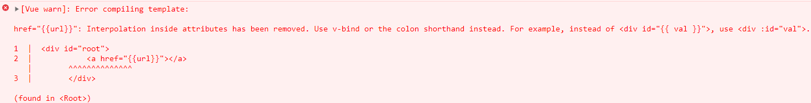

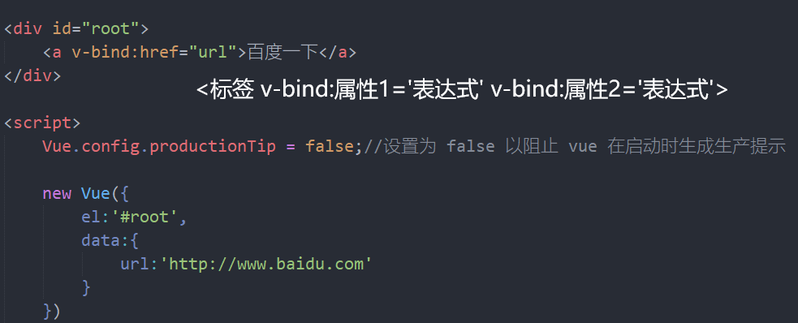

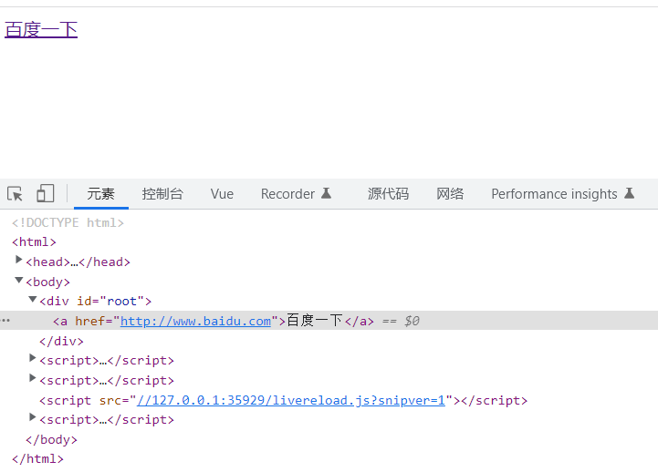

v-bind:attribute 简写 :attribute

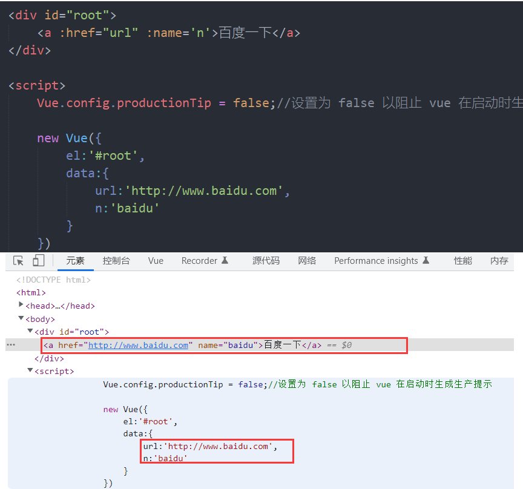

多个相同名称的数据作为表达式，在data中可以使用对象进行分级

比如有两个name，可以分为一个单值的和一个对象的，作为表达式再一级一级调用

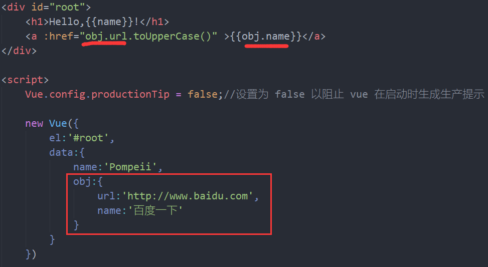

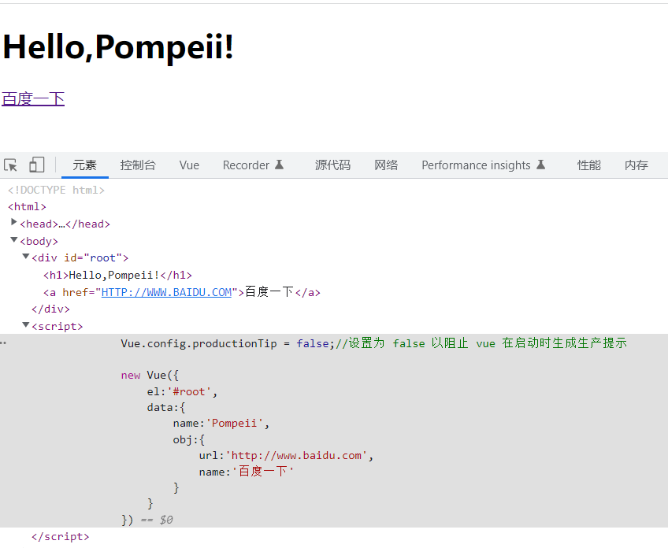

v-bind:title来指定鼠标悬浮时显示的文本

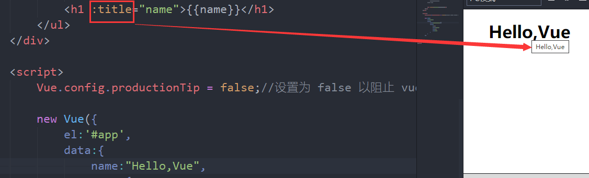

## 数据绑定

- 单向数据绑定：

  语法：v-bind:href ="xxx" 或简写为 :href

  特点：数据只能从 data 流向页面

- 双向数据绑定：

  语法：v-mode:value="xxx" 或简写为 v-model="xxx" 

  特点：数据不仅能从 data 流向页面，还能从页面流向 data
  
  作用范围：表单类元素；input，textarea，select，v-model默认收集的就是value值


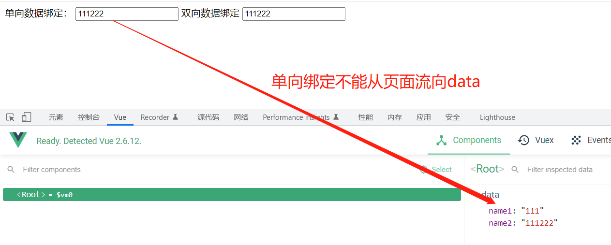

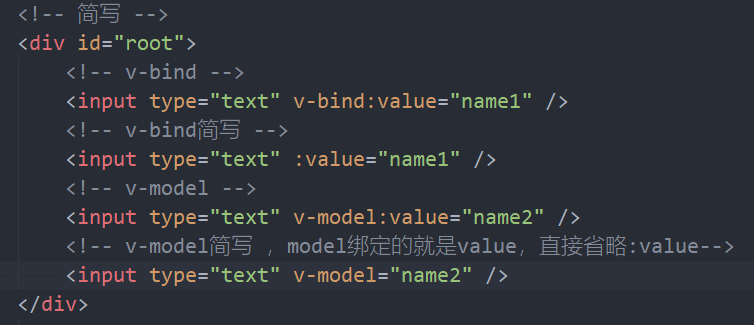

注意：

<font color='red'>v-model只能用来绑定表单类元素上，绑定的是标签的value</font>

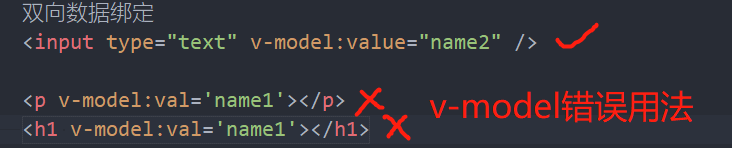

```
[Vue warn]: Error compiling template:
<p v-model="name1">: v-model is not supported on this element type. If you are working with contenteditable, it's recommended to wrap a library dedicated for that purpose inside a custom component.
此元素类型不支持v-model。如果您使用的是contenteditable，建议将专用于此目的的库包装在自定义组件中。

<h1 v-model="name1">: v-model is not supported on this element type. If you are working with contenteditable, it's recommended to wrap a library dedicated for that purpose inside a custom component.
```

contenteditable:contentEditablehtml中的一个属性。设置html的contentEditable="true"时，即可开启该元素的编辑模式。

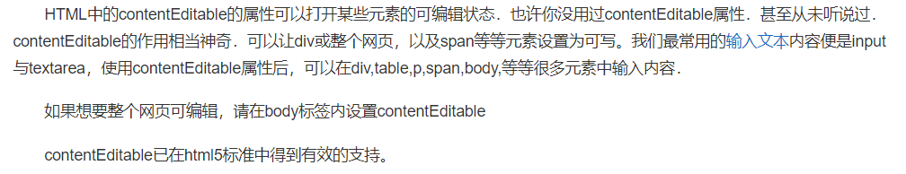

## el与data的两种写法

### el的两种写法

1. new Vue的时候配置el属性
2. 先创建Vue实例，在通过vm.$mount('#root')指定el的值

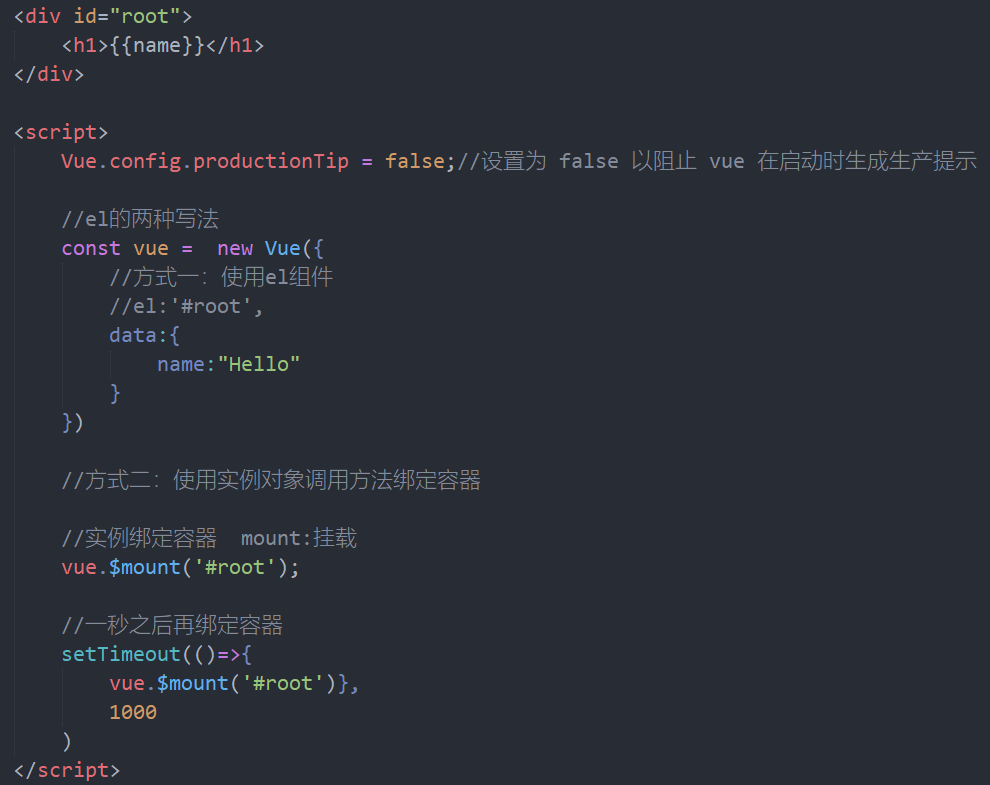

### data的两种写法

- 对象式写法：key-value

  ```javascript
  data:{
      name:'vue',
      user:{
          uname:'admin',
          pwd:123456
      }
  }
  ```

- 函数式写法：返回对象

  (在组件中使用函数方式，而且必须使用普通函数；不能使用箭头函数，箭头函数中的this是全局的window，而不是vue实例)

  ```javascript
  函数式写法
  data:function(){
  	return{
  		
  	}
  }
  //可以简写为：
  data(){
  	return{
  		
  	}
  }
  //不能使用箭头函数
  data:()=>{
  	return{
  			
  	}
  }
  ```

  

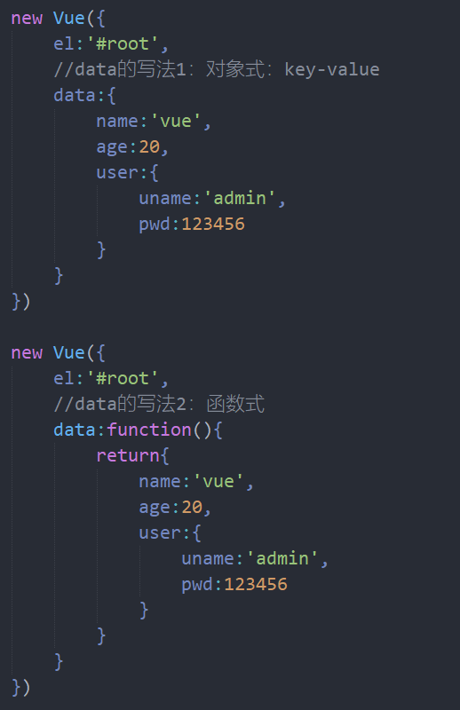

## MVVM模型

1. M：模型(Model) ：对应 data 中的数据

2. V：视图(View) ：模板

3. VM：视图模型(ViewModel) ： Vue 实例对象

总结：
1.data中所有的属性，最后都出现在了vm身上。
2.vm身上所有的属性 及 Vue原型上所有属性，在Vue模板中都可以直接使用


## 组件-component

语法：

```javascript
<div id="components-demo">
  <button-counter></button-counter>
</div>

// 定义一个名为 button-counter 的新组件
//button-counter：自定义组件的名字，需要注意不能含有大写
//template：自定义组件的模板
//props：传递参数到组件中 --> props:['参数']
Vue.component('button-counter', {
  //组件中的data必须是一个函数，如果不这样定义，复用组件的时候多个组件之间的值是统一的，影响其他实例
  data: function () {
    return {
      count: 0
    }
  },
  template: '<button v-on:click="count++">You clicked me {{ count }} times.</button>'
})
```


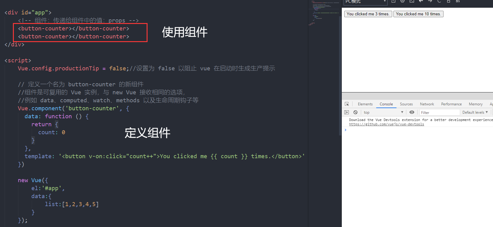

## 插槽slot

插槽类似于占位符，先声明好之后，用的时候把需要的内容放进来

```vue
Vue.component("mycomp", {
	props:['val'],
    //在slot处插入模板
    template:
    '<div>\
        <slot name="mycomp-title"></slot>\
    </div>'
}); 
```

```html
<div id="app">
    <!--自定义组件-->
    <mycomp>
        <!--插槽：可以插入模板-->
        <h1></h1>
        <自定义组件></自定义组件>
    </mycomp>
</div>
```


案例：

原始列表

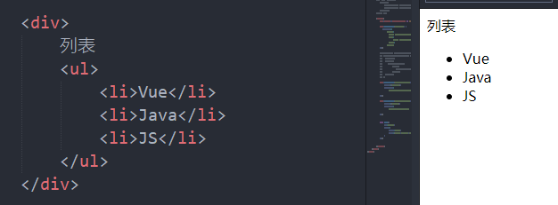

使用插槽实现的动态列表

```html
<div id="app">
    <mycomp>
        <mycomp-title slot="mycomp-title" :title="title"></mycomp-title>
        <mycomp-items slot="mycomp-items" v-for="item in list" :item="item"></mycomp-items>
    </mycomp>
</div>

<script>
    Vue.config.productionTip = false;
    Vue.component("mycomp", {
        template: 
        '<div>\
            <slot name="mycomp-title"></slot>\
            <ul>\
            	<slot name="mycomp-items"></slot>\
            </ul>\
        </div>'
    }); 

    Vue.component("mycomp-title",{
        props:["title"],
        template:
        '<div>{{title}}</div>'
    });

    Vue.component("mycomp-items",{
        props:["item"],
        template:
        '<li>{{item}}</li>'
    });

    new Vue({
        el:'#app',
        data:{
            title:"列表",
            list:["Vue","Java","JS"]
        }
    });
</script>
```

效果：

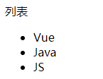


## 自定义事件分发

<!DOCTYPE html>
<html>
	<head>
		<meta charset="utf-8">
		<title></title>
		<!-- 引入Vue -->
		<script src="./vue.js"></script>
	</head>
	<body>

```html
<!DOCTYPE html>
<html>
	<head>
		<meta charset="utf-8">
		<title></title>
		<!-- 引入Vue -->
		<script src="./vue.js"></script>
	</head>
	<body>

		<div id="app">
			<mycomp>
				<mycomp-title slot="mycomp-title" :title="title"></mycomp-title>
				<mycomp-items slot="mycomp-items" v-for="(item,index) in list" 
						:item="item" :index="index" v-on:remove="removeItem(index)">
						<!-- v-on:remove="" 自定义事件 -->
				</mycomp-items>
			</mycomp>
		</div>

		<script>
			Vue.config.productionTip = false;

			Vue.component("mycomp", {
				template: '<div>\
					<slot name="mycomp-title"></slot>\
					<ul>\
						<slot name="mycomp-items"></slot>\
					</ul>\
				  </div>'
			});

			Vue.component("mycomp-title", {
				props: ["title"],
				template: '<div>{{title}}</div>'
			});

			Vue.component("mycomp-items", {
				props: ["item","index"],
				//只能绑定当前组件方法
				template: '<li>{{index}}--{{item}}<button @click="remove">删除</button></li>',
				methods: {
					remove(index) {
						//$emit 自定义事件分发
						this.$emit("remove",index);
					}
				}
			});

			var vm = new Vue({
				el: '#app',
				data: {
					title: "列表",
					list: ["Vue", "Java", "JS"]
				},
				methods: {
					removeItem(index) {
						//从当前索引开始，删除一个元素
						this.list.splice(index, 1);
					}
				}
			});
		</script>
	</body>
</html>
```


# axios异步通信

axios是一个HTTP网络请求库，本质上也是对原生XHR(XMLHttpRequests)的封装

1. axios必须先导入才可以使用
2. 使用get或post方法即可发送对应的请求
3. then方法中的回调函数会在请求成功或失败时触发
4. 通过回调函数的形参可以获取响应内容或错误信息


## axios单独使用

```html
<!DOCTYPE html>
<html lang="en">
<head>
    <meta charset="UTF-8" />
    <meta name="viewport" content="width=device-width, initial-scale=1.0" />
    <meta http-equiv="X-UA-Compatible" content="ie=edge" />
    <title>axios基本使用</title>
</head>

<body>
    <input type="button" value="get请求" class="get">
    <input type="button" value="post请求" class="post">
    <!-- 官网提供的 axios 在线地址 -->
    <script src="https://unpkg.com/axios/dist/axios.min.js"></script>
    <script>
        /*
            接口1:随机笑话
            请求地址:https://autumnfish.cn/api/joke/list
            请求方法:get
            请求参数:num(笑话条数,数字)
            响应内容:随机笑话
        */
        document.querySelector(".get").onclick = function () {
            axios.get("https://autumnfish.cn/api/joke/list?num=3")
            // axios.get("https://autumnfish.cn/api/joke/list1234?num=6")
            .then(function (response) {
                console.log(response);
              },function(err){
                  console.log(err);
              })
        }
        /*
             接口2:用户注册
             请求地址:https://autumnfish.cn/api/user/reg
             请求方法:post
             请求参数:username(用户名,字符串)
             响应内容:注册成功或失败
         */
        document.querySelector(".post").onclick = function () {
            axios.post("https://autumnfish.cn/api/user/reg",{username:"admin"})
            .then(function(response){
                console.log(response);
                console.log(this.skill);
            },function (err) {
                console.log(err);
              })
          }
    </script>
</body>
</html>
```

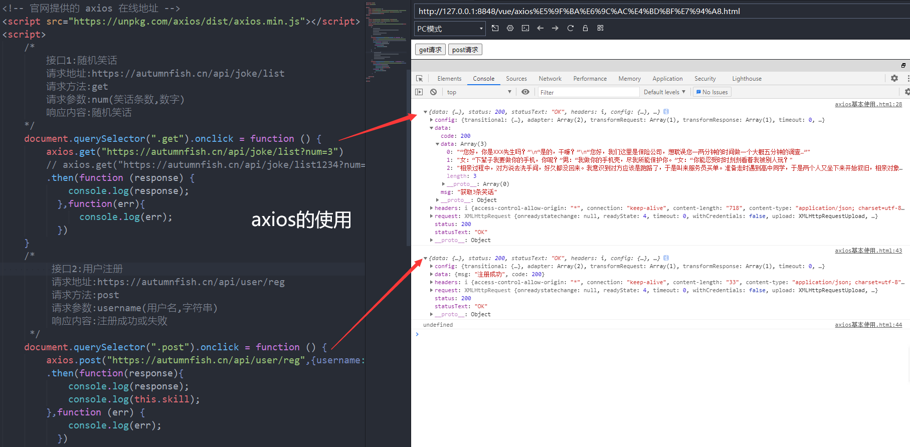

## axios在vue中使用

**使用准备**

```html
1.在项目中安装axios：npm install --save axios vue-axios
    E:\lanlei\web\front\first-vue-cli>npm install --save axios vue-axios
    added 7 packages in 4s
2.在 main.js 中配置 axios
	导入 axios
		import axios from 'axios';
		import VueAxios from 'vue-axios'
	显式使用axios
		Vue.use(VueAxios, axios);
	设置访问后台服务器地址
		axios.defaults.baseURL="http://127.0.0.1:9999/api/";
	将 axios 挂载到 vue 全局对象中,使用 this 可以直接访问
		Vue.prototype.$http=axios;
```

**基本语法**

使用axios的方式

```javascript
Vue.axios.get(api).then((response) => {
  
})

this.axios.get(api).then((response) => {
  
})

this.$http.get(api).then((response) => {
  
})
```

使用语法

```javascript
this.$http.get(地址?key-value&key2=values).then(
    function(response){
    	
	},
    function(err){
    	
	}
}
this.$http.post("login",{key:"value",key2:"value2"}).then(
    function(response){
    	
	},
    function(err){
    	
	}
}
```

**axios常用API**

- get：查询数据

- post 添加数据

- put：修改数据

- delete：删除数据

**axios 的响应结果**

- data：实际响应回来的数据

- headers：响应头信息

- status：响应状态码

- statusText：响应状态信息

案例1

```javascript
//axios 请求拦截
axios.interceptors.request.use(config =>{
    //为请求头对象，添加 Token 验证的 token 字段
    config.headers.token = window.sessionStorage.getItem('token');
    return config;
})
// 添加响应拦截器
axios.interceptors.response.use((res) =>{
    if(res.data.code==401){
    	router.replace("/login");
    }
    return res;
});
```

案例2

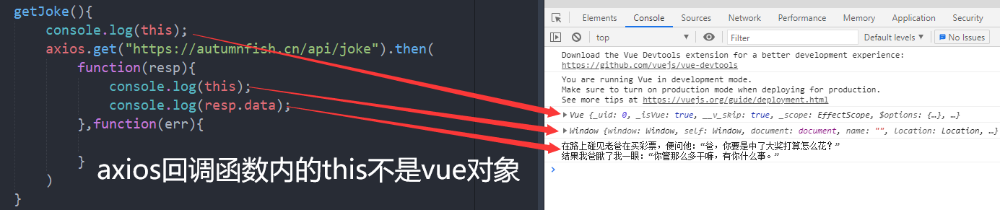

注意！

注意！

注意！

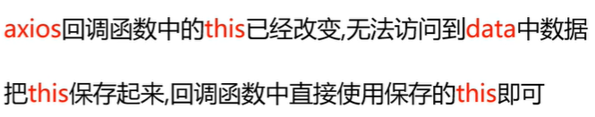

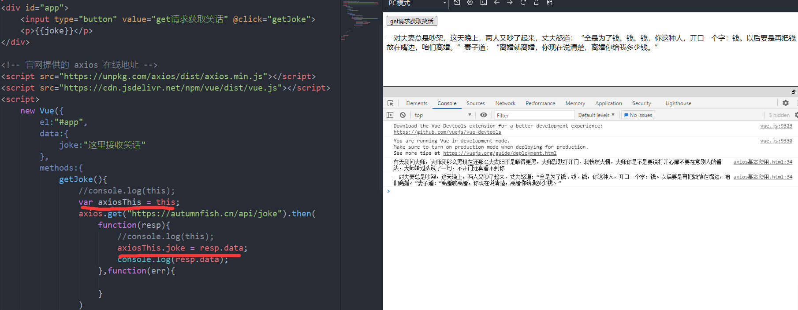

## axios实例——天气预报

```vue
<!DOCTYPE html>
<html lang="en">
	<head>
		<meta charset="UTF-8" />
		<meta name="viewport" content="width=device-width, initial-scale=1.0" />
		<meta http-equiv="X-UA-Compatible" content="ie=edge" />
		<title>天知道</title>
		<link rel="stylesheet" href="css/reset.css" />
		<link rel="stylesheet" href="css/index.css" />
	</head>

	<body>
		<div class="wrap" id="app">
			<div class="search_form">
				<div class="logo"></div>
				<div class="form_group">
					<input type="text" v-model="city" @keyup.enter="searchWeather" class="input_txt"
						placeholder="请输入查询的天气" />
					<button class="input_sub">
						搜 索
					</button>
				</div>
				<div class="hotkey">
					<a href="javascript:;" @click="changeCity('北京')">北京</a>
					<a href="javascript:;" @click="changeCity('上海')">上海</a>
					<a href="javascript:;" @click="changeCity('广州')">广州</a>
					<a href="javascript:;" @click="changeCity('深圳')">深圳</a>
				</div>
			</div>
			<ul class="weather_list">
				<li v-for="item in weatherList">
					<div class="info_type"><span class="iconfont">{{ item.weather }}</span></div>
					<div class="info_temp">
						<b>{{ item.low }}</b>
						~
						<b>{{ item.high }}</b>
					</div>
					<div class="info_date"><span>{{ item.date }}</span></div>
				</li>
			</ul>
		</div>
		<!-- 开发环境版本，包含了有帮助的命令行警告 -->
		<script src="https://cdn.jsdelivr.net/npm/vue/dist/vue.js"></script>
		<!-- 官网提供的 axios 在线地址 -->
		<script src="https://unpkg.com/axios/dist/axios.min.js"></script>
		<script>
			new Vue({
				el:"#app",
				data:{
					city:'',//绑定输入框的城市
					weatherList:[]//城市对应的天气数组
				},
				methods:{
					//回车查询
					searchWeather(){
						var that = this;
                          //查询天气接口：http://www.jcznedu.com:5000/weather/prediction/?city=
						axios.get('http://www.jcznedu.com:5000/weather/prediction/?city='+this.city+'&&limit=5').then(
							function(resp){
								console.log(resp.data.data.daly);
								that.weatherList = resp.data.data.daly;
							},
							function(err){
								
							}
						)
					},
					//点击查询
					changeCity(city){
						this.city = city;
						this.searchWeather();
					}
				}
			})
		</script>
	</body>
</html>
```

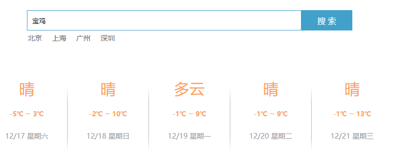


# Vue-cli 项目搭建

创建vue项目

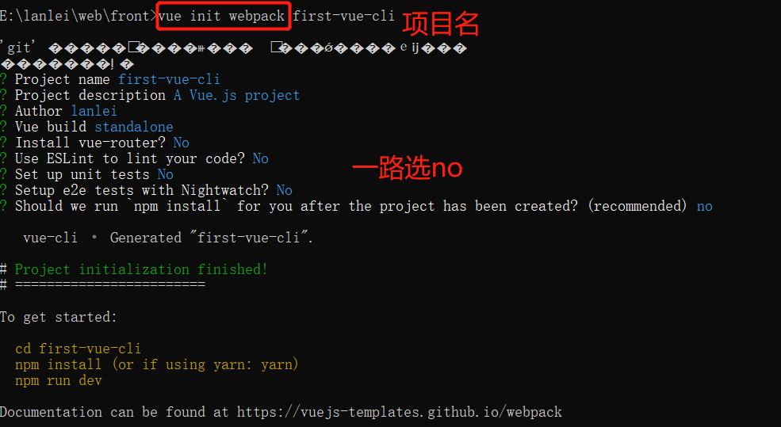

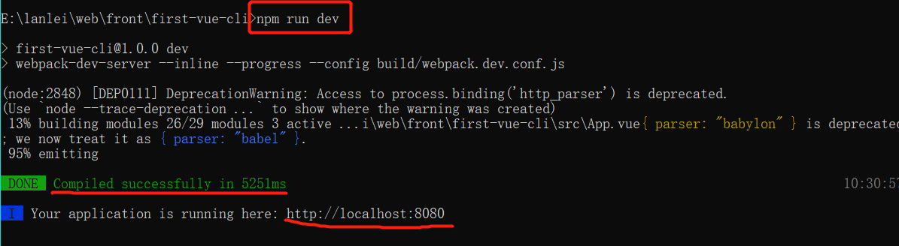

## 需要的环境
### Node.js
简单的说 Node.js 就是运行在服务端的 JavaScript。如果你熟悉 Javascript， 那么你将会很容易的学会 Node.js。 Node.js 是一个基于 Chrome JavaScript 运行时建立的一个平台。 Node.js 是一个事件驱动 I/O 服务端 JavaScript 环境，基于 Google 的 V8 引擎， V8 引擎执行 Javascript 的速度非常快，性能非常好
### npm
npm 是 Node.js 的包管理工具，用来安装各种 Node.js 的扩展。npm 是 JavaScript 的包管理工具，也是世界上最大的软件注册表。有超过 60 万个 JavaScript 代码包可供下载，每周下载约 30 亿次。npm 让 JavaScript 开 发人员可以轻松地使用其他开发人员共享的代码

## 使用 HbuilderX快速搭建一个 vue-cli 项目
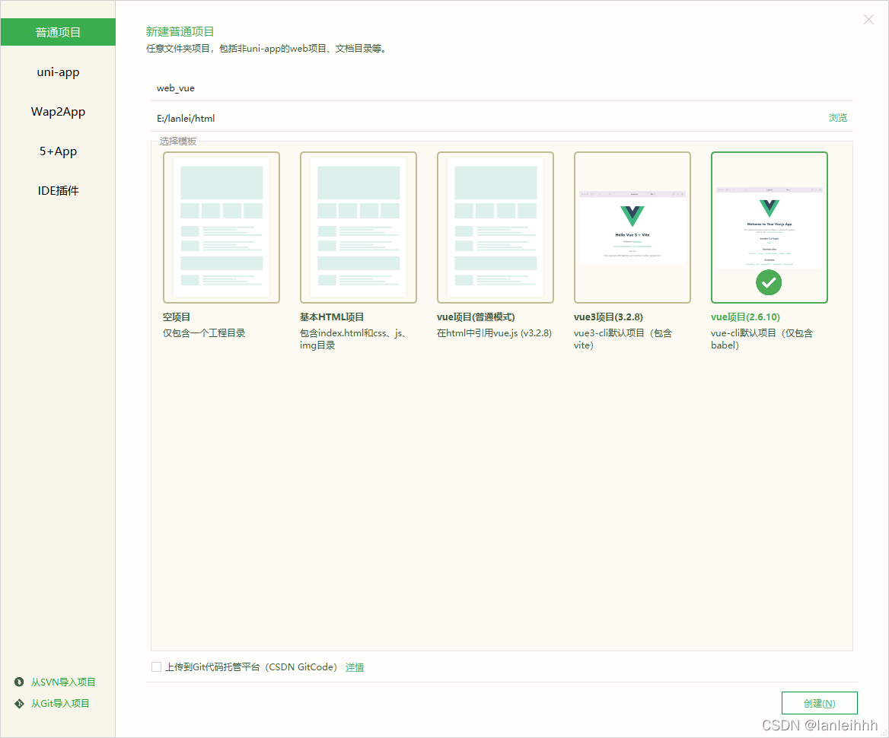
创建成功后,在命令行窗口启动项目

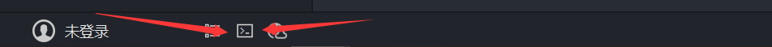
输入命令启动项目
npm run serve
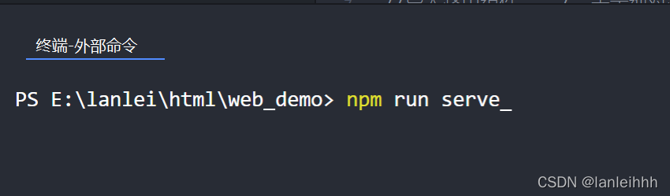
或者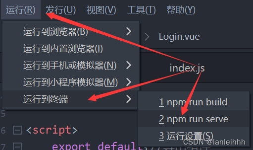

在命令行中 ctrl+c 停止服务

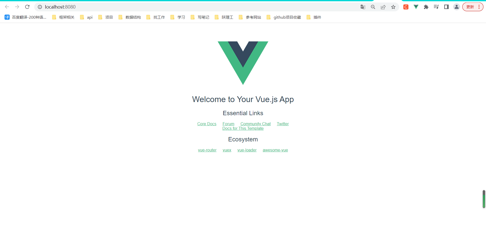

# 页面路由
vue router 是 Vue.js 官方的路由管理器。它和 Vue.js 的核心深度集成，让构建单页面应用变得易如反掌。

## 安装
vue-router 是一个插件包，所以我们还是需要用 npm/cnpm 来进行安装的。 打开命令行工具，进入你的项目目录，输入下面命令。 

```java
npm install vue-router --save-dev

-- 如果安装失败使用该命令
npm install --save vue-router@3
```


## 使用步骤

### 1.创建vue组件(html称页面,vue称组件)

Content.vue

```vue
<!-- 在Vue中,没有页面的概念,只有组件 Content.vue 就是一个组件
	<template>标签里必须有一个根标签,如
	<template>
		<div>根标签</div> 
	</template>
 -->
<template>
  <h1>内容页面</h1>
</template>

<script>
export default {
  name: "Content"
}
</script>

<style scoped>

</style>

```
Main.vue
```vue
<template>
  <h1>首页</h1>
</template>

<script>
export default {
  name: "Main",
  data(){
    return{
      
    }
  }
}
</script>

<style scoped>

</style>
```
### 2.创建 router 目录 创建 index.js 文件,在其中配置路由


```js
import Vue from 'vue'; //导入vue组件
import Router from 'vue-router'; /* 导入路由 */

//导入自己定义的组件  ../相对js文件所在的路径
import Content from '../components/Content'
import Main from '../components/Main'

//将导入的路由组件挂载到Vue全局对象中
Vue.use(Router);

//配置导出路由
export default new Router({
	routes: [{
		path: '/content', //给组件一个映射地址
		name: 'content', //name可以不写
		component: Content //component: 与import的组件名称一样
	}, {
		path: '/main',
		component: Main
	}]
});
```

### 3.使用路由

在App.vue中使用路由跳转

```vue
<div id="app">
    <router-link to="/main">首页</router-link>
    <router-link to="/content">内容页</router-link>
    <router-view></router-view>
</div>
```

### 4.在main.js中配置路由

```javascript
import VueRouter from 'vue-router'
import router from './router'//自动扫描里面的路由配置

//显式声明使用VueRouter
Vue.use(VueRouter);

new Vue({
  //配置路由
  router
})
```


