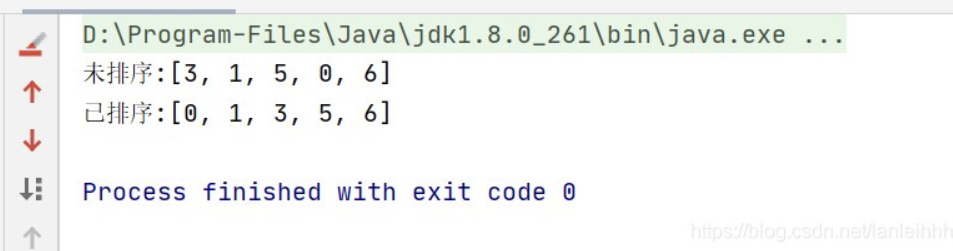
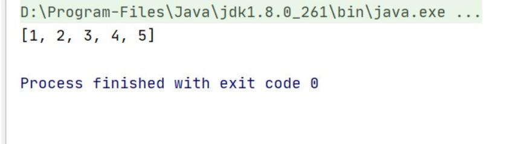
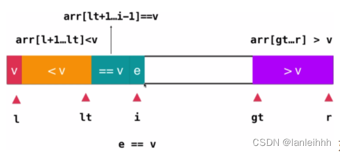
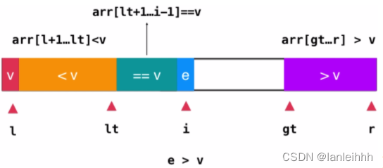
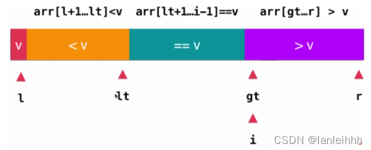
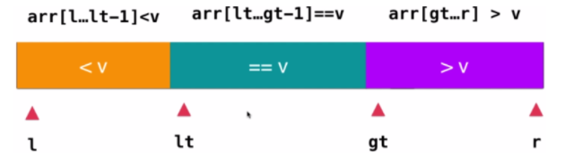
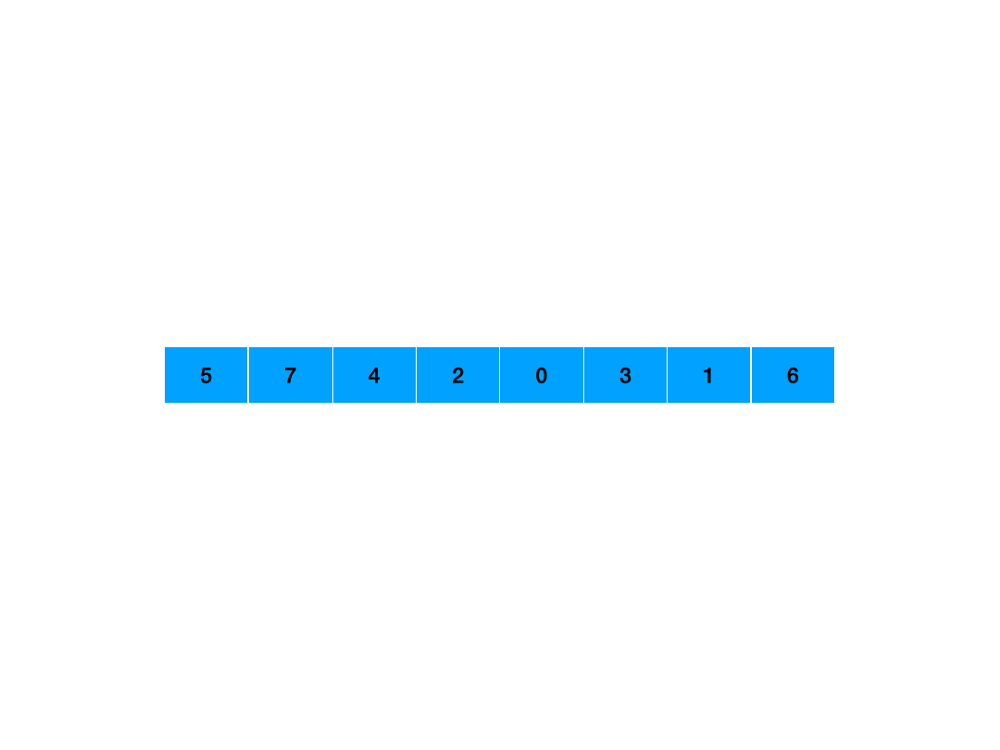

# 十大排序算法


# 1.冒泡排序

### 1.1算法思想：

在未排序的一组数中,重复访问未排序的元素,从第一个未排序元素开始,比较相邻两个元素大小,若上一元素大于(小于)下一元素,对调两元素位置,直至每一趟不能再交换(即排序完成)。

### 1.2算法原理:

1. 比较相邻的元素。如果第一个比第二个大，就交换他们两个。 

2. 对每一对相邻元素做同样的工作，从开始第一对到结尾的最后一对。在这一点，最后的元素应该会是最大的数。 

3. 针对所有的元素重复以上的步骤，除了最后一个。 

4. 持续每次对越来越少的元素重复上面的步骤，直到没有任何一对数字需要比较。

   


### 1.3代码实现：

```java
package Test.arraysort;
import java.util.Arrays;
public class bubbleSort {
    public static void main(String[] args) {
        
        /*冒泡排序
            2 0 1 5 3 8
        一: 0 1 2 5 3 8
        二  0 1 2 3 5 8
         */
		System.out.println("未排序:"+Arrays.toString(a));
        int [] a={2,0,1,5,3,8};//声明初始化数组
        for(int i=0;i<a.length-1;i++){//从第0个元素开始到第length-1个为止,相邻两个元素依次比较
            for(int j=0;j<a.length-1-i;j++){//外层每循环1次,下一次交换次数少比上次1次
                if(a[j]>a[j+1]){//前面元素比后面大,交换两元素
                    int temp=a[j];
                    a[j]=a[j+1];
                    a[j+1]=temp;
                }
            }
        }
        System.out.println("排序后:"+Arrays.toString(a));
    }
}
```

运行结果:

![[外链图片转存失败,源站可能有防盗链机制,建议将图片保存下来直接上传(img-nKfhnPKP-1618671336437)(img/p3.jpg)]](../img/20210417225820805.jpeg)

# 2.选择排序(直接选择)

### 2.1算法思想:

从未排序第一个元素开始到最后一个中,选出最小(大)的元素,将其与第一个未排序元素交换,交换后第一元素变为已排序元素,第二元素为未排序第一个元素,继续重复这个步骤,直至排序完成

### 2.2算法原理

1. 从a[0]开始遍历至[a.length-1],找到最大元素,将它与a[0]交换,下次起始位置+1

2. 从a[1]开始遍历至[a.length-1],找打最大元素,将它与a[1]交换,下次起始位置+1
3. 重复这个步骤,直至最后两个数据完成交换,排序完成

![[外链图片转存失败,源站可能有防盗链机制,建议将图片保存下来直接上传(img-O8C7jGDq-1618671336440)(img/p7.jpg)]](../img/20210417225831302.jpeg)

### 2.3代码实现

```java
package Test.arraysort;
import java.util.Arrays;
public class selectSort {
    public static void main(String[] args) {
        int[] a={3,1,5,0,6};
        System.out.println("未排序:"+Arrays.toString(a));
        for (int i = 0; i < a.length-1; i++) {//已排序元素
            int minIndex=i;//将最小值索引设为i,i为已排序末元素
            for (int j = i+1; j <a.length; j++) {//未排序元素
                if(a[j]<a[i]){
                    minIndex=j;//若未排序小于已排序末元素,将其索引赋给最小值索引
                }
            }
            //当每次找到最小元素后再交换,相比于遇到一个小于已排序末元素的就交换,减少了执行代码次数
            int t=a[i];
            a[i]=a[minIndex];
            a[minIndex]=t;     //在未排序元素中找到最小元素后,将它与已排序末元素交换
        }
        System.out.println("已排序:"+Arrays.toString(a));
    }
}
```

运行结果:




# 3.插入排序

### 3.1算法思想

在未排序元素中,将元素在已排序元素中找到合适位置,依次插入到已排序元素中,使得每次插入后,已排序元素都是有序的,重复这样的步骤,直到排序完毕

### 3.2算法原理

1. 将第一个元素设为已排序的元素,从未排序的第一个元素(待排元素)往前遍历
2. 若待排元素与前面的元素依次比较,比当前元素大，且没有走到数组0下标，就继续，直到找到比当前值小的位置
3. 将该位置及后面的元素后移，将当前值插入
4. 重复上述步骤

![[外链图片转存失败,源站可能有防盗链机制,建议将图片保存下来直接上传(img-zXb4htug-1618671336450)(img/p8.jpg)]](../img/20210417225924165.jpeg)


### 3.3代码实现

```java
package JavaSE.JavaArray.Sort;

import java.util.Arrays;

/*
        插入排序
        从第二个位置开始向前比较,到第0个,完成一次循环
        从后往前,将后面的数与前面所有数比较,若前面大,记录,一趟完成后,插入
 */
public class insertSort {
    public static void insertSort(int arr[]){
        for (int i = 1; i < arr.length; i++) {
            //待排序的第一个元素
            int key = arr[i];
            //已排序区的最后一个位置
            int j = i-1;
            while (j>=0 && arr[j] > key){//将当前元素与排序区的元素作比较，直到比当前值小的停下来
                arr[j+1] = arr[j];//后移元素
                j--;
            }
            arr[j+1] = key;//将当前值插入
        }
    }
}
```

运行结果:




# 4. 计数排序
**算法思想**：
==用空间换时间==，并不是基于元素的比较，而是利用数组的索引确定元素的位置
统计每个元素的个数sum，将sum放入与元素相同的下标位置处
数组中元素处于一个区间内，创建一个`length`等于`max-min+1`的数组
**算法原理**：
1. 找出数组nums中最大值max和最小值min，创建一个新数组`arr[max-min+1]`
2. 遍历数组中第i个元素`nums[i]`，将nums[i]与arr的下标相同的位置处`arr[nums[i]-min] += 1`
3. 将原数组修改为排序后的数组

**代码实现**：

```java
/*
	计数排序
*/
public  void countSort(int[] nums){
        //1.获取数组最大/小值
        int max = Arrays.stream(nums).max().getAsInt();
        int min = Arrays.stream(nums).min().getAsInt();
        //2.创建新数组
        int[] arr = new int[max-min+1];
        //3.遍历元素个数,将个数填入与元素对应的下标处
        // 找到元素与索引对应的位置,让索引处的值+1
        for (int i = 0; i < nums.length; i++) {
            arr[nums[i]-min] += 1;
        }
        //4.填充目标数组
        int curIndex = 0;//记录遍历填充数组的索引
        for (int i = 0; i< arr.length; i++) {
            while (arr[i]>0){
            	//原数组元素-min = 存储索引  原数组元素 = 存储索引 + min
                nums[curIndex++] = i+min;
                arr[i]--;
            }
        }
    }
```


# 5. 快速排序
**算法思想**：
从数组中找一个基准值 v，使得每次排序后的数组中 比v小的都在v的左边，比v大的都在v的右边
放好 v 的位置后，再对左边分区or右边分区排序

**算法原理**：

1. 选取一个元素作为基准值。`可以使用random随即获取一个元素作为基准值，防止在数组偏向顺序or逆序时  快排  性能退化`
2. 将 大于等于 v 的元素放到 v 的右边，小于 v 的放在 v 的左边，一次操作称为**分区**
3. 每次分区后，分别递归地对两边的区域进行分区，直到排序完成


**代码实现**：

```java
public class QuickSort {

    public static void quickSort(int arr[]){
        quickSortDG(arr,0,arr.length-1);
    }

    private static void quickSortDG(int arr[],int left,int right){
        if(left > right || arr == null || arr.length == 0){
            return;
        }
        //找出基准值的位置
        int keyIndex = getIndex(arr,left,right);
        //对两块分区递归排序
        quickSortDG(arr,left, keyIndex-1);
        quickSortDG(arr,keyIndex+1, right);
    }

    private static int getIndex(int[] arr, int left, int right) {
        //基准值
        int key = arr[left];
        while (left != right){
            //在左边找到比key大的停下来
            while (left < right && arr[left] < key){
                left++;
            }
            //在右边找到比key小的停下来
            while(left < right && arr[right] > key){
                right--;
            }
            //交换两个元素
            int temp = arr[left];
            arr[left] = arr[right];
            arr[right] = temp;
        }
        //当两个指针相遇后，left 或 right 都可以是基准值的索引
        arr[left] = key;
        return left;
    }
}
```

## 双路快排(=v平均分布左右两侧)
单路快排是将`=v`的元素放在左侧or右侧
**数组中有大量重复元素时,会导致左右两侧元素数量不平衡,性能下降**
如图所示:

双路快排的思想是将等于v 的元素平均分配在两侧
**步骤**:

1. 建立索引 

   **left** 左边界, 
   **right** 右边界
   **i** 判断所指元素是否< V
   **j** 判断所指元素是否> V

2. 选取随机元素作为基准值
3. 遍历数组
	 循环 若 i 所指元素 < v，指针后移   （ 当i>right   结束）
	 循环 若 j 所指元素 > v，指针前移   （ 当j<left+1 结束）
	 两次循环结束,交换i,j位置的元素,  i++;   j--
	 当 i 与 j 重合后,结束本次排序, j所指位置就是=v的,直接与nums[left]交换
 4. 递归调用

**代码实现**:

```java
/**
* 双路快排
* @param nums 目标数组
*/
public void sort2Ways(int[] nums){
   if (nums == null || nums.length == 0) {
       throw new IllegalArgumentException("nums is empty");
   }
   sort2Way(nums, 0, nums.length - 1);
}

private void sort2Way(int[] nums, int left, int right) {
   //递归到底
   if (left >= right) {
       return;
   }

   //随机化基准值,防止遇顺序或逆序数组性能退化
   int ran = left + 1 + random.nextInt(right - left);
   swap(nums, left, ran);

   //选取基准值
   int v = nums[left];
   //创建辅助索引
   int i = left + 1;//比较当前元素是否 < v
   int j = right;   //比较当前元素是否 > v
   while (true){
       //若 i 所指元素 < v,将i后移,当 nums[i] >v && i>right时结束遍历
       while (nums[i]<v && i<=right){
           i++;
       }
       //若 j 所指元素 > v,将j后移,当nums[j]<v && j<left+1时结束遍历
       while (nums[j]>v && j>=left+1){
           j--;
       }
       if(i>j){
           break;
       }
       //将左边的大值与右边的小值交换
       swap(nums,i,j);
       //交换完,指针后移,继续遍历
       i++;
       j--;
   }
   //找到基准值的位置-->每次交换完后j所指的位置
   swap(nums, left, j);
   //对分区分别排序
   sort2Way(nums, left, j-1);
   sort2Way(nums, j+1, right);
}


private void swap(int[] arr, int a, int b) {
   int temp = arr[a];
   arr[a] = arr[b];
   arr[b] = temp;
}
```
## 三路快排
重复元素越多,三路快排效率越高
**算法思想**：
将数组分为 `<V` 、`=V`、 `>V` 三个部分

在遍历完成后，将数组划分为3个部分，对<V 、>V的部分 递归调用三路快排
**算法原理**：

1. 建立辅助索引
	**lt**  小于V的最后一个元素索引 （lt是<v和=v的分界）
	**gt** 大于V的第一个元素索引      (gt是>v和=v的分界）
	**i** 当前遍历的索引
	
	```java
	//操作元素
	int i = left + 1; 
	//小于val的最后一个元素  注意: lt不能使用left-1,否则会在第一次交换时出问题
	int lt = left;  
	//大于val的第一个元素,    虚拟位置,初始并没有大于val的区域
	int gt = right + 1;
	```

 2. 遍历数组
 	1. 若当前 i 所指元素  等于 V ,直接跳过.

	i++;


2. 若当前 i 所指元素 小于 V, 将该元素与 ==v   部分的第一个元素做交换.lt指针后移 ,i 前移

```java
swap(nums, i, lt + 1);
lt++;
i++;
```

3. 若当前 i 所指元素 大于 V ,将该元素与 >V 区域第一个元素的前一个元素(nums[gt-1])做交换. 
==注意:此时 i 不用++ ,因为是和 `gt-1` 处换过来的元素,还没有遍历过==

```java
swap(nums, i, gt - 1);
gt--;
```

 	4. 当 i 与 gt 重合时,遍历结束
 	
 	此时将left处的V与 lt 所指的元素 交换,就完成了一轮排序.
 	
 	5. 之后对 >V  和 <V 的部分递归调用三路排序的方法,==V 部分的第一次就排好了. 

**代码实现**：

```java
	/**
     * 三路快排
     * @param nums array
     */
    public void sort3Ways(int[] nums) {
        if (nums == null || nums.length == 0) {
            throw new IllegalArgumentException("nums is empty");
        }
        sort3Way(nums, 0, nums.length - 1);
    }

    /**
     * 三路快排递归方法
     * @param left  左边界
     * @param right 右边界
     * @nums array
     */
    private void sort3Way(int[] nums, int left, int right) {
        //递归到底
        if (left >= right) {
            return;
        }

        //随机化基准值,防止遇顺序或逆序数组性能退化
        int ran = left + 1 + random.nextInt(right - left);
        swap(nums, left, ran);

        //递归操作
        int val = nums[left]; //基准元素
        int i = left + 1; //操作元素
        int lt = left;   //小于val的最后一个元素  注意: lt不能使用left-1,否则会在第一次交换时出问题
        int gt = right + 1;//大于val的第一个元素,    虚拟位置,初始并没有大于val的区域
        //i<=right  nums.length-1=right
        for (; i <= right && i < gt; i++) {
            int curElem = nums[i];
            if (curElem == val) {
                //1.若当前元素 = 基准元素val,指针后移
                continue;
            } else if (curElem < val) {
                //2.当前元素 < 基准元素
                swap(nums, i, lt + 1);
                lt++;
            } else {
                //3.当前元素 > 基准元素
                swap(nums, i, gt - 1);
                gt--;
                //i指向的是交换后的未遍历的元素,不用++
                i--;
            }
        }
        swap(nums, left, lt);
        sort3Way(nums, left, lt - 1);
        sort3Way(nums, gt, right);
    }

    private void swap(int[] arr, int a, int b) {
        int temp = arr[a];
        arr[a] = arr[b];
        arr[b] = temp;
    }
```

# 6.归并排序

采用分治策略，将问题分为同一类型的小问题，递归求解，将递归后的答案进行合并




```java
public class MergeSort {
    public static void mergeSort(int[] arr, int left, int right) {
        if (left >= right) {
            return;
        }
        int mid = (left + right) / 2;
        mergeSort(arr, left, mid);
        mergeSort(arr, mid + 1, right);
        merge(arr, left, mid, right);

    }

    //需要注意的是整个合并过程中并没有将两个被合并的数组单独拎出来，二者始终是存在于一个数组地址上的
    public static void merge(int[] arr, int left, int mid, int right) {
        int s1 = left;//根据拿到的左边界，我们定其为第一个数组的指针
        int s2 = mid + 1;//根据中间位置，让中间位置右移一个单位，那就是第二个数组的指针
        int[] temp = new int[right - left + 1];//根据左右边界相减我们得到这片空间的长度，以此声明额外空间
        int i = 0;//定义额外空间的指针
        while (s1 <= mid && s2 <= right) {
            if (arr[s1] <= arr[s2]) {//如果第一个数组的指针数值小于第二个数组的，那么其放置在临时空间上
                temp[i++] = arr[s1++];
            } else {//否则是第二个数组的数值放置于其上
                temp[i++] = arr[s2++];
            }
        }
        while (s1 <= mid) {//如果这是s1仍然没有到达其终点，那么说明它还有剩
            temp[i++] = arr[s1++];//因为我们知道每个参与合并的数组都是有序数组，因此直接往后拼接即可
        }
        while (s2 <= right) {//同上
            temp[i++] = arr[s2++];
        }
        for (int j = 0; j < temp.length; j++) {//数组复制
            arr[j + left] = temp[j];
        }
    }
}
```

# 7.堆排序

步骤：

1. 首先将待排序的数组构造成一个大根堆，此时，整个数组的最大值就是堆结构的顶端

2. 将顶端的数与末尾的数交换，此时，末尾的数为最大值，剩余待排序数组个数为n-1

3. 将剩余的n-1个数再构造成大根堆，再将顶端数与n-1位置的数交换，如此反复执行，便能得到有序数组


注意：

- 父节点的索引：(i-1)/2
- 左子节点索引：2*i+1
- 右子节点索引：2*i+2


```java
public class HeapSort {
    //堆排序入口
    public static void heapSort(int[] arr) {
        int len = arr.length;
        //1.建立堆结构
        for (int i = len/2 -1; i >= 0 ; i--) {
             heapify(arr,len,i);
        }
        //2.排序: 对剩余的结点进行维护
        for (int i = len - 1;  i > 0; i--) {
            swap(arr,i,0);
            heapify(arr, i, 0);
        }
    }

    /**
     * 维护堆的性质
     * @param arr 数组
     * @param len   数据长度
     * @param i 待维护结点下标
     */
    private static void heapify(int[] arr,int len,int i){
        //找出最大的,假设root为最大
        int max = i;
        int left = i * 2 + 1;
        int right = i * 2 + 2;

        if(left < len && arr[left] > arr[max]){
            max = left;
        }
        if(right < len && arr[right] > arr[max]){
            max = right;
        }
        //不相等说明有子节点比他大，交换数值
        if(max != i){
            swap(arr,max,i);
            heapify(arr,len,max);
        }
    }

    private static void swap(int[] arr,int a, int b) {
        int temp = arr[a];
        arr[a] = arr[b];
        arr[b] = temp;
    }
}
```

